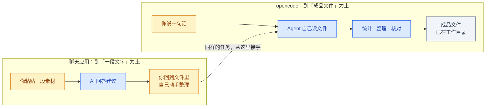
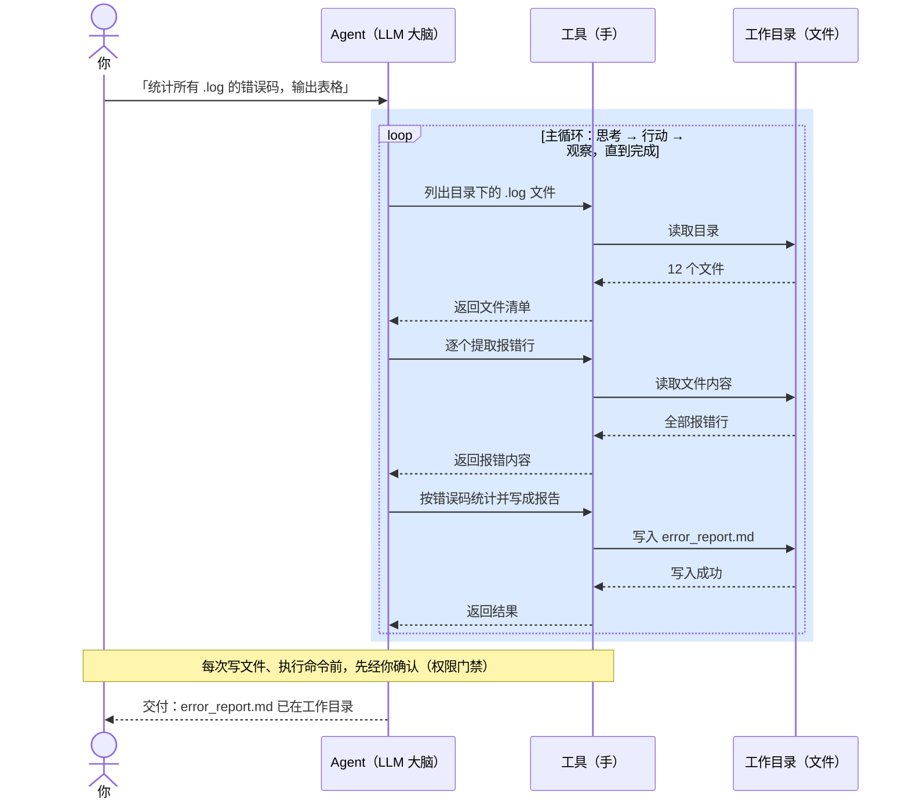
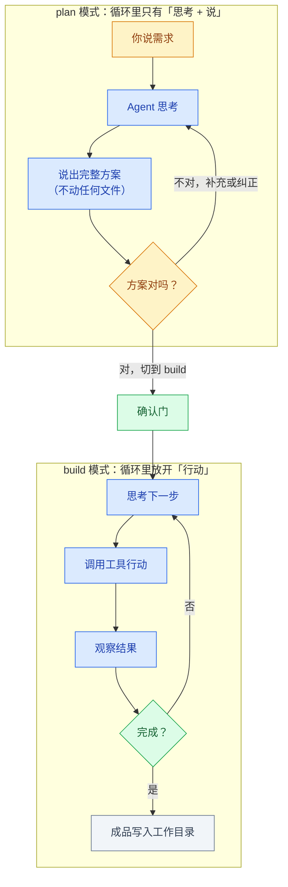
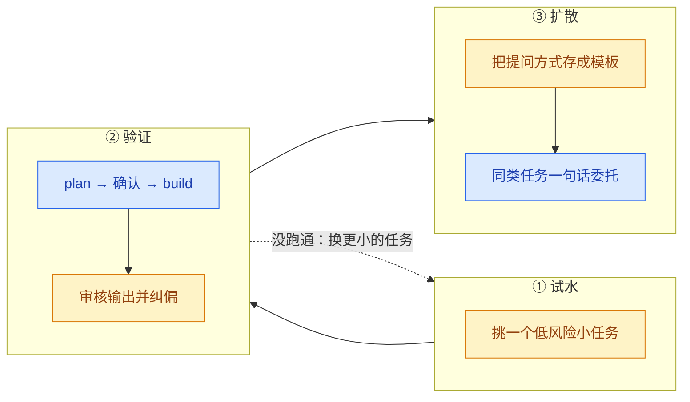
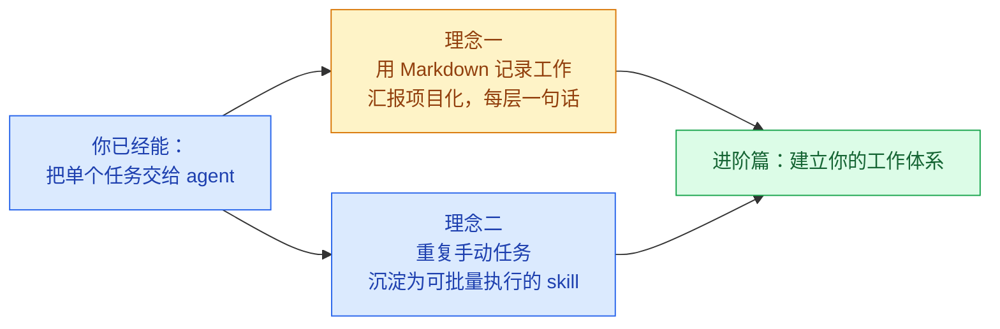

# opencode 入门：理解 Agent 的原理，交出你的第一个任务

| | |
| --- | --- |
| **写给谁** | 第一次接触 agent 的同学——只用过 ChatGPT / DeepSeek 网页版，没打开过命令行也没关系 |
| **前置要求** | 无。不需要会编程，不需要懂技术名词 |
| **读完能做什么** | 讲清 agent 的工作原理；装好 opencode，让它在你的工作目录里完成第一个真实任务 |

> **怎么用这份文档**：现场演示时按 `---` 分隔逐节推进，每节是一页；课后它就是操作手册——所有指令、模板、清单都可以直接复制照做。

> 这张图在说什么：全文六个部分。蓝色两节建立认知（原理），琥珀四节动手上手（实操）——先懂原理，再学操作，操作里的每个设计都能回到原理找到解释。


---

## 第一部分　为什么聊天框不够用

> **本节回答**：ChatGPT 这类聊天工具到底卡在哪一步？agent 多出来的能力是什么？哪些日常工作可以立刻受益？

### 1.1 一个典型场景

一批测试机台导出的日志，每个几十 MB，混着正常记录和报错。用聊天应用处理的实际路径：

| 步骤 | 你做的事 | 代价 |
| --- | --- | --- |
| 1 | 复制一段日志粘进 ChatGPT，问"报了什么错" | 文件太大粘不全，只能截取片段 |
| 2 | 拿到口头建议，回到文件里手动统计错误码 | 半小时起步 |
| 3 | 想要一张汇总表，再手动整理一遍 | 又半小时 |

问题不在模型不够聪明，在于**它进不去你的文件**：它只能看到你粘贴的那段文字，看不到整个目录，看不到文件之间的关系，更不能替你新建文件、跑统计。

opencode 解决的正是这一层——**让它进入你的工作目录，自己读、自己算、把结果写成文件交给你**。

### 1.2 分界线：给文字，还是交成品

> 这张图在说什么：同一个任务，聊天应用走到"给你一段文字"就停了，剩下的是你的事；opencode 跨过这条线，走完读文件、统计、写成成品的全部步骤。颜色约定全文通用：琥珀 = 人做的事，蓝色 = agent 做的事，灰色 = 文件产物。



两个固定的类比，全文沿用：

- 聊天应用像**电话客服**——口头指导，挂断后你还得自己动手。
- agent 像你把**助理领进办公室**——它自己翻文件柜、自己算，把整理好的报告放在你桌上。

### 1.3 每个岗位都用得上的场景

下面这些场景全程不碰代码，覆盖几乎每个岗位：

| 场景 | 你给它什么 | 它交付什么 |
| --- | --- | --- |
| **写周报 / 月报** | 几份零散的工作记录、数据片段 | 按你指定模板排好的报告草稿 |
| **会议纪要整理** | 会议速记 / 录音转写文本 | 分议题的结构化纪要 + 待办清单 |
| **数据汇总** | 多个 Excel / CSV 文件 | 合并到一张总表 + 按维度统计 |
| **资料综述** | 几份不同来源的文档 | 一份带来源标注的综述 |
| **报告排版** | 文字内容 + 排版要求 | 排好版的 Markdown 文档 |

与把素材粘贴给 ChatGPT 相比，关键差别有三条：

- **不用手动粘贴**——你把文件夹打开给它，它自己读全部素材，不会被"粘贴不全"卡住。
- **直接交成品文件**——结果写成文件放进你的目录，不是一段要你再复制的文字。
- **能跨多份资料对照**——"把这周三场会议的纪要合并，标出冲突的待办"，它能同时读三份文件对照着做。

### 1.4 能省多少事（量级参考）

| 任务 | 现在 | 用 opencode |
| --- | --- | --- |
| 从 100MB 日志里提取错误并统计 | 手写脚本或人眼翻：30–60 分钟 | 一句话：几分钟 |
| 给陌生项目加个小功能 | 通读代码理结构：半天 | 让它先讲清结构再动手：几十分钟 |
| 把会议纪要整理成模板报告 | 手动排版：1 小时 | 给它模板和素材：几分钟 |

> 上表是量级参考，实际取决于任务复杂度。重点是：**重复性的整理、统计、梳理工作，它确实能省时间**。

> **带走一句话**：聊天应用的边界是"给你一段文字"，agent 的边界是"给你一个成品文件"——差距就在这最后几步。

---

## 第二部分　Agent 的原理

> **本节回答**：大模型本质是什么、能做什么不能做什么？从大模型到 agent 中间发生了什么？为什么 agent 既"能干活"又"可控"？

这一部分是全文的地基。理解了 agent 的循环，后面每个功能——Plan/Build、AGENTS.md、权限确认——都不再是零散的按钮，而是同一个原理的不同侧面。

### 2.1 大模型：一个只看得见"上下文"的大脑

**大模型（LLM，Large Language Model）**：给定一段前文、续写出下文的系统。它的全部世界就是当前这段输入文字，称为**上下文（context）**。

三个直接推论：

- **它没有眼睛和手**——上下文之外的东西，对它不存在。
- **它不记忆**——每轮对话从上下文重新开始，这就是为什么每次新对话都要重新介绍背景（第四部分解决）。
- **它只会"说"**——输出的是文字，不是行动。

所以聊天框里的 AI 再聪明，也只能给你建议。**卡住的不是智力，是没有手。**

### 2.2 关键跃迁：给大脑接上手

**Agent（智能体）** = LLM + 工具 + 循环：

- **工具（tools）**：读写文件、执行命令、联网检索——agent 的"手"。
- **循环（loop）**：agent 拿到任务后自主决定"下一步做什么"→ 行动 → 观察结果 → 再决定下一步，直到任务完成。

**opencode** 就是一个开源的 agent 工作台：把模型、工具、权限管理打包成一个可直接使用的软件。它有三种形态，本教程以桌面应用为主线：

| 形态 | 适合谁 | 长什么样 |
| --- | --- | --- |
| **桌面应用**（本教程主线） | 所有人，尤其不碰命令行的同事 | 正常的桌面软件：窗口、按钮、对话框 |
| 终端界面（TUI） | 习惯命令行的工程师 | 终端里运行，键盘操作 |
| IDE 插件 | 在用 VS Code / Cursor 的同事 | 嵌在编辑器侧边栏 |

### 2.3 主循环：agent 是怎么干活的

> 这张图在说什么：你的一句指令，在 agent 内部展开成多轮"思考 → 行动 → 观察"的循环。它每调一次工具、看一次结果，再决定下一步；任务完成后把成品写进工作目录。右下角的注记是关键安全设计：涉及写文件、执行命令的动作，先经你确认。



一句话指令的背后是十几次循环。你在界面上看到"正在读文件、正在跑脚本"，就是一轮轮循环的外显。

### 2.4 由循环推出的三条性质

| 性质 | 原理 | 你得到的行为 |
| --- | --- | --- |
| **只看得见上下文** | 循环的输入 = 上下文 + 工具返回的结果 | 粘贴 100MB 日志不可行；打开目录让它自己读是正解 |
| **行动有边界、有门禁** | 工具只能碰你打开的目录；写文件、执行命令前要经你确认 | 它搞不坏你的电脑 |
| **循环支撑多步任务** | 思考—行动—观察可以转任意多轮 | 它交付的是"做完的活"，不是"一段建议" |

### 2.5 Plan / Build：对循环的两种配置

> 这张图在说什么：Plan 和 Build 不是两个功能，是同一个循环的两种配置。Plan 关掉"行动"环节，只让它思考和说明方案——零风险；Build 放开"行动"，循环开始真正干活。中间的菱形是确认门：方案由你把关。



> **带走一句话**：agent = 给大模型这个"大脑"接上"手"，再用循环驱动它把多步任务干完——后面的一切功能，都是围绕这个循环做的约束和配置。

---

## 第三部分　装上就用：第一个五分钟

> **本节回答**：怎么走完企业安装流程？界面里真正需要认识的只有哪三样？第一条指令怎么下，才能安全拿到交付物？

### 3.1 安装：企业内部五步

opencode 是企业版部署，安装走内部流程，**不在公开网上下载**：

| 步骤 | 你做什么 | 在哪做 | 备注 |
| --- | --- | --- | --- |
| 1. 申请 token plan | 提交使用申请，获取使用授权 | 企业内部申请系统 | 准入审批，没它后面走不动 |
| 2. 申请安装包下发 | 审批通过后申请下发安装包 | 同上 / 或 IT 统一下发 | 部分公司由 IT 主动推送 |
| 3. 内部商店安装 | 找到 opencode，点击安装 | 企业内部应用商店 | 像装普通软件一样 |
| 4. 打开并登录 | 用企业账号登录 | 桌面应用 | 模型自动配置，**不需要手动填密钥** |
| 5. 检查 | 确认登录成功、模型已接入 | 桌面应用 | 见下方清单 |

<!-- 截图：Desktop 安装完成后的首屏——标注登录入口 -->

**第 5 步检查清单**：

- [ ] 应用能正常打开、不报错
- [ ] 企业账号登录成功（界面显示已登录）
- [ ] 模型已自动接入（无需手动配置）
- [ ] 新建对话发一句"你好"，能收到回复

> 四项全部通过即安装成功。任何一项卡住，先回内部申请系统查审批状态，或联系 IT。
>
> 无图形界面或要求走命令行的环境：终端版同样先完成步骤 1–2，装好后输入 `opencode` 启动，操作逻辑与桌面应用一致。

### 3.2 认识界面：三个区域

> 这张表在说什么：桌面应用只需认识三个区域——看对话、下指令、切模式，其余界面都可以以后再学。

<!-- 截图：Desktop 主界面——标注对话区 / 输入框 / 模式指示器位置 -->

| 区域 | 在哪 | 干什么用 |
| --- | --- | --- |
| 对话区 | 主体大块 | 显示你和 agent 的来回，包括它读了哪些文件、做了什么 |
| 输入框 | 底部 | 你打字下指令的地方 |
| 模式指示器 | 右下角 | 显示当前是 `plan` 还是 `build`（`Tab` 切换，以实际界面为准） |

**斜杠命令**：输入框打 `/` 弹出命令面板，最常用的三个：

| 命令 | 作用 |
| --- | --- |
| `/new` | 开一个新对话（换话题时用） |
| `/init` | 生成项目说明文件 AGENTS.md（第四部分） |
| `/help` | 查看全部命令 |

### 3.3 打开工作目录：划定办公室边界

**opencode 以你打开的文件夹作为工作范围**——原理上这决定了它的行动边界（2.4 性质二）。在桌面应用里选择"打开文件夹"，挑一个你真实在用的目录：

- 一批测试日志所在的文件夹
- 一个代码仓库
- 你的工作笔记文件夹

> 选哪个都行，只要里面有你真实要处理的文件。它不会动这个文件夹之外的任何东西。

### 3.4 第一条指令：Plan → 确认 → Build

先切换到 **Plan 模式**（右下角显示 `plan`）——此模式下它只说方案、不动文件（2.5 的左边循环）。按你的岗位选一个场景：

```text
# 场景一：日志统计（测试 / 数据 / 工程）
请读取当前目录下所有 .log 文件，提取报错行，按错误码统计频次，
最后输出一个 Markdown 表格。先在 Plan 模式下说说你的处理思路。

# 场景二：周报整理（非编程岗 / 职能 / 管理）
请读取当前目录下所有工作记录，按时间线整理成本周周报，
包含本周完成事项、进行中事项、下周计划。先在 Plan 模式下说说你的处理思路。
```

它会回复处理思路：读哪些文件、怎么提取、怎么组织。**你审核思路**：

- 对 → 切到 `build`，回复"思路没问题，开始执行"
- 不对 → 继续在 Plan 里追问或调整，改到对为止

<!-- 截图：Build 执行完成，交付物出现在工作目录的界面 -->

### 3.5 这五分钟里发生了什么

> 这张图在说什么：整个过程你只出手三次（琥珀色）——开目录、下指令、确认方案；其余的读取、规划、执行、写文件（蓝色）全部由 agent 的循环完成。新手要建立的节奏感就是：什么时候轮到我。


全程你没有复制过一段素材、没有写过一行代码、没有打开过命令行。

> **带走一句话**：委托 agent 的标准节奏是"下指令 → 审方案 → 验交付"——你出三次手，循环跑完整件事。

---

## 第四部分　让它更懂你的工作：AGENTS.md

> **本节回答**：为什么每次新对话都要重新自我介绍？怎么一次沉淀、每轮生效？它的行动为什么是安全的？

### 4.1 为什么需要这个文件

2.1 讲过：模型不记忆，每轮对话从上下文重新开始。所以用 ChatGPT 时，每开一个新对话都要重新介绍——"我是做半导体测试的""bin 是什么意思""我们的文件格式是……"。

**AGENTS.md** 就是解决这个重复的：一个放在项目目录里的"项目须知"文件，opencode 每次启动**自动读它**，整轮对话不再需要重复背景。

### 4.2 一键生成：`/init` + 四段模板

不必从零写。输入 `/init`，它会读你的目录、问几个问题，生成初版 AGENTS.md。你只需补充**它不知道、但你岗位必需**的信息：

```markdown
# 角色与背景
我是 [部门/岗位] 的 [身份]，主要负责 [工作内容]。

# 术语解释
- bin：测试结果分类（pass / fail / 具体失效类别）
- lot：同一批次的产品

# 常用文件 / 命令
- .log 是机台测试日志
- 统计用 python，输出 Markdown 表格

# 注意事项
- 涉及生产数据先确认再动
- 输出用中文，结果导向
```

> 编写要点：只写"AI 不知道、但你岗位必需"的东西——术语、文件格式、常用命令、红线。不要写"你是一个 AI 助手"这类它本来就有的默认设定。

### 4.3 权限：行动前的门禁

对应 2.4 性质二：**每次要改文件或跑命令之前，它都会先弹出来问你"可以吗"**，默认不自动执行。

| 你的情况 | 建议 |
| --- | --- |
| 第一次用、不太放心 | 保持每次都问（默认就是） |
| 涉及生产数据、重要文件 | 一定保持每次都问 |
| 自己的练习目录 | 可以放开权限，加快节奏 |
| 看到它要跑一个不认识的命令 | 先让它解释命令做什么，再决定批不批 |

> **带走一句话**：把"agent 不知道但你岗位必需"的信息写进 AGENTS.md——一次沉淀，每轮对话自动生效。

---

## 第五部分　日常节奏与审核

> **本节回答**：什么任务该先 Plan？会话怎么管理？它出错了、答偏了怎么办？它的输出凭什么敢用？

### 5.1 什么时候先 Plan

| 任务类型 | 怎么做 | 例子 |
| --- | --- | --- |
| 只是问问题、查信息 | 直接问，不用切模式 | "这个报错什么意思" |
| 改一个文件、小调整 | 直接说，看一眼结果 | "把这行的注释加上" |
| 改多个文件、跑统计 | **先 Plan**，确认思路再 Build | "统计所有日志" |
| 涉及生产环境、不可逆操作 | **一定先 Plan**，逐条确认 | 删除、覆盖、批量改名 |

> 一句话准则：**不确定会不会搞坏东西，就先 Plan**。Plan 模式下它只会说不会动，零风险。

### 5.2 会话卫生：`/new` 与 `/compact`

opencode 记住一整轮对话的上下文。这是优点（不用重复背景），也有代价——聊太久上下文过长，响应变慢，还可能被前面的内容带偏。

- **换主题了** → `/new` 开新对话（背景从 AGENTS.md 重新加载，不会丢）
- **同一任务没做完** → 接着聊，不用新建
- **聊很久变慢了** → `/new` 重开，或 `/compact` 把当前对话压缩成摘要

### 5.3 出错了怎么办

先说结论：**正常使用基本不会把电脑搞坏**。三道保险来自 2.4 的三条性质：

1. **边界**——它只在你打开的文件夹里活动。
2. **门禁**——每次动手前都问你，你不点头它不执行。
3. **撤销**——如果文件夹是 Git 仓库，支持 `/undo` 回退上一轮文件改动。

| 情况 | 处理 |
| --- | --- |
| 它改错了文件 | `/undo` 撤回（需 Git 仓库）；或手动改回 |
| 它理解错了意思 | 不要顺着走，`/new` 重新描述需求 |
| 它跑的命令你不放心 | 别批准，先让它解释命令做什么 |
| 对话越来越乱 | `/new` 重开 |

### 5.4 答得不好：追问与纠偏

回答不好，多数时候不是 agent"不行"，而是**它没拿到足够的约束**——回想 2.1：它只看得见上下文，上下文里没有的信息它只能猜。

| 情况 | 不要这样 | 这样做 |
| --- | --- | --- |
| 方向跑偏 | 顺着它越聊越远 | 停下："我其实要的是 X，不是 Y"；偏差大就 `/new` |
| 太笼统 | "再说详细点" | 给样例："像这样：`xxx`，按这个格式重写" |
| 多给了不需要的 | "不要这些" | "只要 X 部分，去掉 Y 和 Z" |
| 漏了要的 | "你漏了东西" | 明确指出："还缺一个按周汇总的维度" |
| 理解错术语 | 反复纠正同一个词 | "这个词在我们这里的意思是……"，并补进 AGENTS.md |

> 关键习惯：**发现走偏，尽早停**。方向性问题用 `/new` 重开，成本最低。

### 5.5 怎么审核它的输出

标准只有一句：**像审核一个勤快但不懂行的实习生交来的活一样审核它**——不全盘接受，也不一次不满意就全盘否定。

| 检查项 | 怎么查 | 不通过怎么办 |
| --- | --- | --- |
| 事实 / 数字对不对 | 抽查关键数据，与原始文件对照 | 指出错处让它改；数字问题零容忍 |
| 格式符合要求吗 | 对照你要的格式（表格列、标题层级） | 明确指出缺什么、多什么 |
| 有没有臆造内容 | 警惕它"补"出来的你没给过的信息 | 问"这条数据来源是哪个文件" |
| 逻辑通顺吗 | 通读一遍，看结论是否站得住 | 指出断点让它重梳 |
| 边界情况覆盖了吗 | 想一个特殊输入看它处理了没 | 补充边界条件让它重做 |

> **一条红线**：涉及生产数据、对外交付、重要决策的内容，**必须人工复核**。opencode 是加速器，不替你负责。

### 5.6 成本

- **企业账号**：公司统一计费，你不单独付费——与 IT 确认即可。
- **自用 API key**：按用量计费（token）。日常文档整理、统计类任务单次成本通常在几毛到几元量级。
- **控制成本的三个习惯**：让它自己读文件（比粘贴省）；任务做完就 `/new`；响应明显变慢就 `/compact` 或 `/new`。

### 5.7 当天上手 Checklist

- [ ] 走完企业安装五步（申请 → 下发 → 商店安装 → 登录 → 检查）
- [ ] 打开一个你手头的真实文件夹（日志 / 代码 / 笔记均可）
- [ ] `/init` 生成 AGENTS.md，补上你的术语和常用文件
- [ ] 问一个项目相关的问题，验证它能读懂你的文件
- [ ] Plan 模式规划一个小任务，确认后切 Build 执行，拿到交付物
- [ ] 按 5.5 的清单审核输出，有问题就追问纠偏

> **带走一句话**：像审核实习生一样审核它——抽查数字、对照格式、警惕臆造；生产数据必须人工复核。

---

## 第六部分　哪些工作可以交出去

> **本节回答**：我怎么判断一件事能不能交给 agent？从哪个任务开始最安全？怎么把一次成功扩散成一类任务？

### 6.1 实习生测试法

拿出你过去一周的工作，逐项问：**"这件事，交给一个看不懂我的专业、但会熟练操作电脑、从不嫌烦的实习生，我能说清楚让他做吗？"**

- **能说清楚** → 大概率可以交给 opencode
- **说不清楚、得靠我自己判断** → 暂时不适合，等你更熟练再说

这个标准比任何技术定义都管用。核心是：**agent 不会读心，凡是能用清晰的步骤和素材描述清楚的活，它就能接**。

### 6.2 适合与不适合

| 信号 | 说明 | 例子 |
| --- | --- | --- |
| **重复做** | 每周/每月来一遍 | 周报、月度汇总、例行巡检 |
| **规则明确** | 有固定格式或固定步骤 | 按模板填、按维度统计 |
| **有现成素材** | 输入是已有文件/数据 | 日志、记录、表格、文档 |
| **机械耗时** | 人做要大量时间、不需深度思考 | 翻几百行找规律、合并十几个表格 |
| **容许迭代** | 出一版草稿你再改 | 报告草稿、整理初稿 |

> 满足三条以上 → 强烈建议试一下；一两条 → 可以试，预期别太高；零条 → 暂时别勉强。

**反过来，这些暂时不适合**：

| 不适合的 | 为什么 |
| --- | --- |
| 需要你个人判断和经验的决策 | 它不知道你的取舍标准 |
| 涉及人际、政治、敏感信息 | 别把不该外泄的内容喂进去 |
| 没有任何素材、凭空创造 | 它会臆造，不可信 |
| 一次性的、学它成本比自己做还高 | 不划算 |

### 6.3 按岗位找切入点

**测试 / 工艺 / 数据工程师**：批量日志的错误码提取与频次统计；测试数据按 lot / wafer / bin 维度的良率汇总；陌生测试程序的调用关系梳理；实验数据整理成 DOE 矩阵。

**产品 / 应用工程师**：按 datasheet / spec 生成检查清单与 SOP；多份技术文档要点对比综述；结合日志和规格做客户问题根因排查。

**职能 / 行政 / 运营**：会议纪要按议题归并 + 待办提取；多份周报合并成月报；数据表格合并与按维度统计；按固定模板排版报告。

**管理岗**：多来源信息的综述与对比；项目进度多份状态报告汇总；决策所需的数据整理与可视化。

> 找不到你的岗位？回到 6.1——拿出上周的工作清单，逐项过"实习生测试"。

### 6.4 第一个真实任务：三步法

> 这张图在说什么：不要一上来把所有活交出去。先挑一个做砸了也没关系的小任务跑通完整一轮，把这次的提问方式存成模板，再扩散到同类任务。范围是滚出来的，不是一次全押。



1. **试水**：选一个本周要做、做砸了也没关系的任务；素材放进一个文件夹；越具体越好——"统计这个文件夹里所有 CSV 的行数"优于"帮我分析数据"。
2. **验证**：Plan 出方案 → 你确认 → Build 执行 → 按 5.5 审核输出 → 有问题按 5.4 纠偏。
3. **扩散**：同类型任务下次直接照这次的方式交；把标准提问方式存下来当模板。

> **最重要的心态**：第一次任务选小一点、期望放低一点。跑通一个完整的"委托 → 确认 → 审核"，比第一次就追求完美更重要。

> **带走一句话**：先用一个小任务跑通完整闭环，再把经验扩散到同类任务——能交出去的活会越来越多。

---

## 结语：两个问题

到这里，你已经能**把一件事**交给 agent。但真正改变工作方式的，是下面两个问题：

> **问题一**：如果每天的工作都用 Markdown 记录在一个项目里，月底的周报、月报、季度汇报会发生什么？

> **问题二**：如果每周重复的 Excel 统计、截图、分析，能沉淀成 agent 可以批量执行的工作流，会发生什么？

> 这张图在说什么：入门篇解决"会用"，进阶篇解决"体系"。两个理念一个把**你的记录**变成资产，一个把**你的流程**变成资产——它们都建立在你刚学会的循环之上。



| 进阶主题 | 进阶篇对应位置 |
| --- | --- |
| Markdown 工作汇报项目（理念一） | 第二部分 |
| 手动任务 → 工作流 skill（理念二） | 第三部分 |
| 提问五段式 / 配置 / 上下文 / 确认门 | 第四部分 |
| 团队共享与经验沉淀 | 第五部分 |

---

## 术语速查

| 术语 | 一句话定义 |
| --- | --- |
| **大模型（LLM）** | 给定前文续写下文的系统，agent 的"大脑" |
| **上下文（context）** | 模型当前能看到的全部文字，它的"工作记忆" |
| **工具（tools）** | agent 的"手"：读写文件、执行命令、联网检索 |
| **Agent（智能体）** | LLM + 工具 + 循环，能自主多步完成任务的系统 |
| **循环（loop）** | 思考 → 行动 → 观察 → 再思考，直到任务完成 |
| **opencode** | 开源的 agent 工作台，本教程使用的工具 |
| **Plan / Build** | 对循环的两种配置：只说不做 / 放开行动 |
| **AGENTS.md** | 项目里的"须知"文件，每轮对话自动加载 |
| **权限确认** | agent 每次写文件、执行命令前的"门禁" |
| `/init` `/new` `/compact` `/undo` | 生成 AGENTS.md / 新对话 / 压缩对话 / 撤销改动 |
