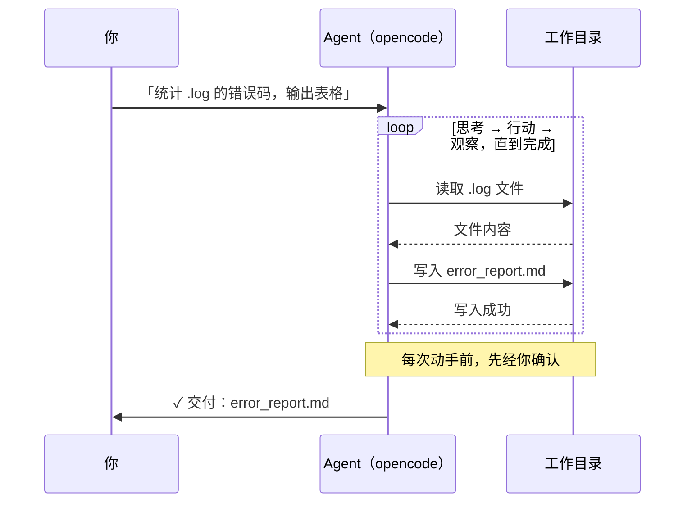
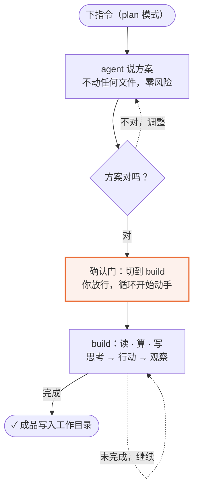
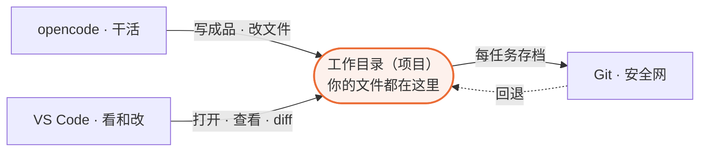

# opencode 入门：理解 Agent 的原理，交出你的第一个任务

| | |
| --- | --- |
| **写给谁** | 第一次接触 agent 的同学——只用过 ChatGPT / DeepSeek 网页版，没打开过命令行也没关系 |
| **前置要求** | 无。不需要会编程，不需要懂技术名词 |
| **读完能做什么** | 讲清 agent 的工作原理；配齐 opencode + VS Code + Git 三件套，让 agent 在你的工作目录里完成第一个真实任务 |

> **怎么用这份文档**：现场演示按 `---` 分节推进，每节是一页；课后当操作手册用——所有指令、模板、清单可直接复制照做。表格符号约定：✓ 达成 / ⚠ 风险。

---

## 第一部分　为什么聊天框不够用

> **本节回答**：ChatGPT 这类聊天工具卡在哪一步？agent 多出来的能力是什么？

### 1.1 一个典型场景

一批测试机台导出的日志，每个几十 MB，混着正常记录和报错。用聊天应用处理的实际路径：

| 步骤 | 你做的事 | 代价 |
| --- | --- | --- |
| 1 | 复制一段日志粘进 ChatGPT，问"报了什么错" | 文件太大粘不全，只能截取片段 |
| 2 | 拿到口头建议，回到文件里手动统计错误码 | 半小时起步 |
| 3 | 想要一张汇总表，再手动整理一遍 | 又半小时 |

问题不在模型智力，在于**它进不去你的文件**：看不到整个目录，不能替你新建文件、跑统计。opencode 解决的就是这一层——**让它进入你的工作目录，自己读、自己算、把结果写成文件交给你**。

### 1.2 分界线：给文字，还是交成品

| | 聊天应用 | opencode |
| --- | --- | --- |
| 它能接触什么 | 你粘贴的那段文字 | 整个工作目录 |
| 它的产出 | 一段建议 | 成品文件 |
| 剩下谁动手 | 你 | 它 |

两个类比，全文沿用：聊天应用像**电话客服**——口头指导，挂断后你自己动手；agent 像**助理领进办公室**——自己翻文件柜、自己算，把报告放在你桌上。

### 1.3 每个岗位都用得上的场景

| 场景 | 你给它什么 | 它交付什么 |
| --- | --- | --- |
| **写周报 / 月报** | 几份零散的工作记录、数据片段 | 按你指定模板排好的报告草稿 |
| **会议纪要整理** | 会议速记 / 录音转写文本 | 分议题的结构化纪要 + 待办清单 |
| **数据汇总** | 多个 Excel / CSV 文件 | 合并到一张总表 + 按维度统计 |
| **资料综述** | 几份不同来源的文档 | 一份带来源标注的综述 |
| **报告排版** | 文字内容 + 排版要求 | 排好版的 Markdown 文档 |

与粘贴给 ChatGPT 相比的三个差别：不用手动粘贴（打开目录它自己读全部素材）；直接交成品文件；能跨多份资料对照（"把三场会议纪要合并，标出冲突的待办"）。

### 1.4 能省多少事（量级参考）

| 任务 | 现在 | 用 opencode |
| --- | --- | --- |
| 从 100MB 日志里提取错误并统计 | 手写脚本或人眼翻：30–60 分钟 | 一句话：几分钟 |
| 给陌生项目加个小功能 | 通读代码理结构：半天 | 先让它讲清结构再动手：几十分钟 |
| 把会议纪要整理成模板报告 | 手动排版：1 小时 | 给它模板和素材：几分钟 |

> 量级参考，实际取决于任务复杂度。重点是：重复性的整理、统计、梳理工作，它确实省时间。

---

## 第二部分　Agent 的原理

> **本节回答**：大模型能做什么、不能做什么？加上什么变成 agent？为什么它既"能干活"又"可控"？

这一部分是全文地基。后面每个功能——Plan/Build、AGENTS.md、权限确认——都是同一个原理的不同侧面。

### 2.1 大模型：只看得见"上下文"的大脑

**大模型（LLM）**：给定一段前文、续写出下文的系统。它的全部世界是当前输入文字，称为**上下文（context）**。三个推论：

| 推论 | 含义 | 后果 |
| --- | --- | --- |
| 没有眼睛和手 | 上下文之外的东西对它不存在 | 粘贴 100MB 日志不可行 |
| 不记忆 | 每轮对话从上下文重新开始 | 每次新对话都要重新介绍背景（第四部分解决） |
| 只会说 | 输出文字，不是行动 | 聊天框里再聪明也只能给建议 |

**卡住的不是智力，是没有手。**

### 2.2 跃迁：给大脑接上手

**Agent = LLM + 工具 + 循环**：

| 组成 | 聊天应用 | Agent（如 opencode） |
| --- | --- | --- |
| 大脑（LLM） | 有 | 有 |
| 手（工具） | 无 | 读写文件 · 执行命令 · 联网检索 |
| 循环 | 无 | 思考 → 行动 → 观察，直到任务完成 |

**opencode** 是一个开源 agent 工作台，有三种形态，本教程以桌面应用为主线：

| 形态 | 适合谁 | 长什么样 |
| --- | --- | --- |
| **桌面应用**（主线） | 所有人，尤其不碰命令行的同事 | 正常的桌面软件 |
| 终端界面（TUI） | 习惯命令行的工程师 | 终端里运行 |
| IDE 插件 | 在用 VS Code / Cursor 的同事 | 编辑器侧边栏 |

### 2.3 主循环：agent 是怎么干活的



*主循环：一句指令展开为多轮「思考 → 行动 → 观察」，动手前先经你确认，成品写入工作目录后交付。*

一句话指令的背后是十几轮循环。界面上"正在读文件、正在跑脚本"，就是循环的外显。**每次写文件、执行命令前，先经你确认（权限门禁，4.3）。**

### 2.4 由循环推出的三条性质

| 性质 | 原理 | 你得到的行为 |
| --- | --- | --- |
| **只看得见上下文** | 循环输入 = 上下文 + 工具返回 | 打开目录让它自己读是正解 |
| **行动有边界、有门禁** | 只碰你打开的目录；动手前要你确认 | 它搞不坏你的电脑 |
| **循环支撑多步任务** | 循环可转任意多轮 | 交付"做完的活"，不是"一段建议" |

### 2.5 Plan / Build：对循环的两种配置



*Plan 只说不做、零风险；方案经你确认后过确认门切 Build 放开行动，执行未完就继续循环，直到成品写入工作目录。*

| 模式 | 循环里有什么 | 用途 |
| --- | --- | --- |
| `plan` | 思考 + 说方案，不动任何文件 | 对方案，零风险 |
| `build` | 放开行动：读、算、写 | 执行并交付 |

切换点就是确认门：方案对了再切 build，不对继续在 plan 里改。

---

## 第三部分　装上就用：第一个五分钟

> **本节回答**：怎么安装？界面认识哪三样？第一条指令怎么下？为什么还要配 VS Code 和 Git？

### 3.1 安装：企业内部五步

opencode 是企业版部署，**不在公开网上下载**：

| 步骤 | 你做什么 | 在哪做 | 备注 |
| --- | --- | --- | --- |
| 1. 申请 token plan | 提交使用申请，获取授权 | 企业内部申请系统 | 没它后面走不动 |
| 2. 申请安装包下发 | 审批通过后申请下发 | 同上 / 或 IT 统一下发 | 部分公司由 IT 推送 |
| 3. 内部商店安装 | 找到 opencode，点击安装 | 企业内部应用商店 | 像装普通软件 |
| 4. 打开并登录 | 企业账号登录 | 桌面应用 | 模型自动配置，**不填密钥** |
| 5. 检查 | 见下方清单 | 桌面应用 | |

<!-- 截图：Desktop 安装完成后的首屏——标注登录入口 -->

**第 5 步检查清单**：

- [ ] 应用能正常打开、不报错
- [ ] 企业账号登录成功
- [ ] 新建对话发一句"你好"，能收到回复

> 任何一项卡住：回内部申请系统查审批状态，或联系 IT。走命令行的环境：同样先完成步骤 1–2，装好后输入 `opencode` 启动。

### 3.2 认识界面：三个区域

| 区域 | 在哪 | 干什么用 |
| --- | --- | --- |
| 对话区 | 主体大块 | 它读了哪些文件、做了什么，全在这里 |
| 输入框 | 底部 | 你打字下指令 |
| 模式指示器 | 右下角 | 当前 `plan` / `build`（`Tab` 切换，以实际界面为准） |

**斜杠命令**（输入框打 `/` 弹出）：

| 命令 | 作用 |
| --- | --- |
| `/new` | 新对话（换话题时用） |
| `/init` | 生成项目说明文件 AGENTS.md（第四部分） |
| `/help` | 查看全部命令 |

### 3.3 打开工作目录：划定边界

桌面应用里"打开文件夹"，挑一个你真实在用的目录（一批测试日志、一个代码仓库、工作笔记文件夹都行）。它不会动这个文件夹之外的任何东西（2.4 性质二）。

### 3.4 第一条指令：Plan → 确认 → Build

切到 **Plan 模式**，按岗位选一个场景：

```text
# 场景一：日志统计（测试 / 数据 / 工程）
请读取当前目录下所有 .log 文件，提取报错行，按错误码统计频次，
最后输出一个 Markdown 表格。先在 Plan 模式下说说你的处理思路。

# 场景二：周报整理（非编程岗 / 职能 / 管理）
请读取当前目录下所有工作记录，按时间线整理成本周周报，
包含本周完成事项、进行中事项、下周计划。先在 Plan 模式下说说你的处理思路。
```

它回复处理思路后：对 → 切 `build`，回复"思路没问题，开始执行"；不对 → 继续在 Plan 里追问或调整。

<!-- 截图：Build 执行完成，交付物出现在工作目录 -->

### 3.5 这五分钟里发生了什么

| 谁 | 做什么 |
| --- | --- |
| **你（共 3 次出手）** | 打开工作目录 → 下指令 → 确认方案 |
| **agent 循环（其余全部）** | 读全部素材 → plan 说方案 → build 执行 → 写成成品文件 |

全程你没复制过一段素材、没写过一行代码、没打开过命令行。新手要建立的节奏感：**什么时候轮到我**。

### 3.6 五分钟之后：配齐另外两件工具

**三件套各司其职：opencode 干活，VS Code 是你看和改的工作台，Git 是让你放心放手的安全网。**



*三件套围绕同一个工作目录各司其职：opencode 写入，VS Code 查看与审核 diff，Git 每任务存档、随时回退。*

**VS Code：看和改文件的工作台**

| 用途 | 说明 |
| --- | --- |
| 写 Markdown | 边写边预览（`Cmd+Shift+V`） |
| 看改动（diff） | agent 改了哪几行，红绿对照——审核的核心手段 |
| 浏览项目 | 目录树浏览整个工作目录 |
| opencode 侧边栏 | 装 IDE 插件，agent 嵌在编辑器里 |

> VS Code 官网下载，企业环境优先走内部商店。这两份教学文档的现场演示，用的就是 VS Code 的 Markdown 预览。

**Git：放手让 agent 干活的安全网**

一句话：**Git 给文件夹装上"存档点"**——任何时候能看清"改了什么"（diff）、回到"之前的状态"（回退）。它是 5.3 里 `/undo` 的前提。不需要学命令，让 agent 替你做：

```text
帮我把当前目录初始化成 Git 仓库，给当前全部文件做第一次存档。
之后每完成一个任务，提醒我存档一次。
```

| 概念 | 一句话 | 什么时候用 |
| --- | --- | --- |
| **存档（commit）** | 给当前状态拍一张快照 | 每完成一个任务存一次 |
| **改动（diff）** | 两个存档点之间改了什么 | 审核 agent 动了哪些行 |
| **回退** | 回到之前的某个存档点 | 改坏了、想撤回的时候 |

> Git 通常由 IT 统一安装（Mac 多数已自带），没有就走内部商店。习惯从下个项目开始养成：**打开目录的第一句话，先让 agent 初始化 Git——安全网要在任务之前存在。**

---

## 第四部分　让它更懂你的工作：AGENTS.md

> **本节回答**：为什么每次新对话都要重新自我介绍？怎么一次沉淀、每轮生效？

### 4.1 为什么需要这个文件

2.1 讲过：模型不记忆，每轮对话从上下文重新开始——所以用 ChatGPT 时每个新对话都要重新介绍"我是做什么的、bin 是什么意思"。

**AGENTS.md** 是放在项目目录里的"项目须知"，opencode 每次启动**自动读它**：写一次，每轮对话自动生效，背景不再重复介绍。

### 4.2 一键生成：`/init` + 四段模板

输入 `/init`，它读你的目录、问几个问题，生成初版。你补**它不知道、但你岗位必需**的信息：

```markdown
# 角色与背景
我是 [部门/岗位] 的 [身份]，主要负责 [工作内容]。

# 术语解释
- bin：测试结果分类（pass / fail / 具体失效类别）
- lot：同一批次的产品

# 常用文件 / 命令
- .log 是机台测试日志
- 统计用 python，输出 Markdown 表格

# 注意事项
- 涉及生产数据先确认再动
- 输出用中文，结果导向
```

> 编写要点：只写"AI 不知道、但你岗位必需"的——术语、文件格式、常用命令、红线。不要写"你是一个 AI 助手"这类它本来就有的默认设定。

### 4.3 权限：行动前的门禁

对应 2.4 性质二：**每次改文件或跑命令之前，它先弹出来问你，默认不自动执行。**

| 你的情况 | 建议 |
| --- | --- |
| 第一次用、不太放心 | 保持每次都问（默认就是） |
| 涉及生产数据、重要文件 | 一定保持每次都问 |
| 自己的练习目录 | 可以放开权限，加快节奏 |
| 看到它要跑一个不认识的命令 | 先让它解释命令做什么，再决定批不批 |

---

## 第五部分　日常节奏与审核

> **本节回答**：什么任务先 Plan？会话怎么管理？出错了怎么办？输出凭什么敢用？

### 5.1 什么时候先 Plan

| 任务类型 | 怎么做 | 例子 |
| --- | --- | --- |
| 只是问问题、查信息 | 直接问 | "这个报错什么意思" |
| 改一个文件、小调整 | 直接说，看一眼结果 | "把这行的注释加上" |
| 改多个文件、跑统计 | **先 Plan**，确认思路再 Build | "统计所有日志" |
| 涉及生产环境、不可逆操作 | **一定先 Plan**，逐条确认 | 删除、覆盖、批量改名 |

> 准则：不确定会不会搞坏东西，就先 Plan——plan 模式零风险。

### 5.2 会话卫生：`/new` 与 `/compact`

- 换主题 → `/new`（背景从 AGENTS.md 重新加载，不会丢）
- 同一任务没做完 → 接着聊，不用新建
- 聊很久变慢 → `/new` 重开，或 `/compact` 压缩当前对话

### 5.3 出错了怎么办

正常使用基本不会把电脑搞坏：有边界（2.4）、有门禁（4.3）、有撤销——文件夹是 Git 仓库时支持 `/undo` 回退上一轮文件改动（所以 3.6 说安全网要在任务之前装好）。

| 情况 | 处理 |
| --- | --- |
| 它改错了文件 | `/undo` 撤回（需 Git 仓库）；或手动改回 |
| 它理解错了意思 | 不要顺着走，`/new` 重新描述需求 |
| 它跑的命令你不放心 | 别批准，先让它解释命令做什么 |
| 对话越来越乱 | `/new` 重开 |

### 5.4 答得不好：追问与纠偏

回答不好，多数时候不是它"不行"，而是**没拿到足够的约束**（2.1：上下文里没有的信息它只能猜）。

| 情况 | 不要这样 | 这样做 |
| --- | --- | --- |
| 方向跑偏 | 顺着越聊越远 | 停下："我其实要的是 X，不是 Y"；偏差大就 `/new` |
| 太笼统 | "再说详细点" | 给样例："像这样：`xxx`，按这个格式重写" |
| 多给了不需要的 | "不要这些" | "只要 X 部分，去掉 Y 和 Z" |
| 漏了要的 | "你漏了东西" | 明确指出："还缺一个按周汇总的维度" |
| 理解错术语 | 反复纠正同一个词 | "这个词在我们这里的意思是……"，并补进 AGENTS.md |

> 关键习惯：发现走偏尽早停。方向性问题用 `/new` 重开，成本最低。

### 5.5 怎么审核它的输出

标准一句：**像审核一个勤快但不懂行的实习生交来的活**——不全盘接受，也不一次不满意就全盘否定。

| 检查项 | 怎么查 | 不通过怎么办 |
| --- | --- | --- |
| 事实 / 数字对不对 | 抽查关键数据，与原始文件对照 | 指出错处让它改；数字问题零容忍 |
| 格式符合要求吗 | 对照你要的格式（表格列、标题层级） | 明确指出缺什么、多什么 |
| 有没有臆造内容 | 警惕它"补"出来的你没给过的信息 | 问"这条数据来源是哪个文件" |
| 逻辑通顺吗 | 通读一遍，看结论是否站得住 | 指出断点让它重梳 |
| 边界情况覆盖了吗 | 想一个特殊输入看它处理了没 | 补充边界条件让它重做 |

> **红线**：涉及生产数据、对外交付、重要决策的内容，**必须人工复核**。opencode 是加速器，不替你负责。

### 5.6 成本

- **企业账号**：公司统一计费，与 IT 确认即可
- **自用 API key**：按用量计费（token）。日常文档整理、统计类任务单次成本通常几毛到几元
- **三个省钱习惯**：让它自己读文件（比粘贴省）；任务做完就 `/new`；响应变慢就 `/compact` 或 `/new`

### 5.7 当天上手 Checklist

- [ ] 走完企业安装五步（申请 → 下发 → 商店安装 → 登录 → 检查）
- [ ] 打开一个你手头的真实文件夹（日志 / 代码 / 笔记均可）
- [ ] `/init` 生成 AGENTS.md，补上你的术语和常用文件
- [ ] 问一个项目相关的问题，验证它能读懂你的文件
- [ ] Plan 模式规划一个小任务，确认后切 Build 执行，拿到交付物
- [ ] 按 5.5 的清单审核输出，有问题就追问纠偏

---

## 第六部分　哪些工作可以交出去

> **本节回答**：怎么判断一件事能不能交给 agent？从哪个任务开始？怎么扩散？

### 6.1 实习生测试法

拿出你过去一周的工作，逐项问：**"这件事，交给一个看不懂我的专业、但会熟练操作电脑、从不嫌烦的实习生，我能说清楚让他做吗？"**

能说清楚 → 大概率可以交给 opencode；说不清楚、得靠我自己判断 → 暂时不适合。agent 不会读心：能用清晰的步骤和素材描述清楚的活，它就能接。

### 6.2 适合与不适合

| 信号 | 说明 | 例子 |
| --- | --- | --- |
| **重复做** | 每周/每月来一遍 | 周报、月度汇总、例行巡检 |
| **规则明确** | 有固定格式或固定步骤 | 按模板填、按维度统计 |
| **有现成素材** | 输入是已有文件/数据 | 日志、记录、表格、文档 |
| **机械耗时** | 人做要大量时间、不需深度思考 | 翻几百行找规律、合并十几个表格 |
| **容许迭代** | 出一版草稿你再改 | 报告草稿、整理初稿 |

> 满足三条以上 → 强烈建议试一下；一两条 → 可以试，预期别太高；零条 → 暂时别勉强。

**反过来，这些暂时不适合**：

| 不适合的 | 为什么 |
| --- | --- |
| 需要你个人判断和经验的决策 | 它不知道你的取舍标准 |
| 涉及人际、政治、敏感信息 | 别把不该外泄的内容喂进去 |
| 没有任何素材、凭空创造 | 它会臆造，不可信 |
| 一次性的、学它成本比自己做还高 | 不划算 |

### 6.3 按岗位找切入点

**测试 / 工艺 / 数据工程师**：批量日志的错误码提取与频次统计；测试数据按 lot / wafer / bin 维度的良率汇总；陌生测试程序的调用关系梳理；实验数据整理成 DOE 矩阵。

**产品 / 应用工程师**：按 datasheet / spec 生成检查清单与 SOP；多份技术文档要点对比综述；结合日志和规格做客户问题根因排查。

**职能 / 行政 / 运营**：会议纪要按议题归并 + 待办提取；多份周报合并成月报；数据表格合并与按维度统计；按固定模板排版报告。

**管理岗**：多来源信息的综述与对比；项目进度多份状态报告汇总；决策所需的数据整理与可视化。

> 找不到你的岗位？回到 6.1，拿出上周的工作清单逐项过"实习生测试"。

### 6.4 第一个真实任务：三步法

1. **试水**：选一个本周要做、做砸了也没关系的任务；素材放进一个文件夹；越具体越好——"统计这个文件夹里所有 CSV 的行数"优于"帮我分析数据"。
2. **验证**：Plan 出方案 → 你确认 → Build 执行 → 按 5.5 审核 → 有问题按 5.4 纠偏。
3. **扩散**：同类型任务下次照这次的方式交；把标准提问方式存下来当模板。

> 心态：第一次任务选小一点、期望放低一点。跑通一个完整的"委托 → 确认 → 审核"，比第一次就追求完美更重要。

---

## 结语：两个问题

到这里，你已经能**把一件事**交给 agent。真正改变工作方式的，是下面两个问题：

> **问题一**：如果每天的工作都用 Markdown 记录在一个项目里，月底的周报、月报、季度汇报会发生什么？

> **问题二**：如果每周重复的 Excel 统计、截图、分析，能沉淀成 agent 可以批量执行的工作流，会发生什么？

答案在下一讲《opencode 进阶与实战》：

| 下一讲主题 | 对应部分 |
| --- | --- |
| Markdown 工作汇报项目（问题一） | 第二部分 |
| 重复任务沉淀为工作流 skill（问题二） | 第三部分 |
| 从零完成一个完整数据项目（实战） | 第四部分 |
| 提问五段式 / 配置 / 上下文 / 确认门 | 第五部分 |
| 从个人到团队 | 第六部分 |

---

## 术语速查

| 术语 | 一句话定义 |
| --- | --- |
| **大模型（LLM）** | 给定前文续写下文的系统，agent 的"大脑" |
| **上下文（context）** | 模型当前能看到的全部文字，它的"工作记忆" |
| **工具（tools）** | agent 的"手"：读写文件、执行命令、联网检索 |
| **Agent（智能体）** | LLM + 工具 + 循环，能自主多步完成任务的系统 |
| **循环（loop）** | 思考 → 行动 → 观察 → 再思考，直到任务完成 |
| **opencode** | 开源的 agent 工作台，本教程使用的工具 |
| **Plan / Build** | 对循环的两种配置：只说不做 / 放开行动 |
| **AGENTS.md** | 项目里的"须知"文件，每轮对话自动加载 |
| **权限确认** | agent 每次写文件、执行命令前的"门禁" |
| **VS Code** | 开源编辑器：看文件、写 Markdown、看 diff 的工作台 |
| **Git** | 版本控制：存档、看改动、可回退——放手让 agent 干活的安全网 |
| `/init` `/new` `/compact` `/undo` | 生成 AGENTS.md / 新对话 / 压缩对话 / 撤销改动 |
