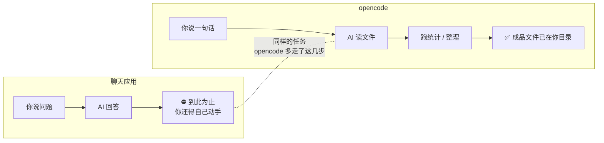
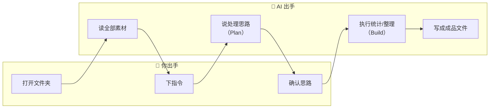
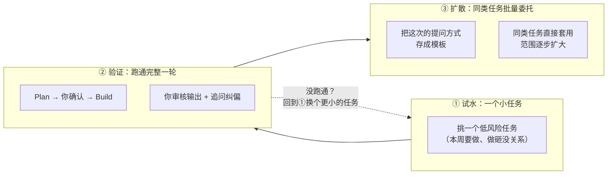

# 《opencode 入门：从聊天框到能干活的 AI》PPT 原始材料

> **写给谁看**：只用过 ChatGPT、DeepSeek 网页版，从没打开过命令行的同事。不需要会编程，不需要懂技术名词。
> **读完能干什么**：装好 opencode 桌面应用，打开一个你手头的项目（代码库、数据目录、笔记文件夹都行），让它帮你完成一个真实的小任务。
> **编写规范**：用场景和类比代替术语；每个技术名词第一次出现时配一句话解释；保留表格和流程图，但每张图前面都先说一句"这张图在说什么"。凡是涉及具体按钮位置的描述，以实际界面为准——本文中需要截图的位置用 `<!-- 截图：... -->` 标出，后续补齐。

---

## 第一部分　为什么你需要 opencode

### 1.1 一个你大概遇到过的场景

假设你手头有一批测试机台导出的日志文件，每个几十 MB，里面混着正常记录和报错。你现在的处理流程大概是这样：

| 步骤 | 你做的事 | 花的时间 |
| --- | --- | --- |
| 1 | 打开 ChatGPT，复制粘贴一段日志进去问"这里报了什么错" | 几分钟 |
| 2 | 发现文件太大粘不全，手动截取几段 | 又几分钟 |
| 3 | 得到一段口头建议，自己回到文件里手动统计错误码 | 半小时起步 |
| 4 | 想生成一张汇总表，又得手动整理 | 再半小时 |

**问题不在 ChatGPT 不够聪明，而在它"进不去你的文件"**。它只能看到你粘贴进去的那一小段文字，看不到整个目录、看不到文件之间的关系、更不能替你新建文件或跑脚本。

opencode 解决的就是这一层——**让它直接进入你的工作目录，自己读、自己算、自己把结果写成文件交给你**。

### 1.2 两种工具，一句话的区别

> 这张图在说什么：同一个任务，聊天应用走到"给你一段文字"就停了；opencode 会继续走完"读文件、算、写成成品"这几步。竖线就是分界——聊天应用止步于此，opencode 跨过它把活干完。



- **聊天应用**像柜台咨询——你描述问题，对方口头给建议，但对方进不了你家。
- **opencode** 像你把一个助理领进了办公室——它能看你的文件柜、能翻你的资料、能替你把整理好的报告放在桌上。

### 1.3 它能帮你省多少事（量级参考）

| 任务 | 现在 | 用 opencode |
| --- | --- | --- |
| 从 100MB 日志里提取错误并统计 | 手写脚本或人眼翻：30–60 分钟 | 说一句话：几分钟 |
| 给一个陌生项目加个小功能 | 通读代码理清结构：半天 | 让它先讲清楚再动手：几十分钟 |
| 把会议纪要整理成模板报告 | 手动排版：1 小时 | 给它模板和素材：几分钟 |

> 上表是量级参考，实际快慢取决于任务复杂度和文件多少。重点是：**重复性的整理、统计、梳理工作，它是真的能省时间**。

### 1.4 它在办公室能帮你做什么

不只是工程师的专属——下面这些是几乎每个岗位都用得上的办公场景，**全程不用碰代码**：

> 这张表在说什么：把你平时"手动整理资料"的活，交给 opencode，你只管提需求和审结果。

| 场景 | 你给它什么 | 它交付什么 |
| --- | --- | --- |
| **写周报 / 月报** | 几份零散的工作记录、数据片段 | 按你指定模板排好的报告草稿 |
| **会议纪要整理** | 会议速记 / 录音转写文本 | 分议题的结构化纪要 + 待办清单 |
| **数据汇总** | 多个 Excel / CSV 文件 | 合并到一张总表 + 按维度分类统计 |
| **做总结** | 一批文档、邮件、聊天记录 | 提炼核心结论 + 待决议事项 |
| **报告排版** | 文字内容 + 排版要求 | 排好版的 Markdown / 文档文件 |
| **资料汇总** | 几份不同来源的资料 | 一份带来源标注的综述 |

和用 ChatGPT 做同样的事相比，关键差别是：

- **不用手动粘贴**——你把文件夹打开给它，它自己读全部素材，不会被"粘贴不全"卡住。
- **直接交成品文件**——它把结果写成文件放在你目录里，不是给你一段文字让你再复制回文档。
- **能跨多份资料对照**——比如"把这周三场会议的纪要合并，标出冲突的待办"，它能同时读三份文件对照着做。

> 一个具体的例子：月底写周报时，你打开存放本月工作记录的文件夹，说一句"按这个模板，把这周五份工作记录整理成本月总结"。它读完全部记录，按模板生成草稿，你再修一修就能交。

---

## 第二部分　opencode 到底是什么

### 2.1 它和 ChatGPT 的本质区别

> 这张表在说什么：同一个 AI 大脑，接不接得到你的文件、能不能动手干活，决定了它是"陪聊"还是"干活"。

| 能力 | 聊天应用 | opencode |
| --- | --- | --- |
| 看你的文件 | 看不到，只能看你粘贴的文字 | 直接读取整个工作目录 |
| 改文件 / 建文件 | 不能 | 能新建、修改、删除（每次动手前会先问你） |
| 跑命令 | 不能 | 能执行脚本、装依赖、查日志（执行前也会问你） |
| 记住上下文 | 只记当前对话 | 跨多轮记住同一个任务，越聊越懂 |
| 联网查资料 | 看平台 | 可以查 API 文档、抓取规范 |

### 2.2 一个比方，帮你建立直觉

**Code Agent**（就是 opencode 这类工具）这个词第一次出现，解释一下：Agent 是"代理/代办"的意思，Code Agent 就是"能代你操作电脑干活的 AI"。

- 聊天应用 = **电话客服**。你打电话描述问题，对方口头指导，挂了电话你还是得自己动手。
- opencode = **上门助理**。你把办公室钥匙给它，说一句"把这周的测试日志统计成表"，它自己翻文件、自己算、自己把表写好放在你桌上。

"能动手"这一步，是两种工具最大的分界线。

### 2.3 opencode 长什么样

opencode 有三种用法，本教程以**桌面应用**为主线（对非专业人士最友好）：

| 用法 | 适合谁 | 长什么样 |
| --- | --- | --- |
| **桌面应用（Desktop App）** ← 本教程主线 | 所有人，尤其是不碰命令行的同事 | 一个正常的桌面软件，有窗口、按钮、对话框 |
| 终端界面（TUI） | 习惯命令行的工程师 | 在终端里运行，键盘操作为主 |
| IDE 插件 | 在用 VS Code / Cursor 的同事 | 嵌在编辑器侧边栏 |

> 本教程后面所有操作演示，都以桌面应用为准。终端和 IDE 插件的用法思路一样，只是入口不同。

---

## 第三部分　装上就用：第一个 5 分钟

> 这一部分的目标：装好 opencode，打开一个你手头的文件夹，让它帮你完成一个真实的小任务。**全程不需要碰命令行。**
>
> 3.1 是安装（走企业内部流程，时间取决于审批），**装好之后**，3.2-3.4 是连续的上手流程，正常几分钟就能走完。

opencode 在公司里是企业版部署，安装走内部流程，**不在公开网上下载**。按下面五步走，全部在内部系统完成。

**分步说明**：

| 步骤 | 你做什么 | 在哪做 | 备注 |
| --- | --- | --- | --- |
| 1. 申请 token plan | 提交使用申请，获取你的使用授权（token plan） | 企业内部申请系统（按公司流程） | 这是准入审批，没它后面走不动 |
| 2. 申请安装包下发 | 审批通过后，申请为你下发安装包 | 同上 / 或由 IT 统一下发 | 部分公司由 IT 主动推送，无需单独申请 |
| 3. 登录内部应用商店安装 | 进入企业内部应用商店，找到 opencode，点击安装 | 企业内部应用商店 | 像装普通软件一样，双击即可 |
| 4. 打开并登录账号 | 打开 opencode，用企业账号登录 | 桌面应用 | 登录后模型自动配置，**不需要手动填密钥** |
| 5. 检查 | 确认登录成功、模型已接入 | 桌面应用 | 见下方检查清单 |

<!-- 截图：Desktop 安装完成后的首屏——标注登录入口 -->

**第 5 步检查清单**（装完逐项确认）：

- [ ] 应用能正常打开、不报错
- [ ] 用企业账号登录成功（界面显示已登录状态）
- [ ] 模型已自动接入（不需要你手动配置 API key）
- [ ] 新建一个对话，发一句"你好"，能收到回复

> 四项全部通过，说明安装成功。任何一项卡住，先回到内部申请系统看审批状态，或联系 IT。

> **如果你所在环境没有图形界面、或公司要求走命令行**：终端版安装同样需要先完成步骤 1-2（申请 token plan 和安装包），然后按下发的方式安装。装好后输入 `opencode` 启动，后续操作逻辑和桌面应用一致。

### 3.2 上手第 1 步：认识界面

> 这张图在说什么：opencode 桌面应用就三个区域，认识这三个就够了。

<!-- 截图：Desktop 主界面——标注对话区 / 输入框 / 模式指示器位置 -->

| 区域 | 在哪 | 干什么用 |
| --- | --- | --- |
| 对话区 | 主体大块 | 显示你和 AI 的来回，包括它读了哪些文件、做了什么 |
| 输入框 | 底部 | 你打字下指令的地方 |
| 模式指示器 | 右下角 | 显示当前是 `plan` 还是 `build`（下一节解释） |

**斜杠命令**：在输入框打一个 `/`，会弹出命令面板。最常用的几个：

| 命令 | 作用 |
| --- | --- |
| `/new` | 开一个新对话（换话题时用） |
| `/help` | 查看所有命令 |
| `/init` | 让它帮你生成项目说明文件（第四部分讲） |

### 3.3 上手第 2 步：打开你的工作目录

这一步是关键——**opencode 以你打开的文件夹作为它的工作范围**。

打开方式：在桌面应用里选择"打开文件夹"，挑一个你手头真实在用的目录。比如：

- 一批测试日志所在的文件夹
- 一个代码仓库
- 你的工作笔记文件夹

> 选哪个都行，只要里面有你真实要处理的文件。opencode 之后的所有操作都以这个目录为边界——它不会去动这个文件夹之外的东西。

### 3.4 上手第 3 步：下你的第一个指令

下面挑一个跟你工作最接近的场景走一遍。两个场景流程完全一样，选哪个都行：

| 你的岗位 | 建议场景 | 打开哪个文件夹 |
| --- | --- | --- |
| 测试 / 数据 / 工程 | 日志统计 | 一批 `.log` 日志所在的目录 |
| 非编程岗 / 职能 / 管理 | 周报整理 | 存放本周工作记录的文件夹 |

**先进入 Plan 模式**（右下角显示 `plan`，用 `Tab` 切换——以实际界面为准）：这个模式下 AI 只会**说打算怎么做，不会动你的文件**。

<!-- 截图：Plan 模式下 AI 给出处理思路的界面 -->

在输入框里打（按你的场景二选一）：

```text
# 场景一：日志统计
请读取当前目录下所有 .log 文件，提取报错行，按错误码统计频次，
最后输出一个 Markdown 表格。先在 Plan 模式下说说你的处理思路。

# 场景二：周报整理
请读取当前目录下所有工作记录，按时间线整理成本周周报，
包含本周完成事项、进行中事项、下周计划。先在 Plan 模式下说说你的处理思路。
```

AI 会回复它的处理思路（读哪些文件、怎么提取、怎么组织）。**你看一眼思路对不对**：

- 对 → 切到 Build 模式让它执行
- 不对 → 继续在 Plan 里追问或调整

**切到 Build 执行**：右下角切到 `build`，告诉它"思路没问题，开始执行"。它会自己读全部素材、整理好、把成品文件写到你目录里。

<!-- 截图：Build 执行完成，交付物（统计表文件）出现的界面 -->

### 3.5 这 5 分钟里发生了什么

> 这张图在说什么：整个过程中，"你"和"AI"交替出手——你只在三个点动手（开目录、下指令、确认思路），其余全是 AI 在跑。新手需要知道的就是这个节奏：什么时候轮到你。



**关键点**：全程你没复制过一段素材、没写过一行代码、没打开过命令行。你只是说了一句话、确认了一次思路。

---

## 第四部分　让它更懂你的工作：AGENTS.md

### 4.1 为什么需要这个文件

你在用 ChatGPT 时大概有体会：每次开新对话，都得重新介绍一遍背景——"我是做半导体测试的""bin 是什么意思""我们用的文件格式是……"。

**AGENTS.md** 就是解决这个重复的。它是一个放在项目目录里的说明文件，opencode 每次启动会**自动读它**，之后整轮对话都不用再重复背景。

### 4.2 一键生成：用 `/init`

不需要从零写。在 opencode 里输入 `/init`，它会读你的目录、问你几个问题，然后帮你生成一个初版的 AGENTS.md。

<!-- 截图：/init 引导生成 AGENTS.md 的过程 -->

生成后你只需要**补充它不知道、但你岗位必需的信息**——主要是领域术语和常用命令。

### 4.3 极简模板（四段就够）

```markdown
# 角色与背景
我是 [部门/岗位] 的 [身份]，主要负责 [工作内容]。

# 术语解释
- bin：测试结果分类（pass / fail / 具体失效类别）
- lot：同一批次的产品

# 常用文件 / 命令
- .log 是机台测试日志
- 统计用 python，输出 Markdown 表格

# 注意事项
- 涉及生产数据先确认再动
- 输出用中文，结果导向
```

> 编写要点：只写"AI 不知道、但你岗位必需"的东西——术语、文件格式、常用命令、红线。不要写"你是一个 AI 助手"这类它本来就有的默认设定。

### 4.4 安全：它不会偷偷动你的文件

这是非专业人士最关心的一个问题，正面回答：

**opencode 每次要改文件或跑命令之前，都会先弹出来问你"可以吗"**。默认不自动执行。

| 你的情况 | 建议 |
| --- | --- |
| 第一次用、不太放心 | 保持每次都问（默认就是） |
| 涉及生产数据、重要文件 | 一定保持每次都问，慢慢来 |
| 自己的练习目录、可以随便改的 | 可以放开让它少问，加快节奏 |
| 看到它要跑一个你不认识的命令 | 先让它解释这个命令是干什么的，再决定批不批准 |

> 更细的权限配置（比如按操作类型分别设置）属于进阶内容，见文末指引。

---

## 第五部分　日常使用与避坑

### 5.1 什么时候先 Plan，什么时候直接问

> 这张表在说什么：不是每次都要走 Plan→Build，看任务轻重决定。

| 任务类型 | 怎么做 | 例子 |
| --- | --- | --- |
| 只是问问题、查信息 | 直接问，不用切模式 | "这个函数是干什么的""这个报错什么意思" |
| 改一个文件、小调整 | 直接说，看一眼结果 | "把这行的注释加上""改个变量名" |
| 改多个文件、跑统计、可能影响别的文件 | **先 Plan**，确认思路再 Build | "统计所有日志""给这个模块加功能" |
| 涉及生产环境、不可逆操作 | **一定先 Plan**，逐条确认 | 删除、覆盖、批量改名 |

> 一句话准则：**不确定会不会搞坏东西，就先 Plan**。Plan 模式下它只会说不会动，没有任何风险。

### 5.2 换话题就 `/new`

opencode 会记住一整轮对话的上下文。这是优点（不用重复背景），但也有代价——聊太久，上下文太长，响应会变慢，而且它可能被前面的内容带偏。

**最简单的习惯**：

- **换主题了** → `/new` 开新对话（背景从 AGENTS.md 重新加载，不会丢）
- **同一个任务还没做完** → 接着聊，不用新建
- **聊了很久，变慢了** → `/new` 重开，或 `/compact`（压缩当前对话为摘要）

> 会话管理有更多命令（查看历史会话、续接上次未完成的任务等），属于进阶内容，见文末指引。

### 5.3 出错了怎么办

这是非专业人士最需要听到的一句话：**用 opencode 基本不会把电脑搞坏**，原因有三：

1. **它只在你打开的那个文件夹里活动**，碰不到别的目录。
2. **每次动手前都问你**，你不点头它不执行。
3. **如果你的文件夹是 Git 仓库**，它支持 `/undo` 撤销上一轮的文件改动（回退到改之前的状态）。

常见小状况：

| 情况 | 处理 |
| --- | --- |
| 它改错了文件 | `/undo` 撤回（需要是 Git 仓库）；或自己改回来 |
| 它理解错了你的意思 | 不要顺着它走，直接 `/new` 重新描述需求 |
| 它跑的命令你不放心 | 别批准，先让它解释命令做什么 |
| 对话越来越乱 | `/new` 重开，干净利落 |

### 5.4 回答得不好怎么办：追问与纠偏

不是每次提问都能一次到位。**回答不好，多数时候不是 AI"不行"，而是它没拿到足够的约束**。下面是几种常见情况的追问方式：

| 情况 | 不要这样 | 这样问 |
| --- | --- | --- |
| 方向跑偏了 | 顺着它继续聊，越走越远 | 停下，`/new` 重开，或直接说"停，我其实要的是 X，不是 Y" |
| 太笼统、不够具体 | "再说详细点" | 给样例："像这样：`xxx`，按这个格式再写一遍" |
| 多给了不需要的 | "不要这些" | "只要 X 部分，去掉 Y 和 Z" |
| 漏了我要的 | "你漏了东西" | 明确指出："还缺一个按周汇总的维度" |
| 理解错了术语 | 反复纠正同一个词 | 说"停，这个词在我们这里的意思是……"，并把它补进 AGENTS.md |

> 一个关键习惯：**发现走偏，尽早停**。不要在错误方向上反复追问——那只会让上下文越来越乱。方向性问题用 `/new` 重开，成本最低。

### 5.5 怎么判断它的输出能不能用

这是非专业人士最容易走极端的地方——要么全盘接受，要么一次不满意就全盘否定。实际的标准是：**像审核一个勤快但不懂行的实习生交来的活一样审核它**。

| 检查项 | 怎么查 | 不通过怎么办 |
| --- | --- | --- |
| 事实 / 数字对不对 | 抽查关键数据，和原始文件对照 | 指出错的地方让它改；数字类问题零容忍 |
| 格式符合要求吗 | 对照你要的格式（表格列、标题层级） | 明确指出缺什么、多什么 |
| 有没有臆造内容 | 警惕它"补"出来的你没给过的信息 | 问"这条数据的来源是哪个文件" |
| 逻辑通顺吗 | 通读一遍，看结论是否站得住 | 指出断点，让它重新梳理 |
| 边界情况覆盖了吗 | 想一个特殊输入，看它处理了没 | 补充边界条件让它重做 |

> **一条红线**：涉及生产数据、对外交付、重要决策的内容，**必须人工复核**，不能直接用。opencode 是加速器，不是替你负责的人。

### 5.6 要不要花钱，花多少

这是很多人不敢开始的真实顾虑。正面回答：

- **企业账号**：如果公司提供了企业账号，通常由公司统一计费，你不单独付费——问一下 IT 或管理员确认。
- **自己用 API key**：按用量计费（token 数量）。日常文档整理、统计这类任务，单次成本通常在几毛到几元量级；大型任务（处理几十 MB 数据、长对话）可能更高。
- **控制成本的简单习惯**：
  - 不要粘贴大文件让它处理（让它自己读文件，比粘贴省）
  - 任务做完了就 `/new`，别让长对话空耗
  - 看到响应明显变慢，往往是上下文太长——这时候 `/compact` 或 `/new`

> 如果你不确定成本，先用一个无关紧要的小任务试一次，看看实际消耗，心里就有数了。

### 5.7 当天上手 Checklist

- [ ] 1. 走完企业版安装五步流程（申请→下发→商店安装→登录→检查）
- [ ] 2. 打开一个你手头的真实文件夹（日志 / 代码 / 笔记均可）
- [ ] 3. `/init` 生成 AGENTS.md，补上你的术语和常用文件
- [ ] 4. 问一个项目相关的问题，验证它能读懂你的文件
- [ ] 5. Plan 模式规划一个小任务，确认后切 Build 执行，拿到交付物
- [ ] 6. 按 5.5 的清单审核它的输出，有问题就追问纠偏

走完这六步，你就已经会用 opencode 了。但要真正提高效率，还差最后一步——**发现你自己工作里哪些事可以交给它**。下一部分专门讲这个。

---

## 第六部分　发现你能交给它的工作

前面五部分教的是"怎么用 opencode 做一件事"。但很多人学完之后卡在——**"我知道它厉害，但我不知道我每天干的哪些活能给它。"** 这一部分就是解决这个跨越的。

### 6.1 先问自己一个问题

拿出你过去一周的工作，逐项问：**"这件事，如果我把它交给一个看不懂我专业、但会熟练操作电脑、且从不嫌烦的实习生，我能说清楚让他做吗？"**

- **能说清楚** → 大概率可以交给 opencode
- **说不清楚，得我自己判断** → 暂时不适合，等你更熟练再说

这个判断标准比任何技术定义都管用。核心是：**opencode 不会读心，凡是能用清晰的步骤和素材描述清楚的活，它就能接**。

### 6.2 什么样的任务适合交给它

> 这张表在说什么：不是所有工作都适合委托。满足越多条件，越值得交给 opencode。

| 信号 | 说明 | 例子 |
| --- | --- | --- |
| **重复做** | 每周/每月都来一遍 | 周报、月度数据汇总、例行巡检 |
| **规则明确** | 有固定格式或固定步骤 | 按模板填、按维度统计、按规范检查 |
| **有现成素材** | 输入是已有的文件 / 数据 | 日志、记录、表格、文档 |
| **机械耗时** | 人做要花大量时间，但不需深度思考 | 翻几百行找规律、合并十几个表格 |
| **容许迭代** | 出一版草稿你再改 | 报告草稿、整理初稿 |

> 满足三条以上 → 强烈建议试一下。满足一两条 → 可以试，但预期别太高。一条都不满足 → 暂时别勉强。

**反过来，这些暂时不适合**：

| 不适合的 | 为什么 |
| --- | --- |
| 需要你个人判断和经验的决策 | opencode 不知道你的取舍标准 |
| 涉及人际、政治、敏感信息 | 别把不该外泄的内容喂进去 |
| 没有任何素材、要凭空创造 | 它会臆造，不可信 |
| 一次性的、学它成本比自己做还高的事 | 不划算 |

### 6.3 按岗位找你的切入点

下面是常见岗位的可委托任务清单。**找到你的岗位（或最接近的），挑一个最简单的开始**：

**测试 / 工艺 / 数据工程师**：
- 批量日志的错误码提取与频次统计
- 测试数据按 lot / wafer / bin 维度的良率汇总
- 陌生测试程序的调用关系梳理
- 历史数据趋势分析与异常批次定位
- 实验数据整理成 DOE 设计矩阵

**产品 / 应用工程师**：
- 按 datasheet / spec 生成检查清单与 SOP
- 多份技术文档的要点对比综述
- 客户问题的根因排查（结合日志和规格）

**职能 / 行政 / 运营**：
- 会议纪要按议题归并 + 待办提取
- 多份周报合并成月报
- 数据表格合并与按维度统计
- 按固定模板排版报告
- 流程文档的整理与版本对比

**管理岗**：
- 多来源信息的综述与对比
- 项目进度的多份状态报告汇总
- 决策所需的数据整理与可视化

> 找不到你的岗位？回到 6.1 那个问题——拿出上周的工作清单，逐项问"能不能说清楚让实习生做"。

### 6.4 你的第一个真实任务：三步法

找到想交出去的活之后，按这三步走，避免一上来就踩坑：

> 这张图在说什么：不要一上来就把所有活交给它。从一个"做砸了也没关系"的小任务开始，验证可行，再把这个经验扩散到同类任务。范围是从小到大滚出来的，不是一次性全押。



**第一步：挑一个小任务**
- 选一个你本周要做、且**做砸了也没关系**的任务
- 素材准备好（文件放进一个文件夹）
- 越具体越好——"统计这个文件夹里所有 CSV 的行数"比"帮我分析数据"好

**第二步：让它做一版草稿，你审核**
- 先 Plan 模式让它说思路
- 确认后 Build 执行
- 按 5.5 的清单审核输出
- 有问题就追问纠偏（5.4），不要默默忍着

**第三步：跑通了，扩大**
- 同类型的任务，下次直接照着这次的方式交
- 把这个任务的标准提问方式存下来当模板
- 慢慢你会发现：能交出去的活越来越多

> **最重要的心态**：第一次用，任务选小一点、期望放低一点。先跑通一个完整的"提问→审核→交付"，比第一次就追求完美更重要。熟练度是攒出来的。

---

## 进阶内容指引

本教程只覆盖了最核心的"装好、用起来、不出事"。下面这些内容在入门篇里有意省略了，需要时再去看**进阶篇**（`ppt/ppt2-advanced/opencode-advanced-techniques.md`）：

| 进阶主题 | 什么时候需要 |
| --- | --- |
| 权限精细配置（`opencode.json`） | 想按操作类型分别设置允许 / 每次问 |
| 会话管理全量命令（`/sessions`、续接、派生） | 经常中断任务、需要回头继续 |
| Skill 领域能力扩展 | 想加载联网检索、代码审查等专用能力 |
| 配置层级（全局 / 项目） | 多个项目、多人协作时统一规范 |
| 提问方法与上下文管理 | 任务复杂、想让它更稳更准 |
| 半导体产线实战场景（接触电阻、良率、DOE） | 想看具体岗位的深度用例 |

> 入门篇的目标只有一个：**今天就能用它完成一个真实任务**。进阶的，等你用熟了再说。
