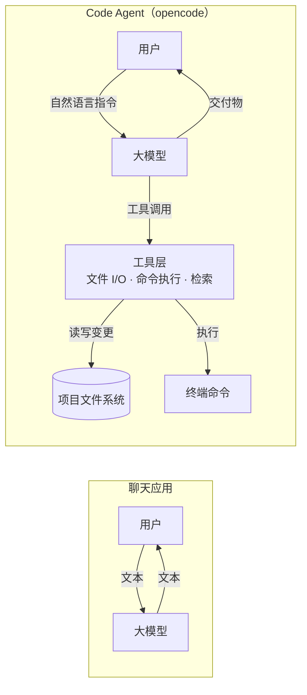
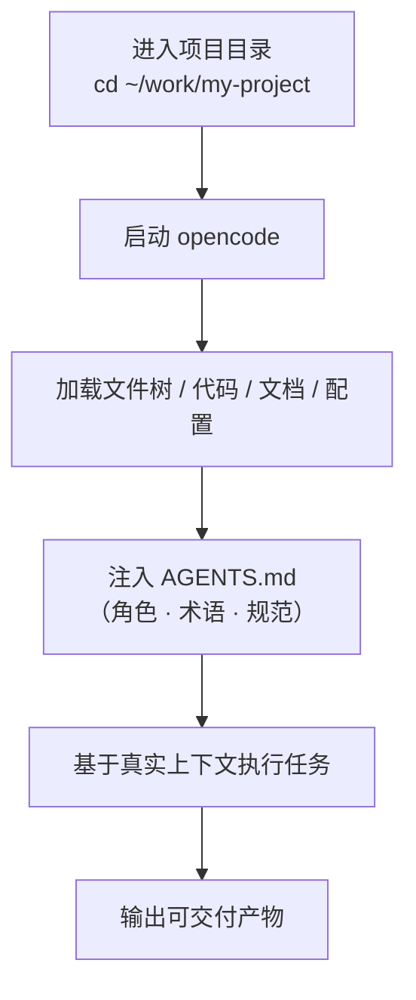
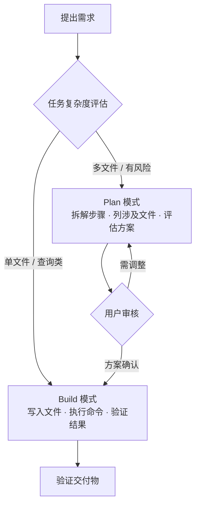
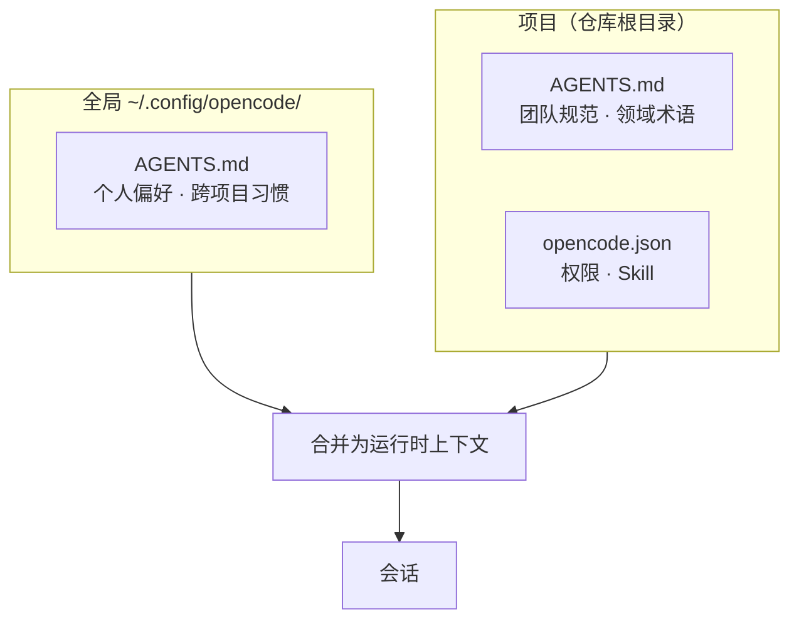
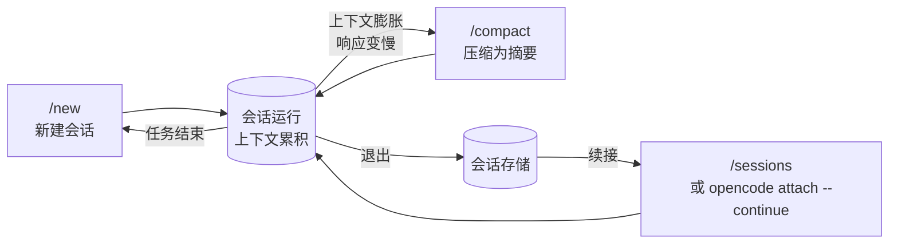
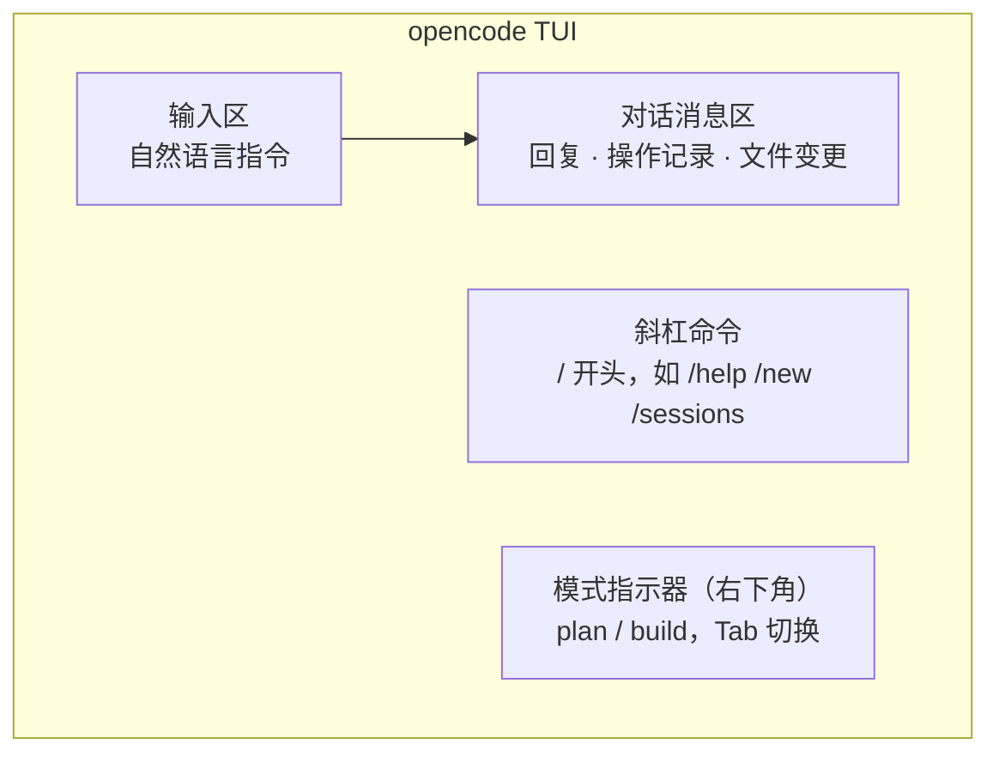
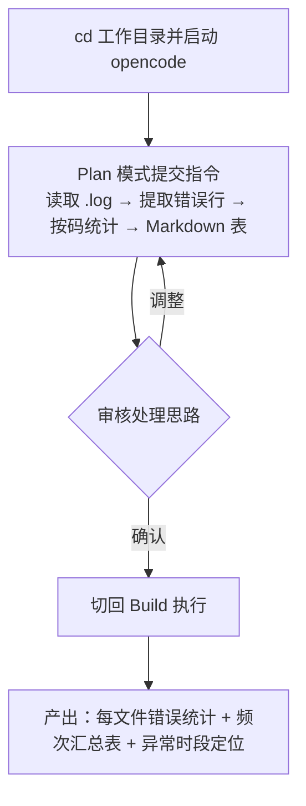

# 《opencode 工具使用入门》PPT 原始材料

> **目标受众**：两类——① 仅使用过聊天式大模型应用（ChatGPT / DeepSeek 网页版）的同事；② 资深半导体工程师与非编程岗同事。两者共性：对"大模型"的认知停留在"问答对话"，不了解 Code Agent 在工程任务中的应用面。
> **核心目标**：建立从"聊天应用"到"Code Agent"的认知差；界定 opencode 在工程工作中的功能边界与典型场景；当天完成安装、配置与首个真实任务。
> **编写规范**：使用工程术语；避免形容词性修饰；以流程图、表格、清单替代段落叙述。

---

## 第一部分　概念建立：聊天应用与 Code Agent 的能力边界

### 1.1 两类工具的边界差异

| 维度 | 聊天应用（Chatbot） | Code Agent（opencode） |
| --- | --- | --- |
| 输入边界 | 用户手动粘贴文本片段 | 读取项目目录的全部文件与结构 |
| 输出形式 | 文本建议、代码片段 | 文件写入、命令执行、结构化交付物 |
| 文件系统 | 无访问权限 | 具备读写权限（受配置约束） |
| 命令执行 | 无 | 具备终端命令执行权限（受配置约束） |
| 网络能力 | 受平台限制 | 可配置 webfetch、检索工具 |
| 状态保持 | 单轮文本对话 | 会话级上下文，跨轮累积 |

### 1.2 架构对比



> **技术原理（面向工程师）**：Code Agent 基于 function calling / tool use 协议运行。大模型输出结构化的工具调用请求，宿主程序（opencode）解析后执行实际 I/O，再将结果回填至上下文，形成"推理—执行—观测"闭环。聊天应用无此执行层，故输出止于文本。

### 1.3 opencode 的技术定位

- **运行形态**：终端 TUI 为主，另支持 Web 界面与命令行（headless）模式
- **模型无关（provider-agnostic）**：解耦大模型服务商；企业版登录后自动完成模型接入
- **开源协议**：代码可审计、可自托管

---

## 第二部分　opencode 能力总览与使用场景

> 本部分回答听众的核心疑问：**opencode 在日常工作中能执行哪些任务、产出什么交付物。**

### 2.1 核心能力清单

| 能力 | 技术内涵 | 工作中的对应操作 |
| --- | --- | --- |
| **上下文感知** | 以启动目录为工作区，加载文件树、代码、文档、配置 | 无需粘贴，直接引用项目内任意文件 |
| **文件读写** | 在工作区内创建、修改、删除文件（受权限约束） | 改源码、生成脚本、产出文档 |
| **命令执行** | 调用 shell 执行命令，捕获 stdout / stderr | 跑脚本、装依赖、查日志、运行测试 |
| **工具调用** | 按协议调用检索、网络抓取等外部工具 | 查 API 文档、抓取最新规范 |
| **会话管理** | 跨轮保持上下文，支持压缩、续接、派生 | 多轮迭代同一任务 |

### 2.2 上下文感知流程



> 与聊天应用的本质差异：opencode 以项目文件作为上下文来源，而非依赖用户文本输入。这决定了它的输出绑定具体工程现场。

### 2.3 六类通用场景

| # | 场景类别 | 典型指令 | 交付物 |
| --- | --- | --- | --- |
| 1 | 代码理解 | "梳理该模块的调用链与数据流" | 结构图 + 逐层说明 |
| 2 | 代码修改 / 缺陷修复 | "定位登录接口超时根因并修复" | 修改后的代码 + 变更说明 |
| 3 | 脚本 / 自动化 | "编写批处理脚本重命名该批文件" | 可执行脚本 + 使用说明 |
| 4 | 资料检索 | "检索该库当前版本 API 用法" | 带来源链接的资料 |
| 5 | 数据分析 | "统计该日志错误码频次" | 汇总表 / 图表 / 报告 |
| 6 | 文档整理 | "依这些笔记生成 SOP" | 结构化文档 |

### 2.4 半导体产线场景示例

> 面向两类受众的具体映射，便于判断各自岗位的接入点。

| 岗位 / 任务 | opencode 可执行操作 | 交付物 |
| --- | --- | --- |
| **测试工程师** — ATE 测试日志 | 读取机台 `.log`，提取 fail bin 与错误码，统计频次与时段分布 | 错误码汇总表 + 异常时段定位 |
| **测试工程师** — 测试程序代码 | 阅读测试程序（C / C++ / 向量文件），梳理测试项调用关系 | 调用结构图 + 逐项说明 |
| **良率 / 数据工程师** — 测试数据 | 处理导出的 CSV / 数据表，按 lot、wafer、bin 维度统计 | 良率分布表 + 图表 |
| **产品 / 应用工程师** — Spec 整理 | 依据 datasheet / 测试规范生成检查清单与 SOP | 结构化文档 |
| **非编程岗** — 报告整理 | 整理会议纪要、周报，按指定模板排版 | 排版后的报告 |

### 2.5 工时对比（参考量级）

| 任务 | 传统流程 | opencode 流程 |
| --- | --- | --- |
| 解析 100MB 日志提取错误 | 编写并调试脚本：30–60 min | 自然语言指令：数 min |
| 给陌生项目新增功能 | 通读代码理解架构：半天 | Plan→Build 流程：数十 min |
| 整理会议纪要为报告 | 手动排版：1 h | 指令 + 模板：数 min |

> 注：上表为量级参考，实际取决于任务复杂度与上下文规模。

---

## 第三部分　工作模式：Plan / Build

### 3.1 双模式的设计动机

opencode 具备文件写入与命令执行权限，故需区分"规划"与"执行"两个阶段，以降低误操作风险：

- **Plan 模式**：仅推理、拆解步骤、列出涉及文件与方案，不产生任何文件变更
- **Build 模式**：按已确认方案执行写入、命令、验证

### 3.2 标准工作流



### 3.3 操作方式

| 操作 | 键位 / 命令 | 效果 |
| --- | --- | --- |
| 进入 Plan | `Tab`（右下角显示 `plan`） | 禁用写入与执行 |
| 进入 Build | `Tab`（右下角显示 `build`） | 启用写入与执行（仍受权限约束） |

> **决策准则**：多文件变更、生产/敏感环境、不可逆操作 → 先 Plan；读取、查询、单文件微调 → 直接对话即可。

---

## 第四部分　配置体系

### 4.1 配置层级



| 配置文件 | 作用域 | 共享范围 | 内容定位 |
| --- | --- | --- | --- |
| `~/.config/opencode/AGENTS.md` | 全局 | 仅本人 | 个人偏好、跨项目工具链习惯 |
| `项目根/AGENTS.md` | 项目 | 随仓库提交，团队共享 | 项目结构、编码规范、领域术语 |
| `项目根/opencode.json` | 项目 | 随仓库提交 | 权限策略、Skill 开关 |

### 4.2 AGENTS.md：项目上下文规约

- 每次会话启动时自动注入系统上下文
- 单次编写，跨会话生效，避免每轮重复输入背景信息
- 使用 `/init` 引导式生成或更新，无需从零编写

**四段式模板：**

```markdown
# 角色与背景
你是 [部门/岗位] 的 [专业身份]，负责 [主要职责]。

# 领域术语
- 术语A：定义（避免按通用语义误解）
- 术语B：定义

# 代码与输出规范
- 语言/框架：[…]
- 健壮性要求：[…]
- 输出风格：结果导向 / 简洁

# 安全与约束
- 敏感环境先确认再执行
- 红线：[…]
```

> 编写要点：写入"模型未知、但岗位必需"的信息——领域术语、常用命令、代码规范。避免写入默认设定（如"你是一个 AI 助手"）。

### 4.3 Skill：领域专用能力扩展

- Skill = 打包的"领域知识 + 操作流程"，按需加载，平时不占用上下文预算
- 触发方式：对话中提出对应需求，由 opencode 判断加载；或在配置中显式启用

| Skill | 能力 | 触发场景 |
| --- | --- | --- |
| web search | 联网检索 | 查 API 文档、行业标准 |
| planning | 结构化任务拆解 | 复杂任务前置规划 |
| review | 成果审查 | 提交前自查 |
| debugging | 系统化排错 | 缺陷定位 |

权限开关（`opencode.json`）：

```json
{
  "$schema": "https://opencode.ai/config.json",
  "permission": { "skill": "allow" }
}
```

### 4.4 权限与安全策略

**默认机制**：写文件、执行命令等敏感操作执行前请求用户批准，构成默认访问控制层。

```json
{
  "$schema": "https://opencode.ai/config.json",
  "permission": {
    "edit": "ask",
    "bash": "ask",
    "webfetch": "allow"
  }
}
```

| 场景 | 推荐策略 |
| --- | --- |
| 生产环境、重要数据、不可逆操作 | 先 Plan 后 Build，逐条确认，`permission` 设为 `ask` |
| 共享代码库主干分支 | 谨慎操作，避免误改他人提交 |
| 沙盒、独立分支、本地实验 | 可放开为 `allow`，降低交互成本 |
| 不确定的命令 | 先要求 opencode 说明该命令作用再批准 |

---

## 第五部分　会话管理

### 5.1 概念

- **会话（Session）** = 一次连续对话的完整上下文
- 会话内上下文跨轮累积，支持多轮迭代
- 上下文规模与响应时延、token 消耗正相关 → 需主动管理

### 5.2 会话生命周期



### 5.3 常用命令

| 命令 | 别名 | 作用 |
| --- | --- | --- |
| `/new` | `/clear` | 新建会话，清空当前上下文 |
| `/sessions` | `/resume` `/continue` | 列出历史会话，切换或续接 |
| `/compact` | `/summarize` | 压缩当前上下文为摘要 |
| `/help` | — | 列出全部命令 |

终端续接：

```bash
opencode attach --continue                 # 续接最近一次会话
opencode attach --session <session-id>     # 指定会话续接 / --fork 派生
```

### 5.4 决策表

| 情况 | 操作 |
| --- | --- |
| 任务结束，切换主题 | `/new` |
| 上次任务未完成 | `/sessions` 或 `opencode attach --continue` |
| 对话过长，响应变慢 | `/compact` |
| 方向偏离 | `/new` 重新描述需求 |

---

## 第六部分　界面认知与安装上手

### 6.1 TUI 界面分区



| 元素 | 触发 | 用途 |
| --- | --- | --- |
| 斜杠命令 | 输入 `/` | 唤起命令面板 |
| 模式切换 | `Tab` | Plan ↔ Build |

### 6.2 安装（三选一）

```bash
# 方式一：官方脚本
curl -fsSL https://opencode.ai/install | bash

# 方式二：Homebrew（macOS / Linux）
brew install anomalyco/tap/opencode

# 方式三：npm 全局
npm install -g opencode-ai
```

### 6.3 启动

```bash
cd ~/work/my-project   # 进入工作区目录（代码库 / 数据目录 / 笔记仓库均可）
opencode               # 以该目录为工作区启动
```

---

## 第七部分　首个真实任务（Demo）

### 7.1 场景

工作目录下有一批软件运行日志，目标：提取错误行、按错误码统计频次、输出 Markdown 表格。

### 7.2 执行流程



**分步指令：**

```text
# 第二步（Plan 模式）
请读取当前目录下所有 .log 文件，提取 Error / ERROR / 错误行，
按错误码统计频次，输出 Markdown 表格。先切到 Plan 模式说明处理思路。

# 第三步（审核通过后切 Build）
思路确认，切回 Build 模式执行。
```

### 7.3 要点

- 用到的能力：上下文感知（无需粘贴日志）、Plan（先审方案）、Build（执行）
- 全程未复制文件内容，由 opencode 直接读取

---

## 第八部分　上手步骤 Checklist

- [ ] 1. 安装 opencode（install 脚本 / brew / npm 三选一）
- [ ] 2. 登录企业账号（自动完成模型配置）
- [ ] 3. 进入真实项目目录启动 opencode
- [ ] 4. `/init` 生成首个 AGENTS.md（先写角色 + 术语）
- [ ] 5. 提出一个项目相关问题，验证上下文感知
- [ ] 6. Plan 模式规划一项小任务，确认后切 Build 执行
- [ ] 7. 走一遍 `/new` · `/sessions` · `/compact`
- [ ] 8. 完成一个真实任务（如第七部分日志统计 Demo）
