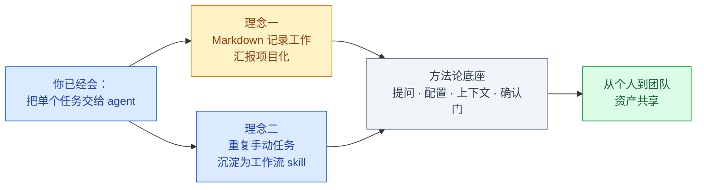
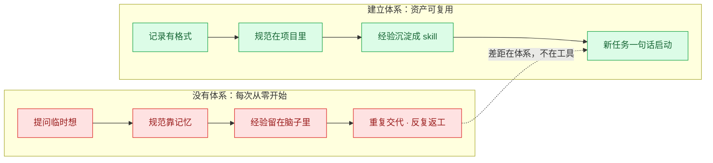
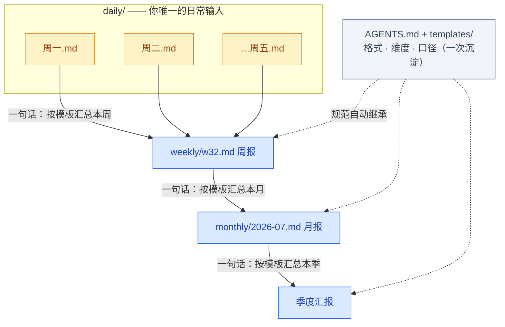
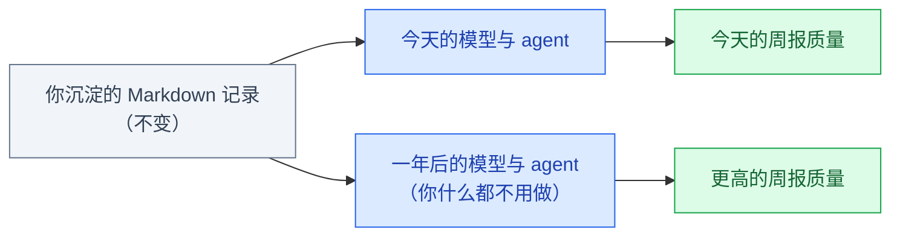
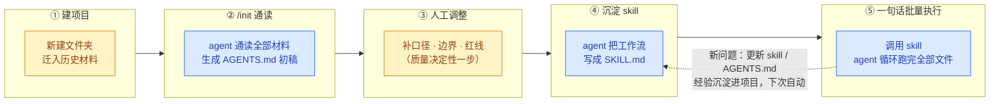
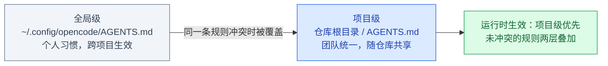
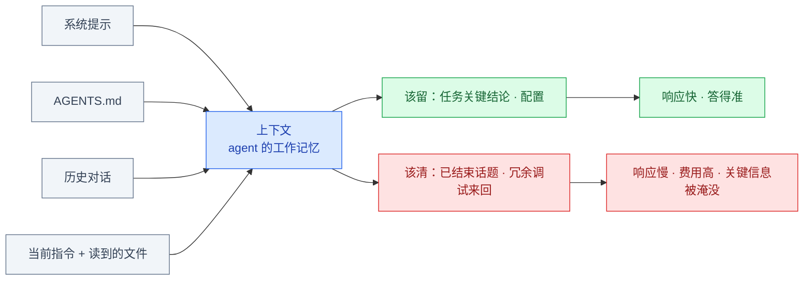
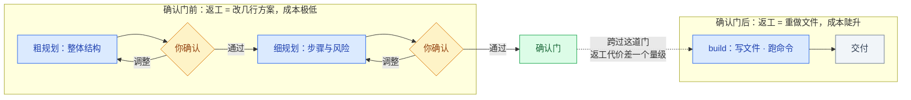

# opencode 进阶：用 Markdown 与 Skill 建立你的工作体系

| | |
| --- | --- |
| **写给谁** | 已读完入门篇、独立完成过至少一个任务的同事 |
| **前置要求** | 入门篇的原理（agent 循环）、Plan / Build、AGENTS.md、权限确认 |
| **读完能做什么** | 建立两个可持续增值的工作体系：① Markdown 工作汇报项目；② 把重复手动任务沉淀为可批量执行的工作流 skill |

> **怎么用这份文档**：现场演示时按 `---` 分隔逐节推进；课后两个实战（2.7、3.7）可以直接照做——它们就是搭体系的操作手册。

> 这张图在说什么：本篇两条主线——理念一把你的**记录**变成资产，理念二把你的**流程**变成资产；方法论底座决定两条线的产出质量，最终汇入团队共享。



---

## 第一部分　从会用到体系化

> **本节回答**：同样会用 opencode，为什么产出差距很大？本篇的结构是什么？

### 1.1 差距在哪

入门篇教你把**一件事**交给 agent。但"会用"的状态是：每次任务从零开始——提问临时想、规范靠记忆、经验留在脑子里。任务越攒越多，每次的交代成本不变，甚至随上下文变长而上升。

**体系化**改变的是三样东西：**记录的格式、沉淀的位置、复用的方式**。

> 这张图在说什么：没有体系时，每次任务都从零开始，重复交代、反复返工；建立体系后，格式、规范、经验都沉淀为项目里的资产，新任务一句话启动。两者的差距不在工具版本，在有没有体系。



### 1.2 本篇结构

| 部分 | 内容 | 回答什么 |
| --- | --- | --- |
| 第二部分 | **理念一：Markdown 汇报项目** | 工作记录怎么变成随模型升值的资产 |
| 第三部分 | **理念二：手动任务 → 工作流 skill** | 批量重复劳动怎么变成一句话 |
| 第四部分 | 方法论底座 | 提问 / 配置 / 上下文 / 确认门 |
| 第五部分 | 从个人到团队 | 资产怎么共享、新人怎么继承 |

### 1.3 常见偏差对照

| 偏差现象 | 根因 | 去哪看 |
| --- | --- | --- |
| 答非所问、方向跑偏 | 提问信息不足 | 4.1 五段式 |
| 术语理解偏差 | 配置未覆盖领域术语 | 4.2 配置 |
| 越聊越慢、越来越贵 | 上下文累积未清理 | 4.3 上下文 |
| 反复返工 | 确认门前打磨不足 | 4.4 确认门 |
| 每次汇报都要重新想格式 | 记录没有项目化 | 第二部分 |
| 批量任务还在手动做 | 流程没有 skill 化 | 第三部分 |

> **带走一句话**：同一份工具，"会用"产出单件任务，"有体系"产出可复用资产——差距在记录的格式、沉淀的位置、复用的方式。

---

## 第二部分　理念一：Markdown 是与大模型沟通的原生语言

> **本节回答**：记录工作的格式为什么选 Markdown？工作汇报项目长什么样、怎么搭？为什么说这批记录是随模型升级而升值的资产？

### 2.1 一个熟悉的负担

月底写周报、月报、季度汇报时的真实过程：翻聊天记录、翻邮件、回忆三周前做过什么——**每次总结都要重新思考一遍"该汇报什么、怎么汇报"**。汇报的格式、维度、口径全部存在你脑子里，每次手动重新组织，每次花掉半天。

这件事 agent 能接管的前提只有一个：**你的工作记录以它能读写的方式存在**。这就引出了格式问题。

### 2.2 为什么是 Markdown

| 维度 | Word / PPT | Excel | **Markdown** |
| --- | --- | --- | --- |
| agent 直接读 | 格式噪声重 | 能读，结构受限 | 纯文本 + 结构标记，直接读 |
| agent 直接写 | 困难 | 困难 | 直接写，且可套模板规范 |
| 逐行对比（diff，版本差异对比） | 二进制，不可比 | 不可比 | 天然支持，改了哪行一目了然 |
| 模板化 | 手动套用 | 手动套用 | 模板即文件，agent 参数化填充 |
| 跨层级聚合（日→周→月） | 复制粘贴 | 手动透视 | **一句话聚合** |

结论一句话：**Markdown 是 agent 世界的通用交换格式**——你交给它的素材、它还给你的成品，是同一种结构化纯文本。格式一旦统一，"记录"和"汇报"之间就再也没有搬运成本。

### 2.3 工作汇报项目：一次搭建

在本地建一个文件夹，把汇报这件事项目化：

```text
work-reports/                 ← 工作汇报项目（一个文件夹）
├── AGENTS.md                 ← 汇报规范：格式、维度、口径、红线
├── templates/                ← 模板：日报 / 周报 / 月报 / 季度
├── daily/                    ← 每日工作记录（你唯一的日常输入）
│   ├── 2026-08-11.md
│   └── 2026-08-12.md
├── weekly/                   ← 周报（agent 聚合生成）
├── monthly/                  ← 月报 / 季度汇报（再聚合）
└── assets/                   ← 图表与截图
```

这个结构和入门篇的原理一一对应：AGENTS.md 是"项目须知"（自动加载），templates/ 是格式规范，daily/ 是素材源，weekly/、monthly/ 是成品区。

### 2.4 汇报自动生长

> 这张图在说什么：你唯一的日常输入是 daily/ 里几分钟的事实记录（琥珀色）。周报、月报、季度汇报不是"重新写"，是"按模板聚合"（蓝色为 agent 生成）：每层只需要一句话。格式、规范、内容布局不靠每次交代——它们在 AGENTS.md 和 templates/ 里，每一层自动继承。



效率、内容总结、格式规范，都在这张图里解决了。剩下的问题是：**汇报的"维度"从哪来**——一份周报该有哪些思考角度，凭什么 agent 知道？

### 2.5 汇报的"维度"从哪来

第一次生成的周报不会完美。关键动作是：每次你做的调整——"缺了风险项""进度要分档""这个数据口径不对"——都让 agent **写回模板或 AGENTS.md**，而不是只改这一份周报。

几轮之后，项目里沉淀的模板就是这个岗位的汇报框架：该有哪些维度的思考、什么算经验总结、什么必须置顶，agent 每次生成都按这个框架来。

**agent 不是天生懂你的汇报，是项目教会它的**——而且教一次，永久生效。这正是"格式、规范、内容布局自动继承"的来源：不是模型的猜测，是你自己沉淀的规范。

### 2.6 记录是随生态升值的资产

> 这张图在说什么：你沉淀的 Markdown 记录（灰色）不需要变动；模型与 agent 持续升级（蓝色），同一批记录的产出质量（绿色）自动提升。记录不贬值，反而随生态升值——这是 Word 时代的文档不具备的性质。



模型换代、上下文窗口变长、工具变强——每次升级，同一批记录的产出自动变好。所以**记录本身就是资产**，而且是最早开始记、复利时间最长。这也是"从今天开始"的理由。

### 2.7 实战：从零搭建 work-reports

六步，半天完成，此后长期生效：

| 步 | 做什么 | 怎么做 |
| --- | --- | --- |
| ① | 建目录、集素材 | 建好 2.3 的目录结构，把近期零散记录（邮件、聊天摘录、便签）集中放进 `daily/` |
| ② | 生成须知 | 在 opencode 里打开 work-reports/，输入 `/init`，得到 AGENTS.md 初稿 |
| ③ | 人工调整 | 补汇报口径（如"进行中事项标进度百分比"）、岗位术语（bin / lot）、红线 |
| ④ | 沉淀模板 | 让 agent 从历史记录归纳周报模板，人工修一版存入 `templates/weekly.md` |
| ⑤ | 日常运转 | 每天花几分钟写 `daily/` 记录；周五一句话生成周报 |
| ⑥ | 持续调优 | 每次不满意 → 改的是模板和 AGENTS.md，不是重新交代 |

关键 prompt 示例：

```text
# 步骤 ④：归纳周报模板
读取 daily/ 目录下全部工作记录，归纳出一份周报模板：
包含本周完成事项、进行中事项（标进度百分比）、下周计划、风险与求助四个部分。
先给我看模板结构，确认后写入 templates/weekly.md。

# 步骤 ⑤：每周五的一句话
按 templates/weekly.md 汇总 daily/ 本周的记录，生成本周周报到 weekly/。
```

> **带走一句话**：把"汇报什么、怎么汇报"沉淀进项目，你只负责记录事实——组织、格式、维度由 agent 从项目规范里继承。

---

## 第三部分　理念二：把重复手动任务沉淀为工作流 Skill

> **本节回答**：批量手动任务为什么必须换方法？旧路径为什么走不通或走不远？五步法怎么把它变成一句话可调用的工作流？

### 3.1 一个线性增长的任务

任务单元很常见：打开一个 Excel → 按口径统计 → 截关键图 → 粘进报告 → 写结论。单次约 20 分钟。

问题在乘法：30 个文件就是一整天；下周口径调整，全部重做；任务量越大，重复劳动越多。而且：

- 新问题出现，人工要做的事更多，经验只能自己写成 SOP 文档；
- SOP 是给**人**看的——新人接手还是要从头教，机器执行不了；
- 团队里每个人的经验各自存放，无法形成有效共享。

大批量的手动操作，**必须换自动化方法**。

### 3.2 旧路径的三条堵

| 路径 | 堵点 |
| --- | --- |
| **纯人工** | 工作量随任务量线性增长；口径一变全部重做；经验只在个人脑中，SOP 难维护难共享 |
| **找 IT 部门开发** | 需求要翻译成工单，排期以周计；小口径变更也要走流程；开发者不懂业务口径 |
| **自学 Excel 函数 / 编程** | 有门槛；写出来只解决当时那个口径；出问题自己扛；换个人就没法维护 |

三条路的共同问题：**业务口径（只有你懂）和执行能力（程序才有）始终分家**。大模型 + agent 第一次把它们合到一起：你用自然语言沉淀口径，agent 负责执行。

### 3.3 新路径：五步法

> 这张图在说什么：把一次性的手动任务变成可持续资产，只需要五步。注意颜色的分工：①③是你出手（建项目、定规范），②④⑤是 agent 出手（通读、写 skill、批量执行）。第③步是质量的决定性步骤——人工针对性调整。虚线是反馈回路：新问题回流到 skill，越用越强。



逐步说明：

1. **建项目**：新建文件夹，把之前沉淀的材料（历史报表、Excel、旧 SOP）全部迁进去——材料本身就是规范的一部分，agent 要从它们里学口径。
2. **`/init` 通读**：agent 通读全部材料，生成 AGENTS.md 初稿——它第一次"理解"你的业务。
3. **人工调整**：补口径、边界、红线——**五步里唯一必须人来做的步骤**，后续产出质量取决于这一步做得多细。
4. **沉淀 skill**：让 agent 把这次跑通的工作流写成 SKILL.md（见 3.4）。
5. **一句话调用**：之后每次新任务就是"跑一遍 batch-report skill"，agent 在循环里批量、自动地完成，你只审最终汇总。

### 3.4 Skill：可执行的 SOP

**Skill**：一份用自然语言写的"行动脚本"——触发条件 + 步骤 + 输入输出规范 + 已知的坑。agent 执行时把它装进上下文，循环按脚本走；平时不加载、不占上下文，触发才生效。

用入门篇的循环理解：skill 就是**预先写好的循环剧本**——agent 不再每次现场决定怎么做，而是按你沉淀过的流程执行。

与 SOP 文档的本质区别：**SOP 给人看，skill 给 agent 执行**。一个 SKILL.md 骨架长这样：

```markdown
# batch-rc-report：接触电阻批量报告

## 什么时候用
用户给出若干 rc_*.csv（或一个目录），要按批次出统计报告时。

## 步骤
1. 读取全部 rc_*.csv，校验列：wafer_id, die_x, die_y, rc_mohm
2. 按批次统计：均值 / 标准差 / 超 50mΩ 占比
3. 每批生成分布图，存入 assets/
4. 汇总为 reports/rc_report_日期.md，异常批次标 ⚠ 并置顶

## 口径（2026-08 讨论沉淀）
- 边缘 Die 异常不算批次失败，单独列一节
- CPK 低于 1.33 必须标注

## 坑
- w23 批次表头带 BOM，先清理再解析
```

### 3.5 经验沉淀飞轮

> 这张图在说什么：体系运转后的增长回路——新问题出现，人只需要几句话把规范写进 skill 或 AGENTS.md，agent 从此自动处理；人工时间被释放，去接住更大的任务量。经验的沉淀位置从"个人脑子和 SOP 文档"变成"项目文件"——agent 能直接执行，团队拷走文件夹就能共享。


对照 3.1 的困境：口径变更从"全部重做"变成"说一句话"；新人上手从"从头教"变成"拷文件夹"；经验从"个人脑中"变成"项目里的可执行资产"。

### 3.6 四条路对比

| 维度 | 纯人工 | Excel 函数 / 自写脚本 | IT 开发 | **agent 工作流 skill** |
| --- | --- | --- | --- | --- |
| 首次上手 | 无 | 数小时～数天 | 需求沟通 + 数周排期 | **半天**（init + 调整 + 沉淀） |
| 单次执行 | 每次 20 分钟起 | 分钟级，人要盯 | 自动，但改不动 | **一句话，人只审总表** |
| 口径变更 | 全部重做 | 改公式 / 改代码 | 提需求等排期 | **说一句，agent 更新 skill** |
| 经验沉淀 | 个人脑中 + SOP 文档 | 代码里，难读 | 别人的代码库里 | **skill 里，自然语言可读** |
| 团队共享 | 口口相传 | 发文件 + 口口相传 | 走 IT 流程 | **拷走文件夹即共享** |

### 3.7 实战：测试数据批处理

场景：每周收到若干批次的接触电阻数据 `rc_*.csv`，需要逐批统计均值 / 标准差 / 异常占比、标注 CPK 低于 1.33 的批次、每批出一张分布图，最后汇总成周报的一部分。

五步法落位：

| 步 | 本例的做法 |
| --- | --- |
| ① 建项目 | 建 `rc-reports/`，迁入近几个月的历史 csv 和旧报表 |
| ② /init | agent 通读后生成 AGENTS.md：数据列含义、批次的定义、单位口径 |
| ③ 人工调整 | 补两条口径（见 3.4 骨架里的"口径"节）和 BOM 的坑 |
| ④ 沉淀 skill | 让 agent 把跑通的处理流程写成 3.4 的 SKILL.md |
| ⑤ 一句话执行 | 每周："跑一遍 batch-rc-report，处理本周的 rc_*.csv" |

首次投入约半天；从此每周的工作从一整天变成"一句话 + 审核一份汇总表"。

> **带走一句话**：批量手动任务的终点不是"更熟练地手动"，是把工作流沉淀为 skill——口径变更一句话，新问题进规范，经验随项目共享。

---

## 第四部分　方法论底座

> **本节回答**：两个理念决定方向，什么决定产出质量？——四块可直接套用的方法。

### 4.1 提问：五段式

> 这张图在说什么：模糊指令留给 agent 大量猜测空间（它只能按通用理解补齐），结果是通用回答和反复返工；五段式每一段都在压缩猜测空间，产出一次到位。


| 段 | 回答什么 | 例子 |
| --- | --- | --- |
| 背景 | 场景 / 已有条件 | "yield_q3.csv 是 Q3 各产品线良率数据" |
| 目标 | 要实现什么 / 验收标准 | "按 product 分组，输出每周良率" |
| 约束 | 限制与红线 | "CPK 低于 1.33 的批次必须标注" |
| 输入 | 相关文件路径 | "./data/yield_q3.csv" |
| 输出 | 文件格式 / 保存位置 | "Markdown 表格，存为 yield_report_q3.md" |

**不必每次写满五段，缺哪段补哪段**——核心是把脑中"默认成立"的前提显式写出来。三个技巧：给示例（对齐格式优于描述）、分步骤（先…再…）、定输出（表格结构 / 文件命名）。

### 4.2 配置：双层与术语

> 这张图在说什么：配置有两层——全局级放个人习惯，项目级放团队统一规范；同一条规则冲突时项目级覆盖全局级，未冲突的规则两层叠加。这决定了"团队项放项目级、个人项放全局级"的分工。



| 层级 | 写什么 | 谁维护 |
| --- | --- | --- |
| 项目级 | 团队统一项：领域术语、规范、目录约定 | 团队共同，随仓库提交 |
| 全局级 | 个人私有项：个人偏好、通用习惯 | 个人，不共享 |

团队已有规范文档的，直接在 `opencode.json` 里引用、不重复搬运（支持 glob 通配）：

```json
{
  "$schema": "https://opencode.ai/config.json",
  "instructions": [
    "docs/development-standards.md",
    "test/testing-guidelines.md"
  ]
}
```

**术语消歧**是配置里最有价值的资产——同一词汇通用义与专业义不一致时必须显式定义，否则 agent 按通用义理解：

| 术语 | 通用语义 | 专业语义（需配置） |
| --- | --- | --- |
| Yield | 产量 / 收益 | **良率**：合格品占总数比例 |
| Probe | 探测 | **探针测试**：晶圆级电性测试 |
| DOE | 易与能量符号混淆 | **实验设计**：优化工艺参数 |

办公岗位同理："闭环""对齐""抓手"在不同公司含义不同，定义清楚再交付。

### 4.3 上下文：循环的工作记忆

入门篇讲过：agent 只看得见上下文。上下文里的每一项都计入 **token**（大模型计量与计费的最小单位，约一个词或一个汉字片段）——上下文越长，响应越慢、费用越高。

> 这张图在说什么：上下文是四路输入的累加。关键不是总量大，而是"该留的没留、该清的没清"——无关历史挤占注意力，重要信息被淹没。



三条管理纪律：

| 纪律 | 操作 |
| --- | --- |
| **输入侧** | 能让它读文件就不粘贴；超大日志先提取关键行（如 `grep -E "ERROR|WARN" large.log > filtered.txt`）再交给它 |
| **会话侧** | 新任务 `/new`；长任务阶段性 `/compact`（压缩为摘要）；方向跑偏果断 `/new`，不在错误方向消耗 |
| **时机** | 响应明显变慢、长任务只剩收尾、话题从 A 转 B 但要保留 A 的结论——这三个信号出现就该 `/compact` |

### 4.4 确认门：返工成本的分水岭

> 这张图在说什么：Plan→Build 的切换点是一条"成本悬崖"——跨过它之前返工，改的是几行方案文字；跨过之后返工，重做的是文件和执行。所以复杂任务要在确认门前多轮打磨：先粗规划对齐结构，再细规划对齐步骤与风险。



一条 Plan 的完整拆解应覆盖三个维度：**空间**（会读 / 改 / 新建哪些文件）、**时间**（步骤顺序与每步验收点）、**兜底**（风险与回滚方案）。方向性返工的代价比细节返工大一个量级——这是全篇最核心的一条纪律。

> **带走一句话**：具体提问压缩猜测空间，配置覆盖术语与规范，上下文该清则清，确认门前多打磨——四件事决定同一份工具的产出上限。

---

## 第五部分　从个人到团队

> **本节回答**：个人体系怎么变成团队资产？效果怎么评估？

### 5.1 三个可共享的资产

| 资产 | 个人形态 | 团队形态 |
| --- | --- | --- |
| **工作汇报项目** | 自己的 work-reports/ | 部门标准目录结构 + 统一模板，新人入职即继承整套汇报框架 |
| **Skill 库** | 自己沉淀的 SKILL.md | 团队认可的 skill 集中存放 + 使用场景清单，减少全员试错 |
| **AGENTS.md 分层** | 全局级个人习惯 | 项目级团队规范随仓库生效，新人拉取即用，无需培训 |

对照第三部分的飞轮：个人体系的经验沉淀在项目文件里，天然具备团队流动性——**拷走文件夹就是共享**，不需要口口相传。

### 5.2 效果评估：用可观察信号

| 信号 | 观察方式 |
| --- | --- |
| 采用率 | 团队成员用 agent 完成任务的频次 |
| 复用数 | 沉淀的模板 / skill / 会话被复用的次数 |
| 沉淀量 | AGENTS.md、模板、skill 的增量 |

> 纪律：无实测数据时标"预估 / 待实测"，或直接用可观察信号——不引用未实测的百分比。

> **带走一句话**：个人体系的终点是团队资产——汇报项目标准化、skill 入库、规范随仓库流转，新人入职即继承全部经验。

---

## 排错速查

> 遇到问题先对照定位根因，再去对应章节。

| 现象 | 根因 | 去哪看 |
| --- | --- | --- |
| 回答不准确、答非所问 | 提问信息不足 / 术语未消歧 | 4.1 五段式 / 4.2 术语消歧 |
| 回答方向跑偏 | 纠偏不及时 | 入门篇 5.4 追问与纠偏 |
| 输出质量不可控 | 缺审核标准 | 入门篇 5.5 审核清单 |
| 越聊越慢 / 越来越贵 | 上下文累积未清理 | 4.3 上下文管理 |
| 每次汇报重新想格式 | 记录未项目化 | 第二部分 汇报项目 |
| 批量任务还在手动做 | 流程未 skill 化 | 第三部分 五步法 |
| 口径一变全部重做 | 规范未沉淀进 skill / AGENTS.md | 3.4 / 3.5 飞轮 |
| 反复返工 | 确认门前打磨不足 | 4.4 确认门 |

---

> 工具已就位，体系待搭建。从今天的第一篇 daily 记录、第一个项目文件夹开始——**记录即资产，流程即资产**，它们随模型与 agent 的进化持续升值。
