# 《opencode 工程化使用：从功能到方法》

> **内容定位**：从 opencode 的基本功能与工作场景出发，到提问方法、配置、上下文管理，并以一次完整实战打通工程化使用方式。
> **配套形态**：PPT 原始材料；第九章由原《大模型实践落地》内容融入。

---

## 一、opencode 是什么：先界定能力边界

### 1.1 聊天机器人 vs 编程智能体

大模型停留在"对话机器人"认知时，会把它当成"会回答问题的输入框"。opencode 不是输入框——它能进入工作目录、读写文件、执行命令、直接改动产物。

| 维度 | 聊天机器人 | opencode 智能体 |
| --- | --- | --- |
| 输入 | 文本 | 文本 + 文件系统 + 终端 |
| 输出 | 文本回答 | 文本回答 + 文件 + 命令执行结果 |
| 文件读写 | 否 | 是 |
| 命令执行 | 否 | 是 |
| 代码改动 | 给建议（需人复制） | 直接改文件 |
| 多步自主 | 否（一问一答） | 是（Plan / Build 循环） |
| 交付物 | 文本 | 代码 / 报告 / 脚本 / 可运行文件 |

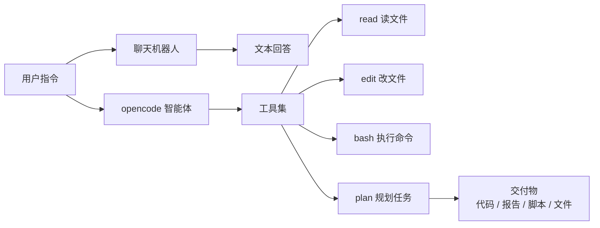

### 1.2 工具集与工作循环

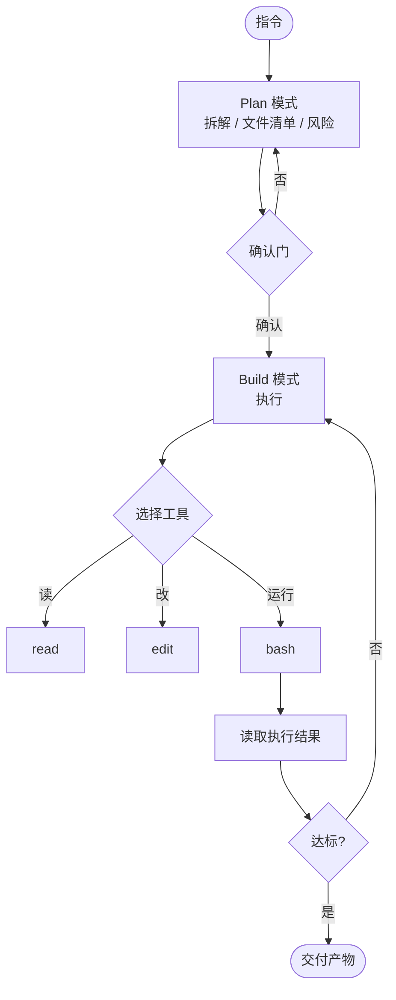

- **Plan 模式**：只规划不动手，产出步骤清单、涉及文件、风险点，等人确认
- **Build 模式**：按确认后的方案执行，调用工具改动文件系统
- **确认门**：Plan 与 Build 之间的拦截点，决定是否进入执行

### 1.3 产出结果的三个因子

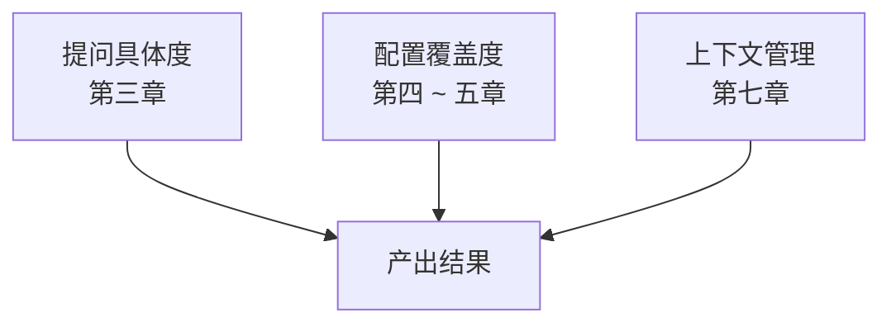

工具能力恒定，**变量是使用方式**。同一份 opencode，不同输入与配置，产出差距来自这三处。

### 1.4 常见偏差与对应章节

| 偏差现象 | 根因 | 对应章节 |
| --- | --- | --- |
| 答非所问、方向跑偏 | 提问信息不足 | 三、提问方法 |
| 反复返工 | 需求未对齐、确认门缺失 | 三 / 九 |
| 越聊越慢 | 上下文累积未清理 | 七、上下文管理 |
| 术语理解偏差 | AGENTS.md 未覆盖领域术语 | 四、配置 |
| 改错文件 | 未先 Plan | 五、Plan-Build 工作流 |

### 1.5 全篇路线


---

## 二、opencode 在工作中的使用场景

### 2.1 场景矩阵

| 任务类型 | 典型输入 | opencode 动作 | 交付物 |
| --- | --- | --- | --- |
| 数据处理 | 测试 CSV / JSON | 读取 / 清洗 / 统计 | 分析脚本 + 图表代码 |
| 异常排查 | 日志 / 报错堆栈 | 定位根因 / 修复 / 验证 | 修复后的可运行代码 |
| 报告生成 | 数据 + 排版规则 | 填充 / 渲染 | 报告文档 |
| 工艺优化 | 历史批次数据 | 设计实验矩阵 | DOE 方案表 |
| 文档撰写 | 技术笔记 | 整理 / 排版 | 规范文档 |
| 代码审查 | 源码 | 规则检查 / 重构建议 | 审查清单 |
| 自动化 | 重复手工操作 | 编写脚本 | 可复用脚本 |

### 2.2 场景示例（半导体工程）

**示例 A：接触电阻数据异常排查**

```
脚本 analyze_rc.py 处理 rc_w23.csv 时第 58 行报
ValueError。数据列为 wafer_id, die_x, die_y, rc_mohm。
请：
1. 读取脚本与 CSV 前 20 行，定位 ValueError 根因
2. 修复脚本
3. 对全量数据跑通验证
```

**示例 B：良率数据趋势分析**

```
读取 ./data/yield_q3.csv（字段：week, product, yield_pct, defect_mode）。
按 product 分组，输出每周良率与缺陷模式占比的 Markdown 表格，
并标注 CPK 低于 1.33 的批次。
```

**示例 C：DOE 设计**

```
近 3 批接触电阻数据 rc_data.json：均值 45mΩ、标准差 3.5mΩ、
异常 Die 集中于边缘。请设计 3 因子 2 水平 DOE：
针尖压力 50~80μm、清洗周期 50~100 次、测试时间 10~30ms。
目标：降低标准差、CPK 提升至 1.5 以上。
输出实验矩阵与每组采样建议。
```

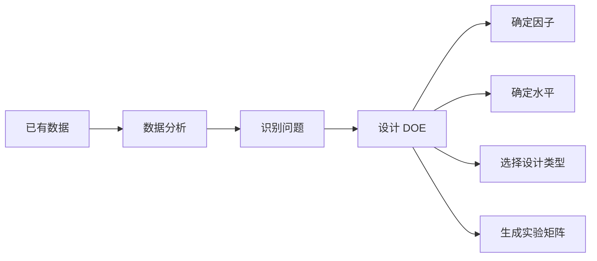

---

## 三、提问方法

### 3.1 提问法则

> 给 opencode 的信息越具体，产出越接近预期。
> 它不具备项目背景，每一条约束都在减少它的猜测空间。

### 3.2 模糊指令 vs 具体指令

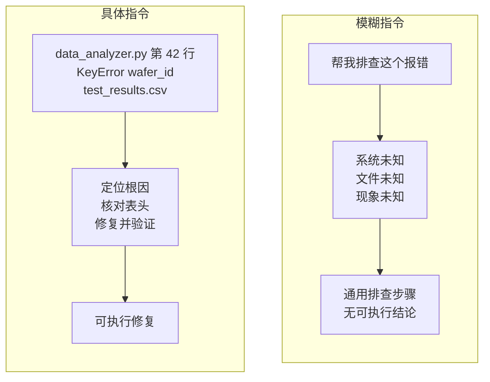

### 3.3 五段式结构


> 不必每次写满五段，**缺哪段补哪段**。核心是把脑中"默认成立"的前提显式写出。

### 3.4 三个技巧

| 技巧 | 操作 | 作用 |
| --- | --- | --- |
| 给示例 | 提供输入/输出样例 | 对齐格式，优于描述 |
| 分步骤 | 拆成有序步骤（先…再…然后…） | 避免跳步 |
| 定输出 | 指定表格 / 脚本结构 / 文件命名 | 产出直接可用 |

---

## 四、配置：AGENTS.md

### 4.1 双层配置与优先级

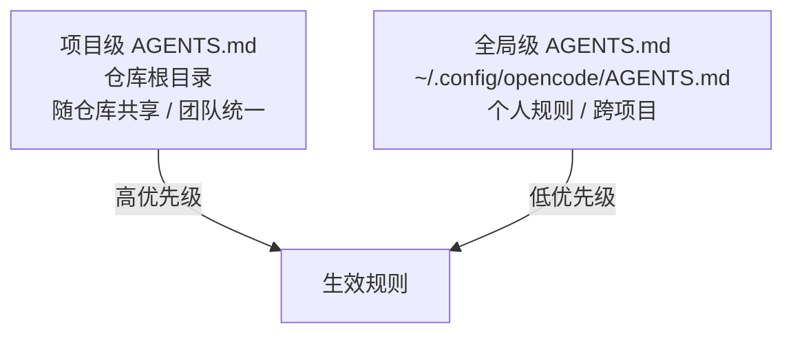

| 层级 | 写什么 |
| --- | --- |
| 项目级 | 团队统一项：领域术语、编码规范、目录约定 |
| 全局级 | 个人私有项：个人偏好、常用工具链、通用习惯 |

### 4.2 opencode.json：引用已有规范文件

```json
{
  "$schema": "https://opencode.ai/config.json",
  "instructions": [
    "docs/development-standards.md",
    "test/testing-guidelines.md"
  ]
}
```

- 团队已有规范文档时直接引用，不重复搬运
- 支持 glob 通配，如 `packages/*/AGENTS.md`

### 4.3 术语消歧

同一词汇，通用语义与专业语义不一致时，需在 AGENTS.md 显式定义：

| 术语 | 通用语义 | 专业语义（需配置） |
| --- | --- | --- |
| Yield | 产量 / 收益 | 良率：合格品占总数比例 |
| Probe | 探测 / 探查 | 探针测试：晶圆级电性测试 |
| DOE | 易与能量守恒符号混淆 | 实验设计：优化工艺参数 |
| SECS/GEM | 无对应通用义 | 半导体设备通讯标准协议 |

### 4.4 配置模板

```markdown
# 角色与背景
你是 [部门] 的 [角色]，负责 [职责1]、[职责2]。

# 专业术语
- 术语A：定义（区分于通用含义）
- 术语B：定义

# 代码与输出风格
- 优先 [语言/框架]，使用 [依赖管理器]
- 代码须满足 [可测性 / 健壮性要求]
- 回答风格：分步骤、结果导向

# 安全与约束
- 涉及 [敏感环境] 先确认安全步骤
- 修改前备份，不直接删除文件
```

> 分项目配置：各项目根目录放独立 AGENTS.md，写该项目独有信息（数据目录结构、特殊编码要求），全局文件保持精简。

---

## 五、Plan-Build 工作流

### 5.1 Plan 拆解三件事

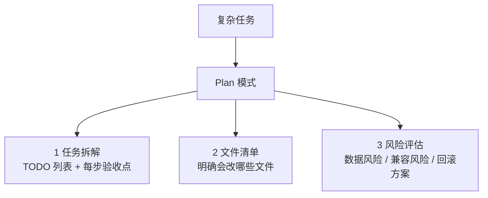

### 5.2 多轮规划：先粗后细

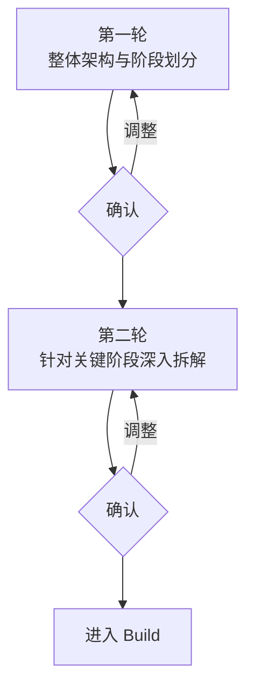

> 确认门设置在执行前，返工成本最低。

### 5.3 三个执行技巧

| 技巧 | 操作 |
| --- | --- |
| 并行任务拆解 | 互不依赖的模块拆为独立任务，分头规划 |
| 增量开发 | 先做最小可用版本，跑通再加功能 |
| 复用已有代码 | 引用项目现有模块，要求保持风格一致 |

---

## 六、Skill 组合

### 6.1 提问框架 + Skill 串联

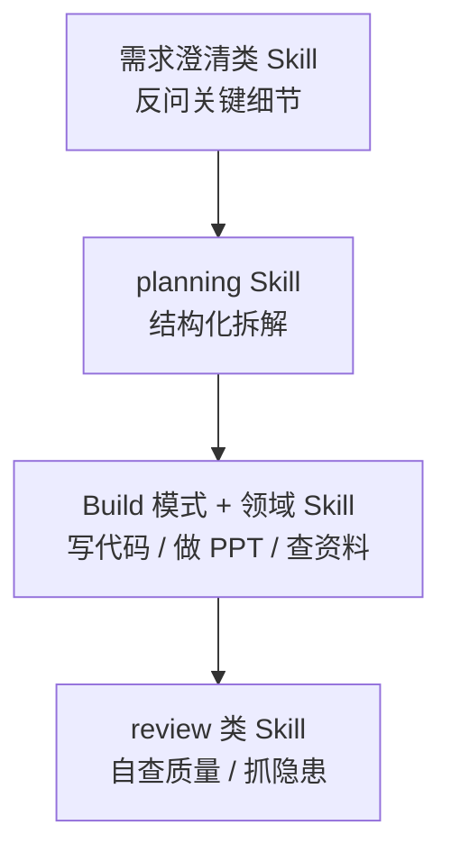

- 单个 Skill 解决单领域问题
- 组合多个 Skill 才能跑通跨环节流程
- 选对 Skill = 用既定流程而非通用流程执行

### 6.2 场景组合

| 场景 | Skill 组合 |
| --- | --- |
| 疑难 Bug 定位 | 需求澄清 → 调试 → 修复 → review |
| 新功能开发 | planning → Build → 测试 → review |
| 技术调研 | web search 检索 → 整理对比报告 |
| 文档 / PPT 制作 | 内容梳理 → 设计 → 渲染 QA |

---

## 七、上下文管理

### 7.1 上下文累积机制

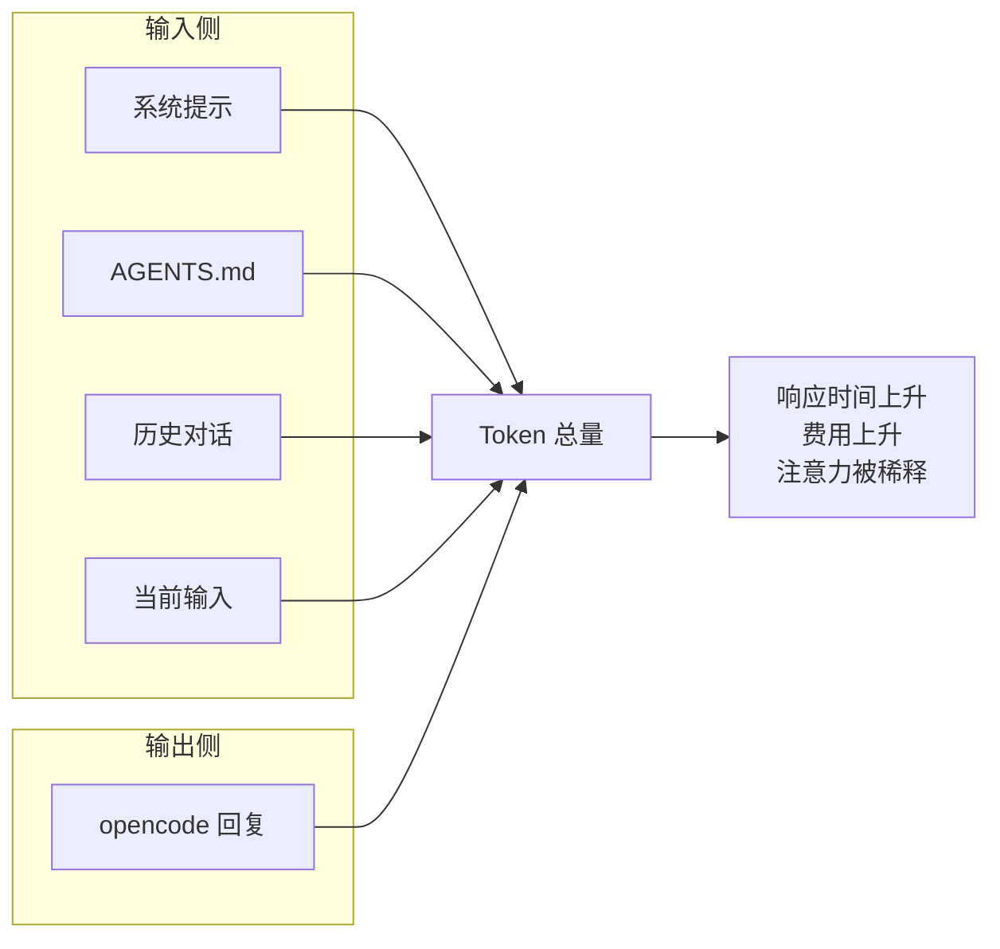

每多一轮对话，历史上下文增长一截。变量不是"聊得多"，而是"该记的记、该清的清"。

### 7.2 /compact 压缩时机

`/compact`（别名 `/summarize`）将当前会话压缩为摘要，保留要点、丢弃细节。

| 触发条件 |
| --- |
| 响应明显变慢，或接近上下文上限 |
| 长任务已完成核心部分，仅剩收尾 |
| 话题从 A 转向 B，需保留 A 的结论 |

### 7.3 会话策略

| 情况 | 策略 |
| --- | --- |
| 新任务 | `/new` 开新会话，不与历史混淆 |
| 长任务中途 | 阶段性 `/compact`，保持上下文精简 |
| 中断后继续 | `/sessions` 续接，或 `opencode attach --continue` |
| 方向跑偏 | 果断 `/new` 重来，不在错误方向消耗 Token |

### 7.4 输入侧优化

| 原则 | 操作 |
| --- | --- |
| 不粘贴大文件 | 让 opencode 自行读取（读文件比粘贴省 Token） |
| 预处理 | 超大日志先用命令提取关键行 |
| 结构化输入 | 数据整理成表格 / JSON，替代原始文本 |

```bash
# 反例：把 100MB 日志整体粘贴
# 正例：先提取关键信息
grep -E "ERROR|WARN" large_log.txt > filtered_errors.txt
# 再交 opencode 分析 filtered_errors.txt 的错误分布
```

---

## 八、数据输入与实验设计（DOE）

### 8.1 三种数据输入方式

| 方式 | 适用场景 | 示例 |
| --- | --- | --- |
| ① 读取项目文件 | 数据位于工作区 | "读取 ./data/rc_data.csv 并分析" |
| ② 粘贴关键数据 | 少量结构化数据 | 贴一段汇总统计表分析趋势 |
| ③ 提供文件路径 | 数据位于工作区外 | "原始数据在 /data/raw.csv，处理后数据在 /data/processed.csv" |

> 原则：能自行读取的不粘贴；必须粘贴时给结构化数据。

### 8.2 DOE 设计流程


---

## 九、实战：用 opencode 把文字材料转成交付 PPT

> 本章由原《大模型实践落地》内容融入。这是一次真实项目，每一步示范"如何把 opencode 用到位"。关注点不止"做了什么"，更在"用什么手法做的"。

### 9.1 任务与约束

| 项 | 内容 |
| --- | --- |
| 任务 | 两份 Markdown 文字材料 → 两份可直接演示的 PPT |
| 交付规格 | 共 35 页，100% 可编辑，原生文本 / 形状 / 表格，0 张图片 |
| 约束 | 不用模板化 AI 风格；不臆造数据；流程可复现 |

### 9.2 七步工作流

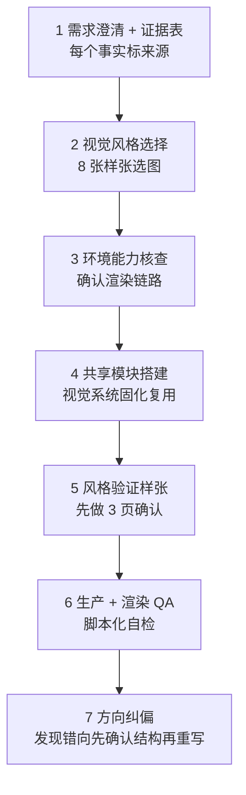

### 9.3 每步手法与背后原则

| 步骤 | 手法 | 原则 |
| --- | --- | --- |
| ① 证据表先行 | 每条事实/数字标来源、置信度、caveat | 不臆造：不用常识补材料缺失的数据 |
| ② 确认门设重 | 故事线 / 页数 / 逐页论点一次确认再动手 | 先对齐再执行：避免方向性返工 |
| ③ 环境核查 | 先确认工具链能力（渲染、图像生成），缺失如实告知 | 事实优先：不假装满足硬门槛 |
| ④ 模块化 | 视觉系统固化为共享模块，两份 PPT 复用 | 复用：改一处多处生效 |
| ⑤ 先验证再量产 | 先做 3 页样张确认，再批量生产 | 小步验证：避免 35 页全返工 |
| ⑥ 脚本化自检 | 用脚本查零尺寸 / 越界，替代肉眼 | 可证伪：用断言替代感觉 |
| ⑦ 果断重写 | 方向错了立即推翻，先确认新结构 | 止损：不在错误方向修补 |

### 9.4 三个认知校正

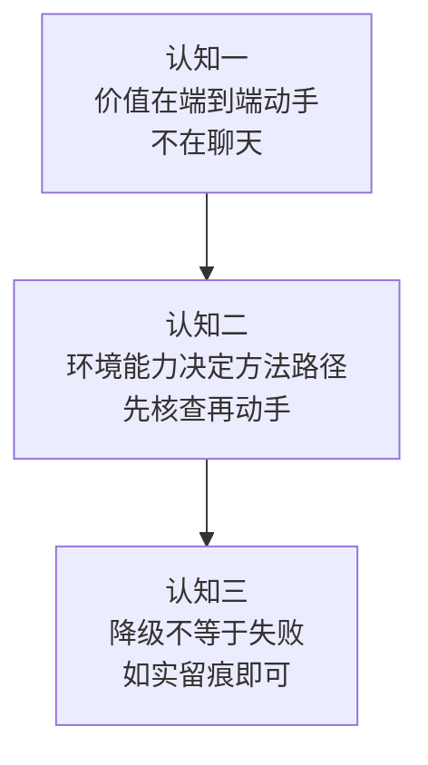

1. **opencode 的价值在"端到端动手"**：生成文件、渲染、自检、迭代，把活干完——人负责审核与决策
2. **环境能力决定方法路径**：有无渲染器、有无图像生成，决定能用哪套流程，先核查再动手
3. **降级不等于失败**：缺图像生成就如实降级为原生对象生产 + 渲染 QA，照样交付可编辑 PPT，关键是如实留痕

### 9.5 踩坑与解法

| 坑 | 现象 | 解法 |
| --- | --- | --- |
| 意图理解错 | 按材料标题做"成本优化"，实需"用好" | 先确认新结构再重写；材料标题 ≠ 真实意图 |
| 图层遮挡 | 连线盖住中心节点 | 先画底层再画上层，注意 z-order |
| 只导出首页 | 渲染器只输出首页 PNG | 先转 PDF 再按页切图 |
| 缺环境能力 | 无法走标准流程 | 如实降级 + 留痕，不假装满足 |
| 效果数据失真 | 把预估百分比当实测成果 | 统一标"预估/待实测"，或用可观察信号 |

### 9.6 复现 Checklist

- [ ] 通读源材料，建证据表（每条标来源 / 置信度）
- [ ] 脑暴 2~3 条故事线，推荐 1 条，写 SCR 论证结构
- [ ] 逐页大纲含信息密度与组件清单，与需求方确认
- [ ] 展示视觉样张选定，锁定色板 / 字号体系
- [ ] 搭共享视觉模块，先做 3 页样张验证
- [ ] 批量生产 + 渲染 + 脚本化自检
- [ ] 渲染图交人审，逐页确认
- [ ] 方向不对 → 先确认新方向与新结构，果断重写

---

## 十、团队落地与复盘

### 10.1 团队共识

| 落地项 | 内容 |
| --- | --- |
| 部门级 AGENTS.md | 统一术语 / 规范 / 风格，新人入职即生效 |
| Prompt 模板库 | 高频任务的结构化提问沉淀为模板 |
| Skill 清单 | 团队认可的 skill 与使用场景，减少试错 |

### 10.2 知识沉淀

- 有价值的会话保留 / 复用，避免重复劳动
- 把"如何让 opencode 完成某类任务"写成 SOP（参照第九章）
- 定期分享案例：有效手法与踩坑记录

### 10.3 效果评估：用可观察信号，不用未实测百分比

| 信号 | 观察方式 |
| --- | --- |
| 采用率 | 团队成员用 opencode 完成任务的频次 |
| 复用数 | 沉淀的模板 / Skill / 会话被复用次数 |
| 沉淀量 | AGENTS.md、Prompt 模板、SOP 文档的增量 |

> 原则：无实测数据时标"预估 / 待实测"，或改用可观察信号——这是第九章方法论的核心纪律。

---

## 十一、FAQ 与收束

### Q1：opencode 回答不准确怎么办？

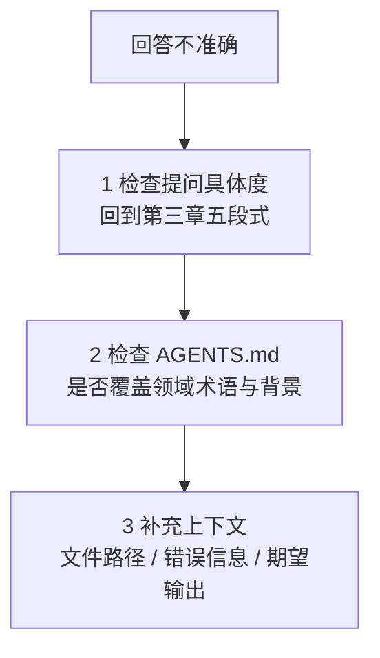

### Q2：对话越聊越慢 / 越聊越贵怎么办？

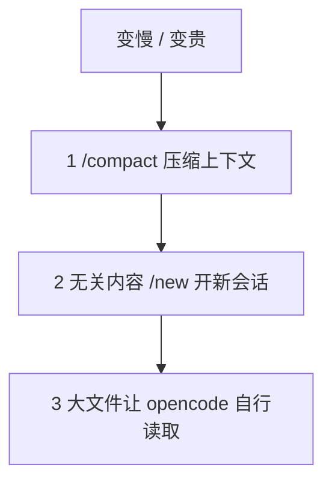

### Q3：opencode 改错文件了怎么办？

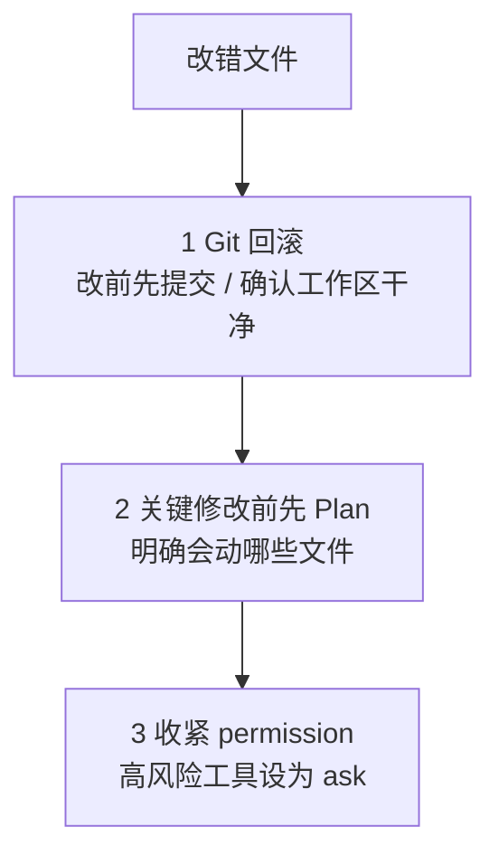

### Q4：不知道用什么模式 / 手法怎么办？

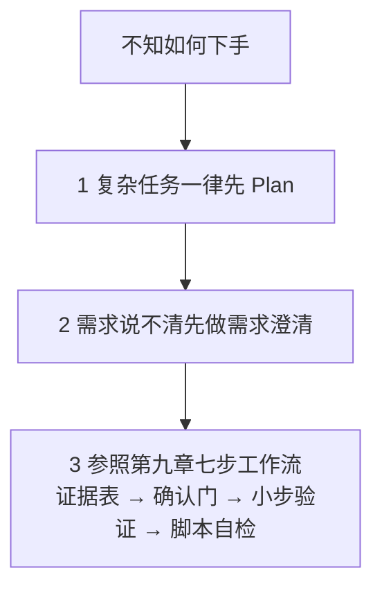

### 收束

> 工具已就位，差距在手法。把本篇的模板、清单、工作流带走，**用 opencode 把一个真实任务完整走一遍**——这是最直接的掌握方式。
