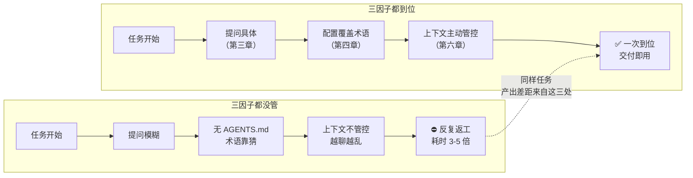
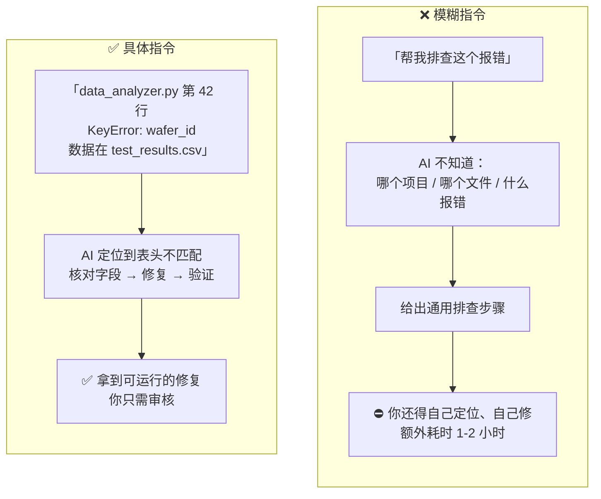
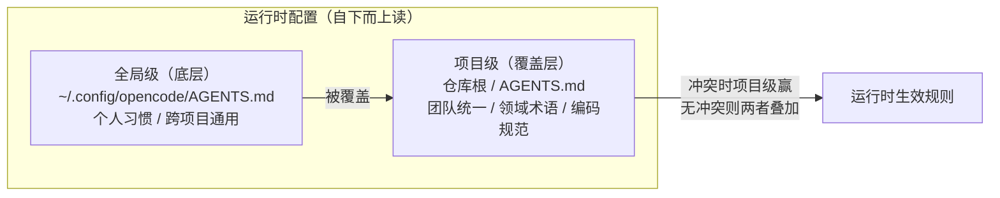
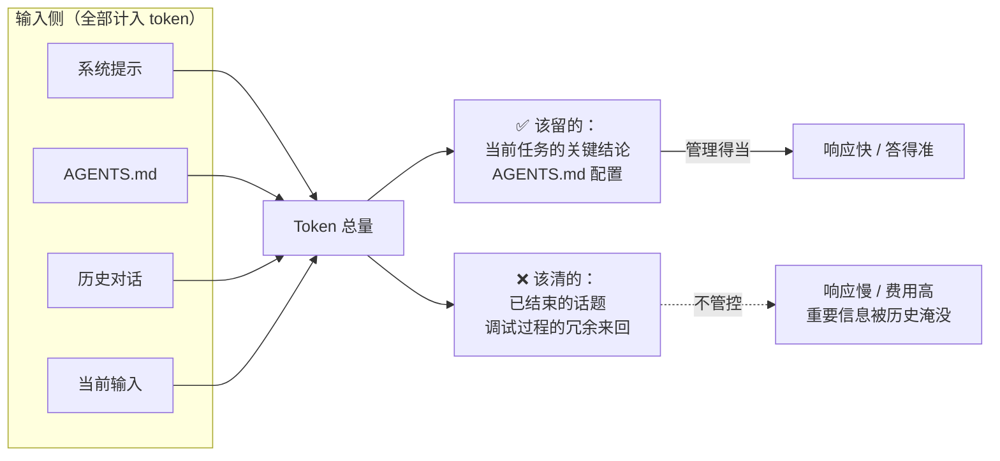
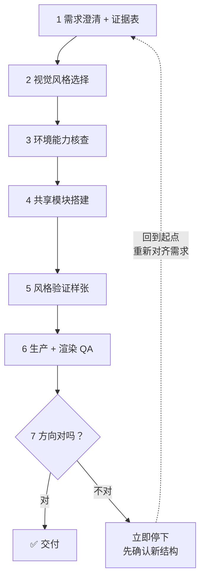

# 《opencode 进阶：从能用到用好》

> **写给谁看**：已读完入门篇、走过一遍安装和首个任务的同事。本篇解决"能用之后怎么用好"。
> **核心命题**：同一份 opencode，产出质量差距来自三处——**提问具体度、配置覆盖度、上下文管理**。本篇逐层展开，以一次完整实战收束。
> **编写规范**：沿用入门篇风格（场景+类比优先，术语首次出现配消歧）；进阶篇保留工程术语，但每个术语首次出现仍配一句话解释。

---

## 一、从入门到进阶：差距在哪

### 1.1 本篇假设你已经会什么

入门篇已覆盖以下内容，本篇不再重复：

- 聊天应用与 opencode 的能力边界差异
- 桌面应用安装、登录、打开工作目录
- AGENTS.md 的作用与基础四段式模板
- Plan / Build 的基本概念与决策准则
- `/new`、`/help`、`/init` 等常用命令
- 权限确认机制（每次动手前会问你）

**如果以上任何一项不熟悉，建议先回到入门篇走一遍实操。**

### 1.2 进阶要解决什么

> 这张图在说什么：同一个任务、同一份 opencode，三因子的强弱组合决定了你是"一次到位"还是"反复返工"。差距不在工具，在这三处怎么用。



同一份 opencode，同样的任务，不同人产出差距可能很大。差距不来自工具本身，而来自这三处——本篇围绕它们展开。

### 1.3 常见偏差与对应章节

| 偏差现象 | 根因 | 去哪看 |
| --- | --- | --- |
| 答非所问、方向跑偏 | 提问信息不足 | 第三章 提问方法 |
| 反复返工 | 需求未对齐、确认门缺失 | 第五章 Plan-Build 进阶 |
| 越聊越慢 / 越来越贵 | 上下文累积未清理 | 第六章 上下文管理 |
| 术语理解偏差 | AGENTS.md 未覆盖领域术语 | 第四章 配置进阶 |
| 改错文件 | 未先 Plan | 第五章 Plan-Build 进阶 |
| 流程跑不顺 | Skill 未组合 / 选错 | 第五章 Skill 组合 |

---

## 二、场景深化：工程与办公

> 入门篇展示了"能干什么"，本篇聚焦"怎么干到位"。下面把场景分工程与办公两类，各自给出深化示例。

### 2.1 场景矩阵

**工程场景**：

| 任务类型 | 典型输入 | opencode 动作 | 交付物 |
| --- | --- | --- | --- |
| 数据处理 | 测试 CSV / JSON | 读取 / 清洗 / 统计 | 分析脚本 + 图表代码 |
| 异常排查 | 日志 / 报错堆栈 | 定位根因 / 修复 / 验证 | 修复后的可运行代码 |
| 工艺优化 | 历史批次数据 | 设计实验矩阵 | DOE 方案表 |
| 代码审查 | 源码 | 规则检查 / 重构建议 | 审查清单 |
| 自动化 | 重复手工操作 | 编写脚本 | 可复用脚本 |

**办公场景**：

| 任务类型 | 典型输入 | opencode 动作 | 交付物 |
| --- | --- | --- | --- |
| 周报 / 月报 | 多份工作记录 | 按模板整理 / 提炼 | 排版好的报告草稿 |
| 会议纪要汇总 | 多场会议速记 / 转写 | 分议题归并 / 标冲突 | 结构化纪要 + 待办清单 |
| 数据汇总 | 多个 Excel / CSV | 合并 / 按维度统计 | 汇总总表 |
| 资料综述 | 多份不同来源资料 | 提炼 / 对比 / 标来源 | 带来源标注的综述 |
| 文档排版 | 文字内容 + 排版规则 | 填充 / 渲染 | 排版完成的文档 |

### 2.2 数据输入方式

> 这张表在说什么：把数据交给 opencode 有三种方式，优先选让它自己读的方式。

| 方式 | 适用场景 | 示例 |
| --- | --- | --- |
| ① 读取项目文件 | 数据位于工作区（首选） | "读取 ./data/rc_data.csv 并分析" |
| ② 粘贴关键数据 | 少量结构化数据 | 贴一段汇总统计表分析趋势 |
| ③ 提供文件路径 | 数据位于工作区外 | "原始数据在 /data/raw.csv，处理后数据在 /data/processed.csv" |

> 原则：**能自行读取的不粘贴；必须粘贴时给结构化数据（表格 / JSON），别给原始大段文本**。原因见第六章——粘贴大文件会快速消耗上下文预算。

### 2.3 工程场景示例（半导体）

**示例 A：接触电阻数据异常排查**

```
脚本 analyze_rc.py 处理 rc_w23.csv 时第 58 行报
ValueError。数据列为 wafer_id, die_x, die_y, rc_mohm。
请：
1. 读取脚本与 CSV 前 20 行，定位 ValueError 根因
2. 修复脚本
3. 对全量数据跑通验证
```

**示例 B：良率数据趋势分析**

```
读取 ./data/yield_q3.csv（字段：week, product, yield_pct, defect_mode）。
按 product 分组，输出每周良率与缺陷模式占比的 Markdown 表格，
并标注 CPK 低于 1.33 的批次。
```

**示例 C：DOE 设计**

DOE（Design of Experiments，实验设计）——从已有数据识别问题、设计实验优化工艺参数。下面这个示例示范了如何把工艺参数和目标说清楚：

```
近 3 批接触电阻数据 rc_data.json：均值 45mΩ、标准差 3.5mΩ、
异常 Die 集中于边缘。请设计 3 因子 2 水平 DOE：
针尖压力 50~80μm、清洗周期 50~100 次、测试时间 10~30ms。
目标：降低标准差、CPK 提升至 1.5 以上。
输出实验矩阵与每组采样建议。
```

### 2.4 办公场景示例

**示例 D：月度工作总结模板化**

```
当前目录下有本周5份工作记录（work_log_w41.md ~ work_log_w45.md）。
请按以下结构整理成本月总结：
- 本月完成事项（按重要度排序）
- 进行中事项（标注进度百分比）
- 下月计划（分必须 / 尽量两档）
- 风险与求助（需要协调的资源）

输出 monthly_summary_w44.md，先在 Plan 模式下说处理思路。
```

**示例 E：多场会议纪要归并**

```
读取 meetings/ 目录下本周3场会议纪要（*.md）。
按议题归并，标出三场会议中冲突或矛盾的待办项，
输出一张"议题 → 各场结论 → 是否冲突"的对照表。
```

> 办公场景和工程场景用同一套方法（提问方法、Plan-Build、上下文管理）。差别只在输入素材和输出格式——方法本身是通用的。

---

## 三、提问方法

### 3.1 核心法则

> 给 opencode 的信息越具体，产出越接近预期。
> 它不具备你的项目背景，**每一条约束都在减少它的猜测空间**。

### 3.2 模糊指令 vs 具体指令

> 这张图在说什么：同一个需求，信息量不同，结果天差地别——不只是"好坏"之分，而是"你还得自己干多久"的差别。



### 3.3 五段式结构

一个高质量指令包含五个部分——**不必每次写满，缺哪段补哪段**。核心是把脑中"默认成立"的前提显式写出：

| 段 | 回答什么 | 例子 |
| --- | --- | --- |
| 背景 | 场景 / 技术栈 / 已有条件 | "Q3 各产品线良率数据，字段 week/product/yield_pct" |
| 目标 | 要实现什么 / 验收标准 | "按 product 分组，输出每周良率" |
| 约束 | 性能 / 兼容性 / 安全限制 | "CPK 低于 1.33 的批次必须标注" |
| 输入 | 相关文件路径 | "./data/yield_q3.csv" |
| 输出 | 文件格式 / 保存位置 | "Markdown 表格，存为 yield_report_q3.md" |

**工程场景示例**（对应 2.3 示例 B）：

```
背景：yield_q3.csv 是Q3各产品线良率数据，字段 week/product/yield_pct/defect_mode
目标：按 product 分组，输出每周良率与缺陷模式占比
约束：CPK 低于 1.33 的批次必须标注
输入：./data/yield_q3.csv
输出：Markdown 表格，存为 yield_report_q3.md
```

**办公场景示例**（对应 2.4 示例 D）：

```
背景：当前目录 work_log_w41.md ~ w45.md 是本周5份工作记录，格式不统一
目标：整理成本月总结，按完成/进行中/计划/风险四块
约束：进行中事项标进度百分比；下月计划分必须/尽量两档
输入：当前目录下 work_log_*.md
输出：monthly_summary_w44.md，Markdown 格式
```

### 3.4 三个技巧

| 技巧 | 操作 | 作用 |
| --- | --- | --- |
| 给示例 | 提供输入/输出样例 | 对齐格式，优于描述 |
| 分步骤 | 拆成有序步骤（先…再…然后…） | 避免跳步 |
| 定输出 | 指定表格 / 脚本结构 / 文件命名 | 产出直接可用 |

---

## 四、配置进阶：团队级与高级用法

> 入门篇已讲过 AGENTS.md 的作用和基础四段式模板。本章聚焦入门篇没覆盖的进阶用法。

### 4.1 双层配置与优先级

> 这张图在说什么：两层配置不是"平级合并"，而是"覆盖"——项目级盖在全局级上面。冲突时项目级赢，没有冲突时两者叠加生效。这决定了"团队统一项放项目级、个人私有项放全局级"的分工。



| 层级 | 写什么 | 谁维护 |
| --- | --- | --- |
| 项目级 | 团队统一项：领域术语、编码规范、目录约定 | 团队共同，随仓库提交 |
| 全局级 | 个人私有项：个人偏好、常用工具链、通用习惯 | 个人，不共享 |

### 4.2 opencode.json：引用已有规范文件

团队如果已有规范文档，不必把内容搬进 AGENTS.md，直接引用（以实际版本字段为准）：

```json
{
  "$schema": "https://opencode.ai/config.json",
  "instructions": [
    "docs/development-standards.md",
    "test/testing-guidelines.md"
  ]
}
```

- 已有规范文档直接引用，**不重复搬运**
- 支持 glob 通配，如 `packages/*/AGENTS.md`

### 4.3 术语消歧

> 这张表是进阶篇最有价值的配置资产之一：同一词汇通用义与专业义不一致时，必须在 AGENTS.md 显式定义，否则 opencode 会按通用义理解。

| 术语 | 通用语义 | 专业语义（需配置） |
| --- | --- | --- |
| Yield | 产量 / 收益 | **良率**：合格品占总数比例 |
| Probe | 探测 / 探查 | **探针测试**：晶圆级电性测试 |
| DOE | 易与能量守恒符号混淆 | **实验设计**：优化工艺参数 |
| SECS/GEM | 无对应通用义 | **半导体设备通讯标准协议** |

> 办公场景同理：每个岗位都有自己的术语黑话（"闭环""对齐""抓手"在不同公司含义不同），在 AGENTS.md 里定义清楚，避免 opencode 按字面意思理解。

### 4.4 分项目配置策略

- 各项目根目录放独立 AGENTS.md，写该项目独有信息（数据目录结构、特殊编码要求）
- 全局文件保持精简，只放跨项目通用的个人习惯
- 新人入职时项目级 AGENTS.md 随仓库拉取即生效，无需额外培训

---

## 五、Plan-Build 进阶与 Skill 组合

> 入门篇已讲过 Plan/Build 基本概念和"什么时候先 Plan"的决策准则。本章讲进阶技巧，并把 Skill 组合纳入同一流程。

### 5.1 Plan 拆解三件事

> 这张图在说什么：Plan 的产出不是一份清单，而是三个维度的交叉——"改哪些文件"（空间）、"按什么顺序"（时间）、"出问题怎么办"（兜底）。三维缺一，Plan 就不完整：只看文件会漏顺序，只看步骤会漏风险，只看风险会漏范围。


入门篇只讲"Plan 是先说思路不动手"，进阶的标准是——Plan 的产出必须同时覆盖这三个维度，缺一不可。

### 5.2 多轮规划：先粗后细

> 这张图在说什么：确认门（Plan→Build 的切换点）是一条"成本悬崖"——在它之前返工，改的是方案文字，成本极低；跨过它进入 Build，返工要重写代码、重做文件，成本陡升一个量级。这就是为什么复杂任务要在确认门前多轮打磨，而不是边做边改。


> **确认门设置在执行前，返工成本最低**。这是进阶篇最核心的一条纪律——方向性返工的代价比细节返工大一个量级。

### 5.3 三个执行技巧

| 技巧 | 操作 |
| --- | --- |
| 并行任务拆解 | 互不依赖的模块拆为独立任务，分头规划 |
| 增量开发 | 先做最小可用版本，跑通再加功能 |
| 复用已有代码 | 引用项目现有模块，要求保持风格一致 |

### 5.4 Skill 组合：从单点到全流程

> 这张图在说什么：单个 Skill 只管自己那一环；组合起来时，每个 Skill 填补的是前一个环节留下的空白——需求澄清把"问什么"问清楚，planning 把"怎么拆"理出来，Build 把东西做出来，review 把遗漏抓出来。重点不是顺序，是每个环节各自挡掉了哪类问题。


**Skill**（技能）解释：打包好的"领域知识 + 操作流程"，按需加载，平时不占上下文。入门篇提过一句，这里展开——选对 Skill = 用既定流程而非通用流程执行。

| 场景 | Skill 组合 |
| --- | --- |
| 疑难 Bug 定位 | 需求澄清 → 调试 → 修复 → review |
| 新功能开发 | planning → Build → 测试 → review |
| 技术调研 | web search 检索 → 整理对比报告 |
| 文档 / 报告制作 | 内容梳理 → 设计 → 渲染 QA |

---

## 六、上下文管理

> 入门篇只讲了"换话题就 `/new`"。本章讲上下文累积的原理和进阶管理策略——这是进阶产出质量和成本控制的关键。

### 6.1 上下文累积机制

> 这张图在说什么：opencode 每次回复消耗的 token，是所有输入项累加的结果。关键不是"总量大"，而是"该留的没留、该清的没清"——无关历史挤占了注意力，重要信息被淹没，导致越聊越慢、越答越偏。



**Token** 解释：大模型计费和计量的最小单位，约等于一个词或一个汉字片段。上下文越长，token 越多，响应越慢、费用越高。

变量不是"聊得多"，而是**"该记的记、该清的清"**。

### 6.2 /compact 压缩时机

`/compact`（别名 `/summarize`）将当前会话压缩为摘要，保留要点、丢弃细节。

| 触发条件 |
| --- |
| 响应明显变慢，或接近上下文上限 |
| 长任务已完成核心部分，仅剩收尾 |
| 话题从 A 转向 B，需保留 A 的结论 |

### 6.3 会话策略

| 情况 | 策略 |
| --- | --- |
| 新任务 | `/new` 开新会话，不与历史混淆 |
| 长任务中途 | 阶段性 `/compact`，保持上下文精简 |
| 中断后继续 | `/sessions` 续接（以实际版本命令为准） |
| 方向跑偏 | 果断 `/new` 重来，不在错误方向消耗 token |

### 6.4 输入侧优化

| 原则 | 操作 |
| --- | --- |
| 不粘贴大文件 | 让 opencode 自行读取（读文件比粘贴省 token） |
| 预处理 | 超大日志先提取关键行再交给它 |
| 结构化输入 | 数据整理成表格 / JSON，替代原始文本 |

```bash
# 反例：把 100MB 日志整体粘贴
# 正例：先提取关键信息
grep -E "ERROR|WARN" large_log.txt > filtered_errors.txt
# 再交 opencode 分析 filtered_errors.txt 的错误分布
```

---

## 七、实战与方法论

> 本章示范"如何把前面所有方法用到位"。任务是把文字材料转成可演示的 PPT——这个实战本身偏通用，**示范的手法（证据表、确认门、小步验证、脚本自检）同样适用于办公场景的报告/汇总/总结任务**。

### 7.1 任务与约束

| 项 | 内容 |
| --- | --- |
| 任务 | 两份 Markdown 文字材料 → 两份可直接演示的 PPT |
| 交付规格 | 共 35 页，100% 可编辑，原生文本 / 形状 / 表格，0 张图片 |
| 约束 | 不用模板化 AI 风格；不臆造数据；流程可复现 |

### 7.2 七步工作流

> 这张图在说什么：这七步不是一次性流水线，而是一个有反馈回路的循环——第 7 步（方向纠偏）不是终点，而是回到第 1 步重新澄清的入口。与普通线性流程的区别就在这条回路：发现走错了，回到起点重新对齐，而不是硬着头皮往下走。



### 7.3 每步手法与背后原则

| 步骤 | 手法 | 原则 |
| --- | --- | --- |
| ① 证据表先行 | 每条事实/数字标来源、置信度、caveat | **不臆造**：不用常识补材料缺失的数据 |
| ② 确认门设重 | 故事线 / 页数 / 逐页论点一次确认再动手 | **先对齐再执行**：避免方向性返工 |
| ③ 环境核查 | 先确认工具链能力（渲染、图像生成），缺失如实告知 | **事实优先**：不假装满足硬门槛 |
| ④ 模块化 | 视觉系统固化为共享模块，两份 PPT 复用 | **复用**：改一处多处生效 |
| ⑤ 先验证再量产 | 先做 3 页样张确认，再批量生产 | **小步验证**：避免 35 页全返工 |
| ⑥ 脚本化自检 | 用脚本查零尺寸 / 越界，替代肉眼 | **可证伪**：用断言替代感觉 |
| ⑦ 果断重写 | 方向错了立即推翻，先确认新结构 | **止损**：不在错误方向修补 |

### 7.4 三个认知校正

三个认知贯穿整个实战，也是本篇方法论的核心——它们之间是并列关系（各自独立成立），不是因果链：

1. **opencode 的价值在"端到端动手"**：生成文件、渲染、自检、迭代，把活干完——人负责审核与决策
2. **环境能力决定方法路径**：有无渲染器、有无图像生成，决定能用哪套流程，先核查再动手
3. **降级不等于失败**：缺图像生成就如实降级为原生对象生产 + 渲染 QA，照样交付可编辑 PPT，关键是如实留痕

### 7.5 踩坑与解法

| 坑 | 现象 | 解法 |
| --- | --- | --- |
| 意图理解错 | 按材料标题做"成本优化"，实需"用好" | 先确认新结构再重写；**材料标题 ≠ 真实意图** |
| 图层遮挡 | 连线盖住中心节点 | 先画底层再画上层，注意 z-order |
| 只导出首页 | 渲染器只输出首页 PNG | 先转 PDF 再按页切图 |
| 缺环境能力 | 无法走标准流程 | 如实降级 + 留痕，不假装满足 |
| 效果数据失真 | 把预估百分比当实测成果 | 统一标"预估/待实测"，或用可观察信号 |

### 7.6 复现 Checklist

- [ ] 通读源材料，建证据表（每条标来源 / 置信度）
- [ ] 脑暴 2~3 条故事线，推荐 1 条，写 SCR 论证结构
- [ ] 逐页大纲含信息密度与组件清单，与需求方确认
- [ ] 展示视觉样张选定，锁定色板 / 字号体系
- [ ] 搭共享视觉模块，先做 3 页样张验证
- [ ] 批量生产 + 渲染 + 脚本化自检
- [ ] 渲染图交人审，逐页确认
- [ ] 方向不对 → 先确认新方向与新结构，果断重写

---

## 八、从个人到团队

### 8.1 团队共识

| 落地项 | 内容 |
| --- | --- |
| 部门级 AGENTS.md | 统一术语 / 规范 / 风格，新人入职即生效 |
| Prompt 模板库 | 高频任务的结构化提问沉淀为模板（见第三章五段式） |
| Skill 清单 | 团队认可的 skill 与使用场景，减少试错 |

### 8.2 知识沉淀

- 有价值的会话保留 / 复用，避免重复劳动
- 把"如何让 opencode 完成某类任务"写成 SOP（参照第七章）
- 定期分享案例：有效手法与踩坑记录

### 8.3 效果评估：用可观察信号，不用未实测百分比

| 信号 | 观察方式 |
| --- | --- |
| 采用率 | 团队成员用 opencode 完成任务的频次 |
| 复用数 | 沉淀的模板 / Skill / 会话被复用次数 |
| 沉淀量 | AGENTS.md、Prompt 模板、SOP 文档的增量 |

> 原则：**无实测数据时标"预估 / 待实测"，或改用可观察信号**——这是第七章方法论的核心纪律。

---

## 排错速查

> 遇到问题别急着猜，先对照下表定位根因，再去对应章节看解法。

| 现象 | 根因 | 去哪看 |
| --- | --- | --- |
| 回答不准确、答非所问 | 提问信息不足 / 术语未消歧 | 第三章 提问方法 / 第四章 4.3 术语消歧 |
| 回答方向跑偏 | 纠偏不及时，在错误方向消耗 | 入门篇 5.4 追问与纠偏 |
| 输出质量不可控 | 缺乏审核标准 | 入门篇 5.5 怎么判断输出能不能用 |
| 越聊越慢 / 越来越贵 | 上下文累积未清理 | 第六章 上下文管理 |
| 不知道哪些活能交给它 | 缺少任务识别框架 | 入门篇 第六部分 发现你能交给它的工作 |
| 改错文件 | 未先 Plan / permission 过宽 | 第五章 Plan-Build 进阶 |
| 反复返工 | 确认门缺失 / 需求未对齐 | 第五章 5.2 多轮规划 / 第七章 7.3 手法 |
| 流程跑不顺 | Skill 未组合 | 第五章 5.4 Skill 组合 |

---

> 工具已就位，差距在手法。把本篇的模板、清单、工作流带走，**用 opencode 把一个真实任务完整走一遍**——这是最直接的掌握方式。
