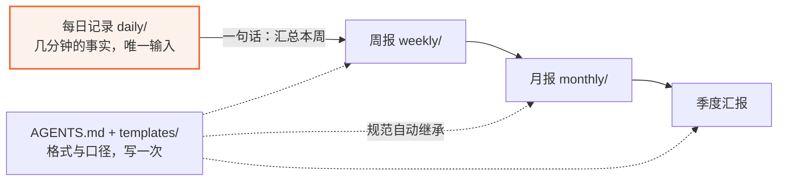
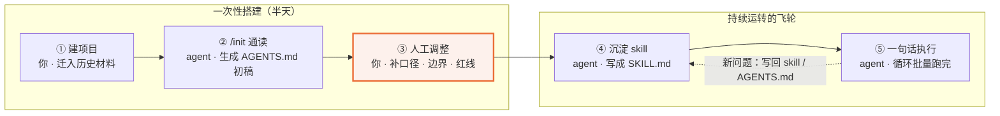
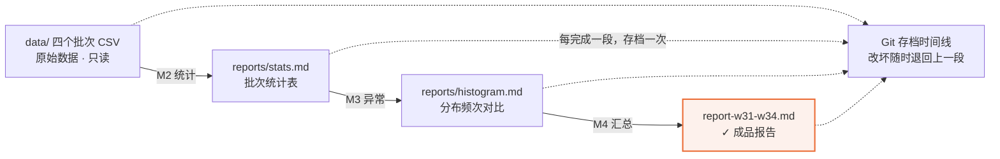
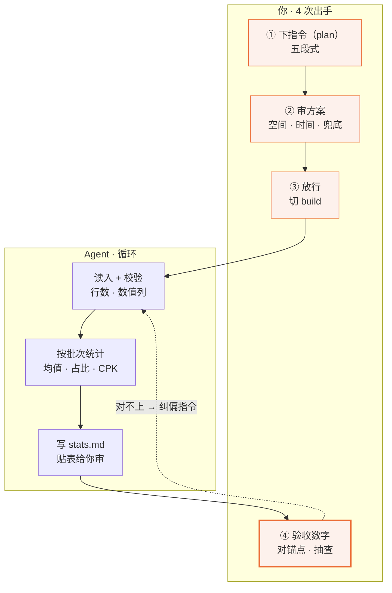
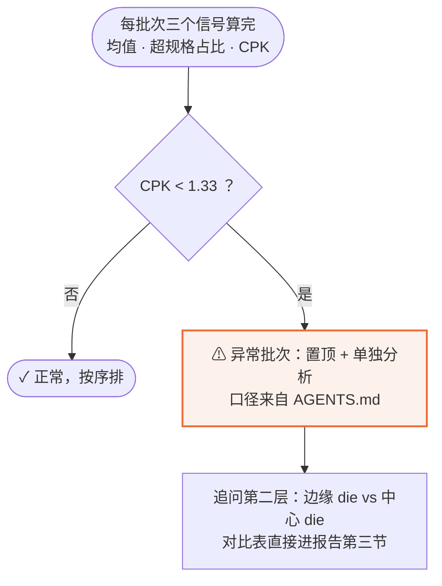
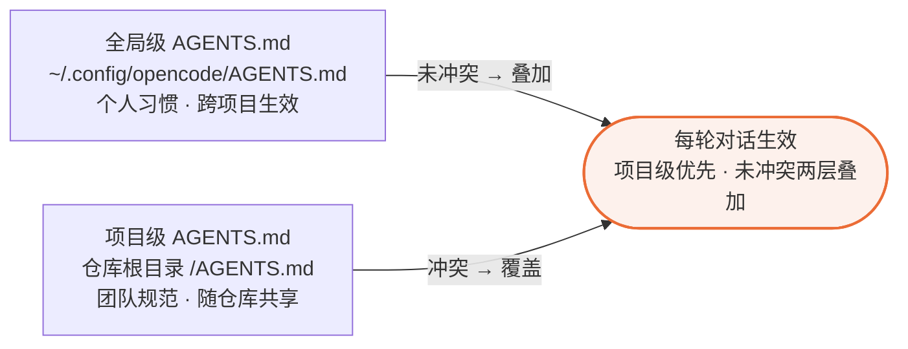
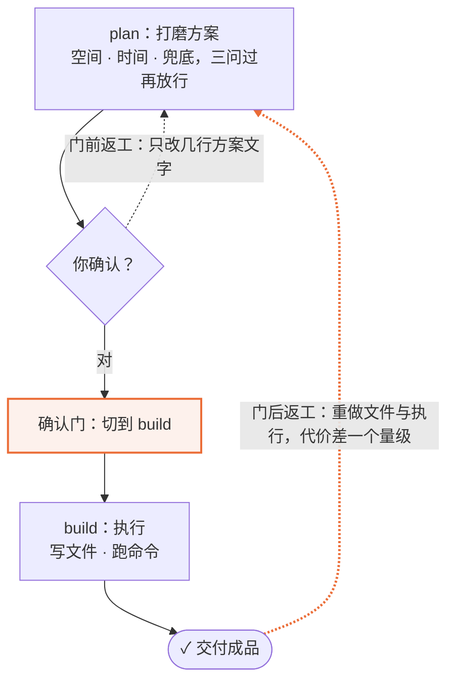

# opencode 进阶与实战：建立工作体系，完成你的第一个项目

| | |
| --- | --- |
| **写给谁** | 上过《opencode 入门》的同学——会 Plan/Build、用过 `/init`，想从"会把一件事交给 agent"走到"独立做完一个项目" |
| **前置要求** | 三件套就位（opencode / VS Code / Git）＋ 课堂发放的练习素材包（`materials/data/` 四个 CSV） |
| **读完能做什么** | 建立两个可持续增值的工作体系（Markdown 汇报项目、skill 工作流）；独立完成"原始数据 → 统计 → 图表 → 报告"的完整项目；下次同类任务一句话复跑 |

> **一份文档，两种读法**：
>
> - **课堂（60 分钟）**：按下表节奏跟讲，"演示"列是讲师现场做的动作，标"课后"的内容课上不展开。
> - **课后（约 2–2.5 小时）**：从头到尾自己把第四部分的完整项目跑一遍——本文档就是操作手册，所有 prompt、验收锚点、排错速查都可直接照做。

**60 分钟课堂节奏**：

| 时间 | 环节 | 现场演示 | 课后自学 |
| --- | --- | --- | --- |
| 0:00–0:05 | 一、从会用到体系 | 差距对比表 | — |
| 0:05–0:15 | 二、理念一：Markdown 汇报项目 | work-reports 一句话生成周报 | 2.7 六步完整搭建 |
| 0:15–0:25 | 三、理念二：skill 五步法 | SKILL.md 骨架、一句话触发 | — |
| 0:25–0:50 | 四、实战：接触电阻项目 | M1 骨架 5' / M2 指令+审核+纠偏 10' / M3 异常 5' / M4 报告沉淀 5' | 完整跑一遍 + 互查 |
| 0:50–1:00 | 五、方法论底座 + 课后作业 | 五段式、确认门、配置 | 第六部分 |

---

## 第一部分　从会用到体系

入门篇结束时你会把**一件事**交给 agent。"会用"的状态是：每次任务从零开始——提问临时想、规范靠记忆、经验留在脑子里。

**体系化改变三样东西：记录的格式、沉淀的位置、复用的方式。**

| | 没有体系 | 有体系 |
| --- | --- | --- |
| 提问 | 每次临时想 | 口径在 AGENTS.md，新任务一句话启动 |
| 规范 | 靠记忆、口头传 | 在项目文件里，自动生效 |
| 经验 | 留在个人脑中 | 沉淀成模板 / skill，可复用可共享 |

本课两个理念 + 一个实战，把这三行全部落地：

| 部分 | 内容 | 回答什么 |
| --- | --- | --- |
| 二 | 理念一：Markdown 汇报项目 | 工作记录怎么变成随模型升值的资产 |
| 三 | 理念二：skill 五步法 | 批量重复劳动怎么变成一句话 |
| 四 | 实战：接触电阻项目 | 两者怎么装配成一个完整项目 |
| 五 | 方法论底座 | 提问 / 配置 / 上下文 / 确认门 |
| 六 | 从个人到团队与课后 | 资产怎么共享、课后怎么练 |

---

## 第二部分　理念一：Markdown 汇报项目

> **本节回答**：工作记录用什么格式存？汇报怎么从"每月重新写"变成"一句话聚合"？

### 2.1 为什么是 Markdown

月底写周报的真实过程：翻聊天记录、翻邮件、回忆三周前做了什么——每次总结都重新思考一遍"汇报什么、怎么汇报"，每次花半天。agent 能接管这件事的前提只有一个：**你的记录以它能读写的方式存在**。

| 维度 | Word / PPT | Excel | **Markdown** |
| --- | --- | --- | --- |
| agent 直接读 | 格式噪声重 | 结构受限 | 纯文本 + 结构标记，直接读 |
| agent 直接写 | 困难 | 困难 | 直接写，可套模板 |
| 逐行对比（diff） | 二进制不可比 | 不可比 | 天然支持 |
| 跨层级聚合（日→周→月） | 复制粘贴 | 手动透视 | **一句话聚合** |

**Markdown 是 agent 世界的通用交换格式**：你交给它的素材、它还给你的成品，是同一种结构化纯文本。

### 2.2 项目结构：一次搭建

```text
work-reports/                 ← 工作汇报项目（一个文件夹）
├── AGENTS.md                 ← 汇报规范：格式、维度、口径、红线
├── templates/                ← 模板：日报 / 周报 / 月报 / 季度
├── daily/                    ← 每日工作记录（你唯一的日常输入）
│   ├── 2026-08-11.md
│   └── 2026-08-12.md
├── weekly/                   ← 周报（agent 聚合生成）
├── monthly/                  ← 月报 / 季度汇报（再聚合）
└── assets/                   ← 图表与截图
```

第一天就让这个目录成为 Git 仓库（入门篇 3.6）：每次周报生成都是一个存档点，改错了随时回退，将来团队共享直接推送仓库。

### 2.3 汇报自动生长



*你只写每日记录这一个输入，agent 按模板把它逐层聚合成周报、月报、季度汇报；AGENTS.md 与模板的规范在每一层自动继承。*

你唯一的日常输入是 `daily/` 里几分钟的事实记录。周报、月报、季度汇报不是"重新写"，是"按模板聚合"——每层一句话，格式与维度由 AGENTS.md 和 templates/ 自动继承。

### 2.4 汇报的"维度"从哪来

第一次生成的周报不会完美。关键动作：每次你做的调整——"缺了风险项""这个数据口径不对"——让 agent **写回模板或 AGENTS.md**，而不是只改这一份周报。几轮之后，项目里沉淀的模板就是这个岗位的汇报框架。

**agent 不是天生懂你的汇报，是项目教会它的**——教一次，永久生效。

### 2.5 记录随生态升值

模型换代、上下文窗口变长、工具变强——同一批 Markdown 记录，产出质量自动上升。你什么都不用做。**记录本身就是资产，越早开始记，复利时间越长。**

### 2.6 实战：从零搭建 work-reports

六步，半天完成，此后长期生效：

| 步 | 做什么 | 怎么做 |
| --- | --- | --- |
| ① | 建目录、集素材 | 建好 2.2 的目录结构，把近期零散记录集中放进 `daily/` |
| ② | 生成须知 | 在 opencode 里打开 work-reports/，输入 `/init`，得到 AGENTS.md 初稿 |
| ③ | 人工调整 | 补汇报口径（如"进行中事项标进度百分比"）、岗位术语、红线 |
| ④ | 沉淀模板 | 让 agent 从历史记录归纳周报模板，人工修一版存入 `templates/weekly.md` |
| ⑤ | 日常运转 | 每天几分钟写 `daily/`；周五一句话生成周报 |
| ⑥ | 持续调优 | 每次不满意 → 改模板和 AGENTS.md，不是重新交代 |

关键 prompt：

```text
# 步骤 ④：归纳周报模板
读取 daily/ 目录下全部工作记录，归纳出一份周报模板：
包含本周完成事项、进行中事项（标进度百分比）、下周计划、风险与求助四个部分。
先给我看模板结构，确认后写入 templates/weekly.md。

# 步骤 ⑤：每周五的一句话
按 templates/weekly.md 汇总 daily/ 本周的记录，生成本周周报到 weekly/。
```

---

## 第三部分　理念二：把重复手动任务沉淀为 skill

> **本节回答**：批量重复任务为什么要换方法？四条路怎么选？五步法怎么把它变成一句话？

### 3.1 四条路对比

典型任务单元：打开一个 Excel → 按口径统计 → 截图 → 写结论，单次 20 分钟。问题在乘法：30 个文件一整天，下周口径一变全部重做。

| 维度 | 纯人工 | 自学函数/脚本 | 找 IT 开发 | **agent 工作流 skill** |
| --- | --- | --- | --- | --- |
| 首次上手 | 无 | 数小时～数天 | 需求沟通 + 数周排期 | **半天** |
| 单次执行 | 每次 20 分钟起 | 分钟级，人要盯 | 自动，但改不动 | **一句话，人只审总表** |
| 口径变更 | 全部重做 | 改公式/改代码 | 提需求等排期 | **说一句，agent 更新 skill** |
| 经验沉淀 | 个人脑中 + SOP 文档 | 代码里，难读 | 别人的代码库里 | **skill 里，自然语言可读** |
| 团队共享 | 口口相传 | 发文件 | 走 IT 流程 | **拷走文件夹即共享** |

四条旧路的共同问题：**业务口径（只有你懂）和执行能力（程序才有）始终分家**。大模型 + agent 第一次把它们合到一起：你用自然语言沉淀口径，agent 负责执行。

### 3.2 五步法



*前三步是一次性搭建（③ 人工调整决定后续所有产出的质量），后两步构成飞轮：执行中遇到的新问题写回 skill，下次自动处理——人工时间就此释放。*

| 步 | 谁做 | 做什么 |
| --- | --- | --- |
| ① 建项目 | 你 | 新建文件夹，把历史材料（报表、Excel、旧 SOP）全部迁进去 |
| ② `/init` 通读 | agent | 通读全部材料，生成 AGENTS.md 初稿——它第一次"理解"你的业务 |
| ③ 人工调整 | 你 | 补口径、边界、红线——**质量决定性一步**，后续产出取决于这一步做得多细 |
| ④ 沉淀 skill | agent | 把跑通的工作流写成 SKILL.md |
| ⑤ 一句话执行 | agent | 循环批量跑完，你用 diff 核对改动、审汇总表 |

新问题出现 → 几句话写回 skill / AGENTS.md → agent 从此自动处理 → 人工时间释放去接更大的任务量。这就是经验沉淀的飞轮。

### 3.3 SKILL.md：可执行的 SOP

**Skill** 是一份用自然语言写的"行动脚本"——平时是项目里的普通文件、不占上下文；触发时装入上下文，循环从"现场发挥"切换成"按剧本走"。**SOP 给人看，skill 给 agent 执行。**

骨架示例（第四部分实战会亲手生成一份）：

```markdown
# batch-rc-report：接触电阻批量报告

## 什么时候用
用户给出若干 rc_*.csv（或一个目录），要按批次出统计报告时。

## 步骤
1. 读取全部 rc_*.csv，校验列：batch, wafer_id, die_x, die_y, rc_mohm
2. 按批次统计：均值 / 标准差 / 超规格占比
3. 每批生成分布图，存入 assets/
4. 汇总为 reports/rc_report_日期.md，异常批次标 ⚠ 并置顶

## 口径（2026-08 讨论沉淀）
- 边缘 die 异常不算批次失败，单独列一节
- CPK 低于 1.33 必须标注

## 坑
- w32 文件中间混入一行重复表头，先剔除再统计
```

---

## 第四部分　实战：从零完成接触电阻项目

> **本节回答**：一个完整项目从定题到成品怎么走？每一步的指令怎么下、产物怎么验？这是本课的主体——课堂上跟演示走，课后照着完整跑一遍。

### 4.1 定题与验收标准

**项目一句话**：

| 你给它什么 | 它交付什么 |
| --- | --- |
| `data/` 下 w31–w34 四个批次的接触电阻 CSV（每批 3 片 wafer × 100 die） | `reports/` 下一份可交出去的批次报告：统计表、异常标注、边缘 die 分析、结论 |

素材是 w31–w34 四个批次的测试数据，列为 `batch, wafer_id, die_x, die_y, rc_mohm`（单位 mΩ）。对照入门篇 6.2 的信号表：每周重复做、规则明确（USL / CPK 红线）、有现成素材、容许迭代——四条全中，正是理想的第一项目。

**验收标准**（动手前先立靶子，做完回来对照）：

- [ ] 统计表：四个批次各一行——die 数、均值、标准差、超规格占比（rc_mohm ≥ 50）、CPK
- [ ] 异常标注：CPK 低于 1.33 的批次标 ⚠ 并置顶，附异常分析
- [ ] 边缘 die 单独一节：不计入批次失败判定，但要有对比数字
- [ ] 可独立阅读：没上过课的同事不看数据也能读懂结论
- [ ] 每条结论后面跟着支撑数字



*成品是长出来的：原始数据经 M2 / M3 / M4 三个里程碑逐级加工成报告，每长出一段就做一次 Git 存档，任何一步都能退回上一段。*

**三条纪律**：

| 纪律 | 说明 |
| --- | --- |
| 1. 原始数据只读 | agent 提出修改 / 删除 `data/` 里的文件，一律不批——清理在新文件或内存里完成 |
| 2. 过验收点才前进 | 每个里程碑末尾有验收点，过了再进下一步 |
| 3. 卡住 5 分钟就问 | 课堂举手；课后对照文末排错速查 |

### 4.2 里程碑① 建项目骨架（课堂 5 分钟）

新建空文件夹（如 `rc-reports/`），把素材包 `data/` 拷进去，用 opencode 打开。第一条指令：

```text
帮我把当前文件夹初始化成 Git 仓库，并建好项目目录：
assets/（图表）、reports/（报告）、templates/（模板）。
data/ 是原始数据，保持原样。建完目录后，给当前全部文件做第一次 Git 存档。
```

再 `/init` 生成 AGENTS.md 初稿——目录里只有数据，初稿会很空，**口径本来就该由你来补**（五步法第 ③ 步）：

```text
向 AGENTS.md 补充以下口径，并入合适的段落：
- 规格上限 USL = 50 mΩ；rc_mohm ≥ 50 计为超规格
- CPK 按单边上限计算：(USL − 均值) / (3 × 标准差)；CPK 低于 1.33 的批次必须标注
- 边缘 die：die_x 或 die_y 为 0 或 9；其异常单独列节，不计入批次失败判定
- 原始数据只读：清理在内存或新文件完成，不改动 data/ 原文件
```

**验收点**：

- [ ] agent 汇报 Git 第一个存档完成，VS Code 里能看到目录树
- [ ] AGENTS.md 里能找到：USL 50、CPK 公式与红线、边缘 die 定义
- [ ] 存档（骨架完成，第二个存档点）

### 4.3 里程碑② 数据读得对（课堂 10 分钟）

本里程碑是全项目的核心节奏：**下指令 → 审方案 → 放行 → 验收，发现问题就纠偏**。



*你出手 4 次——下指令、审方案、放行、验收数字，其余由 agent 循环承担；验收发现行数对不上时，一条纠偏指令把循环拉回读入重跑。*

切到 **Plan 模式**，发这条指令（完整的五段式，各段作用见 5.1）：

```text
背景：data/ 下是 w31–w34 四个批次的接触电阻数据（rc_*.csv），
列为 batch, wafer_id, die_x, die_y, rc_mohm（单位 mΩ），每批 3 片 wafer。
目标：核对四个文件都能正确读入，然后按批次统计：die 数、均值、标准差、
超规格占比（rc_mohm ≥ 50）、CPK。
约束：读入时校验行数与数值列；任何一行读不进去都要明确报告，不许静默跳过；
原始数据只读。
输入：data/rc_w31.csv ~ data/rc_w34.csv。
输出：先在对话里贴一张 Markdown 统计表给我审，确认后再写入 reports/stats.md。
```

它回复方案后，过**三问**再放行（5.4）：只读 `data/` 四个文件、只写 `reports/stats.md`（空间）；先校验后统计（时间）；异常报告不静默处理（兜底）。三问都过 → 切 Build："方案没问题，开始执行。"

拿到统计表，对照**验收锚点**（本批素材的应然值；换一批数据锚点跟着换）：

| 锚点 | 应然值 | 怎么查 |
| --- | --- | --- |
| 每批次 die 数 | 300 | 四行都看一眼 |
| 正常批次均值 | 39–41 mΩ | 看量级 |
| 超 50 mΩ 占比 | 正常批次 0 | — |
| CPK | 正常批次 > 1.5 | — |

**审核的三种结局**（动作都是同一个：问清理规则）：

| 结局 | 你看到什么 | 你做什么 |
| --- | --- | --- |
| 它报告了异常 | 汇报里写明"某文件某行读不进去" | 表扬，走纠偏 |
| 它自己处理了 | 统计正常，但交代了处理方式 | 追问："删了哪行、依据是什么" |
| 它没发现 | die 数、均值与锚点对不上 | 你来抓：走纠偏 |

**纠偏闭环**（本批素材里确实埋了一处行数异常）：

```text
w32 的 die 数和其他批次对不上。请先在 Plan 模式说明排查思路，我确认后你再动手：
定位多出来的行是什么、在文件第几行、清理规则是什么，
然后重算 w32 的统计并更新 reports/stats.md。
```

它查明后应给出：异常行的位置与内容、清理依据、清理后的新统计。确认规则合理再放行，然后把坑沉淀进项目：

```text
把刚才发现的这个坑补进 AGENTS.md 的注意事项：哪个文件、什么问题、
读入时先怎么处理。
```

**验收点**：

- [ ] 四个批次 die 数一致（300），正常批次均值落在 39–41
- [ ] 异常行的清理规则已写进 AGENTS.md
- [ ] 存档

### 4.4 里程碑③ 统计与图表（课堂 5 分钟）

先 `/new`——M2 的对话装满了读入与纠偏的来回，M3 是新任务（上下文纪律见 5.3；AGENTS.md 自动兜底背景）。

打开 `reports/stats.md` 看三个信号：**均值、超规格占比、CPK**。哪个批次不对劲应该一眼可见，然后让判定落成规则而不是印象：



*三个信号算完后只有一道判断：CPK 是否低于 1.33；正常批次按序排列，异常批次置顶并追问边缘 / 中心 die 的第二层结构——判定靠规则，不靠感觉。*

**分布频次表**（必做，"文字版直方图"）：

```text
按批次把 rc_mohm 做分布统计：以 2 mΩ 为区间（从 36 起）输出每批次的频次表，
≥50 的超规格区间单独一行；哪个批次分布明显右移，在表下用一句话点出。
结果先贴在对话里给我看，确认后写入 reports/histogram.md。
```

**加分项（需环境有 python）**：让 agent 用 matplotlib 给每批画分布直方图、标 50 mΩ 红线，存 `assets/`。画不出来不纠结：频次表已够支撑全部结论。

**第二层异常：边缘 die 拆分**：

```text
把异常批次按 die 位置拆成两组：边缘 die（die_x 或 die_y 为 0 或 9）
和中心 die，分别统计 die 数、均值、超规格占比，贴一张对比表，
并用一句话说明边缘和中心差多少。
```

**验收锚点**：异常批次均值比其他批次高 6 mΩ 以上、超规格占比约两成、CPK 远低于红线；边缘 die 均值比中心高约 5 mΩ、超规格占比一边过半一边个位数百分比——"整体偏移 + 边缘劣化"的双层结构就是报告第三节的分析骨架。

**验收点**：

- [ ] `reports/histogram.md` 有四批次频次表，异常批次被点出
- [ ] 边缘 / 中心对比表在手，差距与锚点量级一致
- [ ] 存档

### 4.5 里程碑④ 报告与沉淀（课堂 5 分钟）

**生成成品报告**：

```text
把前三个里程碑的产物汇总成 reports/report-w31-w34.md，结构四节：
① 总览表（异常批次置顶）② 异常批次分析 ③ 边缘 die（单独一节）
④ 结论与建议。要求：每条结论后面跟着支撑数字；
数据清理的处理（如有）在报告开头注明一句。
```

生成后对照 4.1 的验收标准逐项打钩——项目开头的靶子，现在回来验靶。

**模板沉淀**（理念一落地：这次的结构不该只用一次）：

```text
把这次报告的结构沉淀成 templates/rc-weekly.md：节标题、每节放什么表、
哪些口径必须出现（USL、CPK 红线、边缘 die 单独列节）。
下周换一批新数据，按这个模板直接生成。
```

**SKILL 草稿**（选做，理念二落地——五步法的 ④）：

```text
把今天从统计到报告的完整流程写成 SKILL.md 草稿，参照 3.3 的骨架：
什么时候用、步骤、口径、坑。先贴内容给我看，确认后存入项目根目录。
```

下周新数据到手就是一句话：**"跑一遍 rc 周报 skill，处理 data/ 下新的 rc_*.csv"**——今天的四个里程碑，下周变成一句话。

**最终项目结构**（对照你的目录树）：

```text
rc-reports/                  ← 你的第一个 opencode 项目
├── AGENTS.md                ← 口径：USL、CPK、边缘 die、数据清理的坑
├── SKILL.md                 ← （选做）流程：下次一句话复跑
├── data/                    ← 原始数据（只读，一个都没动）
├── assets/                  ← 图表（选做）
├── reports/
│   ├── stats.md             ← M2 统计表
│   ├── histogram.md         ← M3 分布对比
│   └── report-w31-w34.md    ← ✓ 成品报告
└── templates/
    └── rc-weekly.md         ← 报告模板
```

**最终验收**：4.1 的五项标准全部打钩，另加三条——`data/` 从未被动过（红线）；Git 存档每段一个（骨架 / 统计 / 图表 / 报告）；w32 的坑已沉淀进 AGENTS.md。

### 4.6 课后：完整跑一遍（约 2–2.5 小时）

课堂上你看的是演示；课后从 4.1 到 4.5 自己完整跑一遍，才算真正掌握。节奏参考：

| 环节 | 时长 |
| --- | --- |
| 课前检查 + 定题（4.1） | 15 min |
| M1 骨架（4.2） | 20 min |
| M2 数据与审核纠偏（4.3） | 30 min |
| 休息 | 10 min |
| M3 统计与图表（4.4） | 35 min |
| M4 报告与沉淀（4.5） | 25 min |
| 互查 + 收尾 | 15 min |

**互查**：和一位同事交换报告（VS Code 打开对方的 `rc-reports/`），按入门篇 5.5 的清单必查三项：

| 查什么 | 怎么查 |
| --- | --- |
| die 数 | 统计表四行都是 300？异常批次处理注明了吗 |
| 抽一个数 | 任选一个批次的超规格占比，让对方 agent 现场重算这一项，看对不对得上 |
| 结论有据 | 每条结论后面跟数字了吗——没有的划出来 |

对照材料：`materials/reference/` 里有参考版 AGENTS.md 和参考成品报告，数字与本批数据完全一致——**先产出你自己的版本，再对照**。

---

## 第五部分　方法论底座

> **本节回答**：两个理念决定方向，什么决定产出质量？——四件直接可套用的工具。

### 5.1 提问：五段式

4.3 那条 M2 指令就是完整实例。每一段都在压缩 agent 的猜测空间：

| 段 | 回答什么 | 不写会发生什么 |
| --- | --- | --- |
| 背景 | 场景 / 已有条件 | 它不知道列含义、每批该多少行 |
| 目标 | 要什么 / 验收标准 | 开放式指令，产出不可审 |
| 约束 | 限制与红线 | 行读不进去就悄悄跳过 |
| 输入 | 相关文件路径 | 漏读或多读文件 |
| 输出 | 格式 / 保存位置 | 数字散落在对话里 |

不必每次写满五段，缺哪段补哪段——核心是把脑中"默认成立"的前提显式写出来。三个技巧：**给示例**（对齐格式优于描述）、**分步骤**（先…再…）、**定输出**（表格结构 / 文件命名）。

### 5.2 配置：双层与术语



*全局级放个人习惯、项目级放团队规范；两条规则冲突时项目级覆盖，未冲突的两层叠加后每轮对话生效。*

| 层级 | 位置 | 写什么 | 谁维护 |
| --- | --- | --- | --- |
| 全局级 | `~/.config/opencode/AGENTS.md` | 个人偏好、通用习惯 | 个人，不共享 |
| 项目级 | 仓库根目录 `/AGENTS.md` | 领域术语、规范、目录约定 | 团队共同，随仓库提交 |

团队已有规范文档的，在 `opencode.json` 里引用、不重复搬运（支持 glob 通配）：

```json
{
  "$schema": "https://opencode.ai/config.json",
  "instructions": [
    "docs/development-standards.md",
    "test/testing-guidelines.md"
  ]
}
```

**术语消歧**是配置里最有价值的资产——同一词汇通用义与专业义不一致时必须显式定义，否则 agent 按通用义理解：

| 术语 | 通用语义 | 专业语义（需配置） |
| --- | --- | --- |
| Yield | 产量 / 收益 | **良率**：合格品占总数比例 |
| Probe | 探测 | **探针测试**：晶圆级电性测试 |
| DOE | 易与能量符号混淆 | **实验设计**：优化工艺参数 |

办公岗位同理："闭环""对齐""抓手"在不同公司含义不同，定义清楚再交付。

### 5.3 上下文：三纪律

agent 只看得见上下文（入门篇 2.1）。上下文里的每一项都计入 **token**——越长响应越慢、费用越高。关键不是总量大，而是"该留的没留、该清的没清"：

| 纪律 | 操作 |
| --- | --- |
| **输入侧** | 能让它读文件就不粘贴；超大日志先提取关键行再交给它 |
| **会话侧** | 新任务 `/new`；长任务阶段性 `/compact`；方向跑偏果断 `/new` |
| **时机** | 响应明显变慢、长任务只剩收尾、话题从 A 转 B 但要保留 A 的结论——出现就该 `/compact` |

### 5.4 确认门：返工成本的分水岭



*跨过确认门前返工，改的只是几行方案文字；门后返工，重做的是文件与执行——两条回边跨不跨门，代价差一个量级，所以复杂任务要在门前多轮打磨。*

Plan→Build 的切换点是一条"成本悬崖"：跨过它之前返工，改的是几行方案文字；跨过之后返工，重做的是文件和执行。所以复杂任务要在门前多轮打磨。

一条 Plan 的完整拆解应覆盖三个维度：

| 维度 | 问什么 | M2 的答案 |
| --- | --- | --- |
| 空间 | 会读 / 改 / 新建哪些文件？ | 只读 `data/` 四个文件，只写 `reports/stats.md` |
| 时间 | 步骤顺序与每步验收点？ | 先读入校验，校验过了再统计 |
| 兜底 | 出异常怎么办？ | 报告给你，不静默处理 |

方向性返工的代价比细节返工大一个量级——这是最核心的一条纪律。

---

## 第六部分　从个人到团队与课后

> **本节回答**：个人体系怎么变成团队资产？课后第一步做什么？卡住了查哪里？

### 6.1 三个可共享的资产

| 资产 | 个人形态 | 团队形态 |
| --- | --- | --- |
| **工作汇报项目** | 自己的 work-reports/ | 部门标准目录 + 统一模板，新人入职即继承整套汇报框架 |
| **Skill 库** | 自己沉淀的 SKILL.md | 团队认可的 skill 集中存放 + 使用场景清单，减少全员试错 |
| **AGENTS.md 分层** | 全局级个人习惯 | 项目级团队规范随仓库生效，新人拉取即用 |

个人体系的经验沉淀在项目文件里，天然具备团队流动性——**拷走文件夹就是共享**。效果看三个可观察信号：成员用 agent 完成任务的频次（采用率）、模板 / skill 被复用的次数（复用数）、AGENTS.md 与模板的增量（沉淀量）。无实测数据时标"预估 / 待实测"，不引用未实测的百分比。

### 6.2 课后作业：换你自己的数据

1. **找素材**：从你的工作里找一份 CSV / 日志 / 表格，用入门篇 6.2 的信号表过一遍，满足三条就动手
2. **复用骨架**：新建文件夹，把今天的目录结构、AGENTS.md 口径段、`templates/rc-weekly.md` 拿去改——结构不用重想
3. **跑通后沉淀**：把你自己数据里的坑和口径写回 AGENTS.md；跑通两三轮后，让 agent 写成你自己的 SKILL.md

下次带两个东西来：你的报告，和你的 SKILL.md。

### 6.3 排错速查

| 现象 | 根因 / 处理 | 去哪看 |
| --- | --- | --- |
| 回答不准确、答非所问 | 提问信息不足 / 术语未消歧 | 5.1 五段式 / 5.2 术语消歧 |
| 回答方向跑偏 | 纠偏不及时 | 入门篇 5.4 |
| 输出质量不可控 | 缺审核标准 | 入门篇 5.5 审核清单 |
| 越聊越慢 / 越来越贵 | 上下文累积未清理 | 5.3 上下文纪律 |
| 反复返工 | 确认门前打磨不足 | 5.4 确认门 |
| 每次汇报重新想格式 | 记录未项目化 | 第二部分 |
| 批量任务还在手动做 | 流程未 skill 化 | 第三部分 |
| 不敢放开批量执行 | 缺 Git 安全网 | 入门篇 3.6 |
| 口径一变全部重做 | 规范未沉淀进 skill / AGENTS.md | 3.2 / 4.5 |
| agent 要修改 / 删除 data/ 文件 | 违反红线，一律不批 | 4.1 三条纪律 |
| 某批次 die 数是 301 | 文件里混了非数据行，走纠偏闭环 | 4.3 |
| 直方图画不出来 | 环境没有 python / 绘图库，降级频次表 | 4.4 |
| 报告结论没有数字 | 指令里没要求，补"每条结论附支撑数字" | 4.5 |

---

> 工具已就位，体系待搭建。从今天的第一篇 daily 记录、第一个项目文件夹开始——**记录即资产，流程即资产**，它们随模型与 agent 的进化持续升值。
